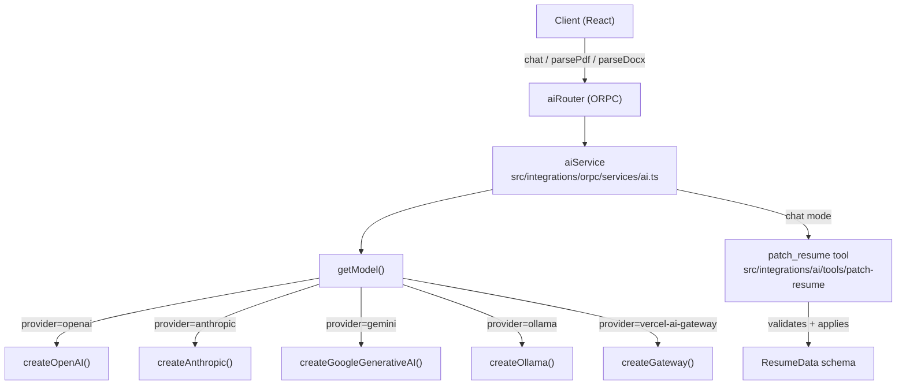
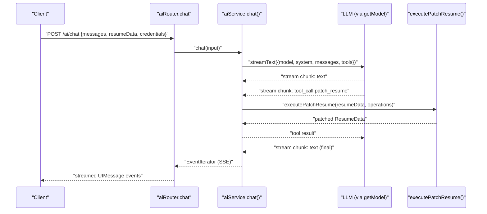
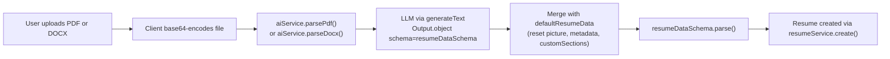

# Page: AI Integration

# AI Integration

<details>
<summary>Relevant source files</summary>

The following files were used as context for generating this wiki page:

- [.env.example](.env.example)
- [docs/community/spotlight.mdx](docs/community/spotlight.mdx)
- [docs/docs.json](docs/docs.json)
- [docs/guides/using-the-patch-api.mdx](docs/guides/using-the-patch-api.mdx)
- [docs/self-hosting/sso.mdx](docs/self-hosting/sso.mdx)
- [package.json](package.json)
- [pnpm-lock.yaml](pnpm-lock.yaml)
- [src/components/resume/store/resume.ts](src/components/resume/store/resume.ts)
- [src/integrations/orpc/dto/resume.ts](src/integrations/orpc/dto/resume.ts)
- [src/integrations/orpc/router/printer.ts](src/integrations/orpc/router/printer.ts)
- [src/integrations/orpc/router/resume.ts](src/integrations/orpc/router/resume.ts)
- [src/integrations/orpc/services/ai.ts](src/integrations/orpc/services/ai.ts)
- [src/integrations/orpc/services/printer.ts](src/integrations/orpc/services/printer.ts)
- [src/integrations/orpc/services/resume.ts](src/integrations/orpc/services/resume.ts)
- [src/utils/resume/move-item.ts](src/utils/resume/move-item.ts)
- [src/utils/resume/patch.ts](src/utils/resume/patch.ts)
- [src/utils/string.ts](src/utils/string.ts)

</details>


This page documents the AI features in Reactive Resume: the supported LLM providers, the server-side `aiService`, the streaming chat assistant with its resume-patching tool, and PDF/DOCX document parsing. It covers the backend service in `src/integrations/orpc/services/ai.ts` and the associated ORPC router that exposes these capabilities to the client. For information on how individual ORPC procedures are structured and called, see [API Design](#2.4). For the JSON Patch mechanism that the AI tool uses to write resume changes, see [JSON Patch API](#3.1.4).

---

## Supported Providers

The AI integration is provider-agnostic. The `aiProviderSchema` [src/integrations/orpc/services/ai.ts:32-33]() defines five supported providers:

| Provider ID | SDK Package | Notes |
|---|---|---|
| `openai` | `@ai-sdk/openai` | OpenAI-compatible endpoints |
| `anthropic` | `@ai-sdk/anthropic` | Anthropic Claude |
| `gemini` | `@ai-sdk/google` | Google Gemini |
| `ollama` | `ai-sdk-ollama` | Local Ollama instance |
| `vercel-ai-gateway` | `ai` (createGateway) | Vercel AI Gateway proxy |

All five are resolved in the `getModel` function using a `ts-pattern` `match` exhaustive switch [src/integrations/orpc/services/ai.ts:43-54](). This function returns a language model instance compatible with the Vercel AI SDK's `streamText` / `generateText` APIs.

---

## Credential Schema

AI credentials are **per-user** — the server does not hold a global API key. Each call into the AI service passes credentials as part of the request payload, validated by `aiCredentialsSchema` [src/integrations/orpc/services/ai.ts:56-61]():

```
provider  string  – one of the five provider IDs above
model     string  – model name (e.g. "gpt-4o", "claude-3-5-sonnet-20241022")
apiKey    string  – the user's API key for the chosen provider
baseURL   string  – optional custom base URL (useful for Ollama or proxies)
```

Users configure these credentials in the settings section of the UI. The server never persists them; they are forwarded directly to the relevant SDK factory on each request.

---

## Architecture Overview

**Diagram: AI Integration Data Flow**



Sources: [src/integrations/orpc/services/ai.ts:1-195]()

---

## Chat Assistant

The `chat` function [src/integrations/orpc/services/ai.ts:164-188]() provides a streaming conversation interface that can autonomously modify the user's resume via a tool call.

### System Prompt

The system prompt is loaded from `src/integrations/ai/prompts/chat-system.md` at build time using Vite's `?raw` import. Before the model is invoked, `buildChatSystemPrompt` [src/integrations/orpc/services/ai.ts:160-162]() injects the current `ResumeData` JSON into the template by replacing the `{{RESUME_DATA}}` placeholder. This gives the model complete context about the resume it is working with.

### The `patch_resume` Tool

The chat uses the Vercel AI SDK's `tool()` primitive to expose one tool to the model [src/integrations/orpc/services/ai.ts:177-184]():

| Property | Value |
|---|---|
| Tool name | `patch_resume` |
| Description | Imported from `patchResumeDescription` in `src/integrations/ai/tools/patch-resume` |
| Input schema | `patchResumeInputSchema` (Zod) – wraps an array of JSON Patch operations |
| Execute function | `executePatchResume(resumeData, operations)` – applies patches and returns updated data |

The chat is configured with `stopWhen: stepCountIs(3)` [src/integrations/orpc/services/ai.ts:184](), limiting the model to at most three agentic steps per turn (e.g., one tool call and one follow-up message).

### Streaming

The result of `streamText` is converted to a server-sent event stream using `streamToEventIterator` from `@orpc/server` [src/integrations/orpc/services/ai.ts:173-187](). The client consumes this stream using `@ai-sdk/react`.

**Diagram: Chat Request Lifecycle**



Sources: [src/integrations/orpc/services/ai.ts:160-188]()

---

## Document Parsing

Two functions parse external documents into a `ResumeData` object that can be imported directly into the resume builder.

### PDF Parsing (`parsePdf`)

`parsePdf` [src/integrations/orpc/services/ai.ts:86-118]() sends the file to the model as a `file` content block with `mediaType: "application/pdf"`. It uses `generateText` with `Output.object({ schema: resumeDataSchema })` to instruct the model to return a structured JSON object conforming to the full resume schema.

After generation, the function merges the model output with safe defaults:
- `customSections` is always reset to `[]`
- `picture` and `metadata` are taken from `defaultResumeData`

This prevents the model from populating fields that require server-side handling.

### DOCX Parsing (`parseDocx`)

`parseDocx` [src/integrations/orpc/services/ai.ts:120-154]() follows the same pattern. It accepts either `application/msword` or `application/vnd.openxmlformats-officedocument.wordprocessingml.document` as the `mediaType`. The file is passed as a `file` content block, and the same `Output.object` + post-processing pattern is applied.

### File Input Format

Both parsers accept files via `fileInputSchema` [src/integrations/orpc/services/ai.ts:63-66]():

```
name   string  – original filename
data   string  – base64-encoded file content
```

The client is responsible for encoding the file to base64 before sending.

**Diagram: Document Parsing Flow**



Sources: [src/integrations/orpc/services/ai.ts:63-154]()

---

## Connection Testing

`testConnection` [src/integrations/orpc/services/ai.ts:70-80]() is a lightweight health check. It sends the model a prompt asking it to respond with the string `"1"` using `Output.choice({ options: ["1"] })`. It returns `true` if the model responds correctly, allowing the UI to verify credentials before saving them.

---

## Prompt Files

Prompts are stored as Markdown files and imported via Vite's `?raw` import at build time:

| File | Used in |
|---|---|
| `src/integrations/ai/prompts/chat-system.md` | `buildChatSystemPrompt` — system context for the chat assistant |
| `src/integrations/ai/prompts/pdf-parser-system.md` | `parsePdf` — system prompt for PDF extraction |
| `src/integrations/ai/prompts/pdf-parser-user.md` | `parsePdf` — user turn preceding the file content |
| `src/integrations/ai/prompts/docx-parser-system.md` | `parseDocx` — system prompt for DOCX extraction |
| `src/integrations/ai/prompts/docx-parser-user.md` | `parseDocx` — user turn preceding the file content |

Sources: [src/integrations/orpc/services/ai.ts:19-28]()

---

## ORPC Router Surface

The `aiRouter` exposes three procedures through the ORPC layer. Based on the system architecture and the service functions described above:

| Procedure | Transport | Description |
|---|---|---|
| `aiRouter.chat` | Streaming (SSE) | Streaming chat with `patch_resume` tool |
| `aiRouter.parsePdf` | Request/response | Parse a PDF file into `ResumeData` |
| `aiRouter.parseDocx` | Request/response | Parse a DOCX file into `ResumeData` |

All three procedures require authentication (`protectedProcedure`) since they consume user-provided API keys and operate on the user's resume data.

---

## MCP Server

The `@modelcontextprotocol/sdk` dependency in `package.json` [package.json:79]() indicates that the application also exposes an MCP (Model Context Protocol) server. This allows external AI clients to interact with Reactive Resume programmatically. Details on configuring and using the MCP server are covered in the application's user-facing guide referenced in `docs/docs.json` [docs/docs.json:75]() under `guides/using-the-mcp-server`.

Sources: [package.json:34-37](), [package.json:69](), [package.json:79](), [src/integrations/orpc/services/ai.ts:1-195]()

---

