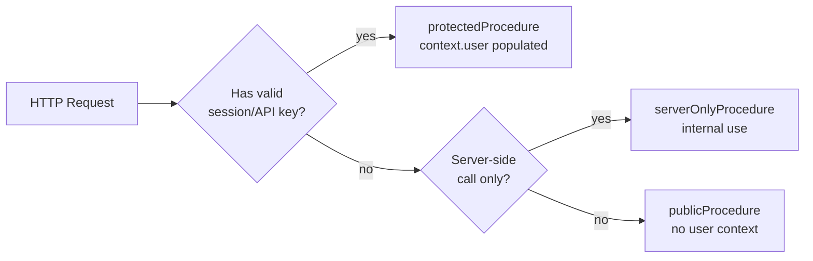
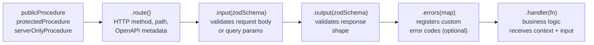
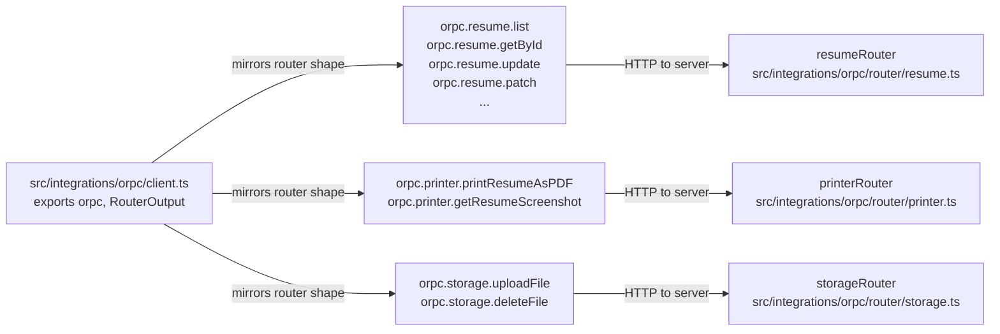

# Page: API Design

# API Design

<details>
<summary>Relevant source files</summary>

The following files were used as context for generating this wiki page:

- [.gitignore](.gitignore)
- [.vscode/settings.json](.vscode/settings.json)
- [CLAUDE.md](CLAUDE.md)
- [compose.dev.yml](compose.dev.yml)
- [compose.yml](compose.yml)
- [docs/changelog/index.mdx](docs/changelog/index.mdx)
- [docs/community/spotlight.mdx](docs/community/spotlight.mdx)
- [docs/contributing/development.mdx](docs/contributing/development.mdx)
- [docs/docs.json](docs/docs.json)
- [docs/getting-started/quickstart.mdx](docs/getting-started/quickstart.mdx)
- [docs/guides/setting-up-passkeys.mdx](docs/guides/setting-up-passkeys.mdx)
- [docs/guides/using-the-patch-api.mdx](docs/guides/using-the-patch-api.mdx)
- [docs/self-hosting/docker.mdx](docs/self-hosting/docker.mdx)
- [docs/self-hosting/examples.mdx](docs/self-hosting/examples.mdx)
- [docs/self-hosting/sso.mdx](docs/self-hosting/sso.mdx)
- [docs/spec.json](docs/spec.json)
- [knip.json](knip.json)
- [scripts/fonts/generate.ts](scripts/fonts/generate.ts)
- [scripts/fonts/types.ts](scripts/fonts/types.ts)
- [src/components/resume/preview.module.css](src/components/resume/preview.module.css)
- [src/components/resume/store/resume.ts](src/components/resume/store/resume.ts)
- [src/components/typography/combobox.tsx](src/components/typography/combobox.tsx)
- [src/components/typography/webfontlist.json](src/components/typography/webfontlist.json)
- [src/integrations/auth/client.ts](src/integrations/auth/client.ts)
- [src/integrations/auth/config.ts](src/integrations/auth/config.ts)
- [src/integrations/orpc/dto/resume.ts](src/integrations/orpc/dto/resume.ts)
- [src/integrations/orpc/router/printer.ts](src/integrations/orpc/router/printer.ts)
- [src/integrations/orpc/router/resume.ts](src/integrations/orpc/router/resume.ts)
- [src/integrations/orpc/router/storage.ts](src/integrations/orpc/router/storage.ts)
- [src/integrations/orpc/services/ai.ts](src/integrations/orpc/services/ai.ts)
- [src/integrations/orpc/services/printer.ts](src/integrations/orpc/services/printer.ts)
- [src/integrations/orpc/services/resume.ts](src/integrations/orpc/services/resume.ts)
- [src/integrations/orpc/services/storage.ts](src/integrations/orpc/services/storage.ts)
- [src/routes/__root.tsx](src/routes/__root.tsx)
- [src/routes/api/health.ts](src/routes/api/health.ts)
- [src/routes/auth/-components/social-auth.tsx](src/routes/auth/-components/social-auth.tsx)
- [src/routes/auth/login.tsx](src/routes/auth/login.tsx)
- [src/routes/auth/register.tsx](src/routes/auth/register.tsx)
- [src/routes/builder/$resumeId/-sidebar/right/sections/typography.tsx](src/routes/builder/$resumeId/-sidebar/right/sections/typography.tsx)
- [src/routes/dashboard/settings/authentication/-components/hooks.tsx](src/routes/dashboard/settings/authentication/-components/hooks.tsx)
- [src/utils/env.ts](src/utils/env.ts)
- [src/utils/resume/move-item.ts](src/utils/resume/move-item.ts)
- [src/utils/resume/patch.ts](src/utils/resume/patch.ts)
- [src/utils/string.ts](src/utils/string.ts)
- [src/vite-env.d.ts](src/vite-env.d.ts)
- [vite.config.ts](vite.config.ts)

</details>


## Purpose and Scope

This page documents the ORPC API layer: how server-side routers and procedures are organized, how Zod schemas validate inputs and outputs, how procedure access is controlled, and how the client-side `orpc` object binds server procedures to TanStack Query for use in components.

For the authentication system underlying access control, see [Authentication System](#3.4). For the resume `ResumeData` structure validated by this layer, see [Resume Data Schema](#3.1.3). For the JSON Patch mechanism used in the `patch` procedure, see [JSON Patch API](#3.1.4).

---

## Technology: oRPC

The application uses [oRPC](https://orpc.unnoq.com/) as its sole API layer. oRPC is an RPC framework that sits on top of standard HTTP and exposes endpoints both as a type-safe RPC client and as a REST-compatible OpenAPI spec simultaneously.

Key properties:
- **End-to-end type safety**: input and output schemas are Zod schemas; the TypeScript types for the client are inferred directly from those same schemas.
- **OpenAPI generation**: every procedure declared with `.route()` is automatically reflected in the OpenAPI spec served at `/api/openapi`.
- **TanStack Query integration**: the `orpc` client exposes `.queryOptions()` and `.mutationOptions()` helpers that integrate directly with TanStack Query.

The OpenAPI spec is served from `docs/spec.json` and consumed by the Mintlify documentation site.

Sources: [CLAUDE.md:1-10](), [src/integrations/orpc/router/resume.ts:1-10]()

---

## Procedure Types and Request Context

Three base procedures are defined in `src/integrations/orpc/context.ts`. Every server procedure is created by chaining from one of these three.

| Procedure | Auth required | Use case |
|---|---|---|
| `publicProcedure` | None | Public resume viewing, password verification, PDF export |
| `protectedProcedure` | Session cookie or `x-api-key` header | All authenticated user operations |
| `serverOnlyProcedure` | Internal server calls only | Printer-side resume fetching |

The `context` object injected into every handler contains:
- `context.user` — the authenticated user record (populated by Better Auth; absent on `publicProcedure`)
- `context.locale` — detected locale from the request (used when creating resumes)

API key authentication is handled transparently by Better Auth's `apiKey` plugin configured with `enableSessionForAPIKeys: true` [src/integrations/auth/config.ts:231-238](). This means `protectedProcedure` does not need to distinguish between session-based and API-key-based callers; both produce a `context.user`.

**Diagram: Procedure Types and Access Control**



Sources: [CLAUDE.md:84-98](), [src/integrations/auth/config.ts:229-238]()

---

## Router Structure

Routers are plain TypeScript objects whose keys become the procedure path in the client API. They live in `src/integrations/orpc/router/`. The top-level router assembles all sub-routers.

**Diagram: oRPC Router Hierarchy**

```mermaid
graph TD
  appRouter["appRouter\n(top-level)"]

  appRouter --> resumeRouter["resumeRouter\nsrc/integrations/orpc/router/resume.ts"]
  appRouter --> printerRouter["printerRouter\nsrc/integrations/orpc/router/printer.ts"]
  appRouter --> storageRouter["storageRouter\nsrc/integrations/orpc/router/storage.ts"]
  appRouter --> aiRouter["aiRouter\nsrc/integrations/orpc/router/ai.ts"]
  appRouter --> authRouter["authRouter\n(Better Auth handlers)"]
  appRouter --> flagsRouter["flagsRouter\n(feature flag exposure)"]

  resumeRouter --> rList["list\nGET /resumes"]
  resumeRouter --> rGetById["getById\nGET /resumes/{id}"]
  resumeRouter --> rGetBySlug["getBySlug\nGET /resumes/{username}/{slug}"]
  resumeRouter --> rCreate["create\nPOST /resumes"]
  resumeRouter --> rImport["import\nPOST /resumes/import"]
  resumeRouter --> rUpdate["update\nPUT /resumes/{id}"]
  resumeRouter --> rPatch["patch\nPATCH /resumes/{id}"]
  resumeRouter --> rDuplicate["duplicate\nPOST /resumes/{id}/duplicate"]
  resumeRouter --> rDelete["delete\nDELETE /resumes/{id}"]
  resumeRouter --> rSetLocked["setLocked\nPOST /resumes/{id}/lock"]
  resumeRouter --> rSetPassword["setPassword\nPUT /resumes/{id}/password"]
  resumeRouter --> rVerifyPassword["verifyPassword\nPOST /resumes/{username}/{slug}/password/verify"]
  resumeRouter --> rRemovePassword["removePassword\nDELETE /resumes/{id}/password"]
  resumeRouter --> tagsRouter["tags.list\nGET /resumes/tags"]
  resumeRouter --> statisticsRouter["statistics.getById\nGET /resumes/{id}/statistics"]

  printerRouter --> pPrintPDF["printResumeAsPDF\nGET /resumes/{id}/pdf"]
  printerRouter --> pScreenshot["getResumeScreenshot\nGET /resumes/{id}/screenshot"]

  storageRouter --> sUpload["uploadFile"]
  storageRouter --> sDelete["deleteFile"]
```



Sources: [src/integrations/orpc/router/resume.ts:60-378](), [src/integrations/orpc/router/printer.ts:6-56](), [src/integrations/orpc/router/storage.ts:14-80](), [CLAUDE.md:76-80]()

---

## Procedure Definition Pattern

Every procedure follows the same builder chain:

```
<baseProc>.route({...}).input(schema).output(schema).errors({...}).handler(async ({ context, input }) => {...})
```

A full example from the resume router [src/integrations/orpc/router/resume.ts:85-100]():

```
protectedProcedure
  .route({
    method: "GET",
    path: "/resumes/{id}",
    tags: ["Resumes"],
    operationId: "getResume",
    summary: "Get resume by ID",
    description: "...",
    successDescription: "The resume with its full data.",
  })
  .input(resumeDto.getById.input)
  .output(resumeDto.getById.output)
  .handler(async ({ context, input }) => {
    return await resumeService.getById({ id: input.id, userId: context.user.id });
  })
```

**Diagram: Procedure Builder Chain**



The `.route()` fields map directly to OpenAPI operation metadata. Omitting `.route()` still creates a valid procedure, but it does not appear in the generated OpenAPI spec (used for internal/server-only calls).

Sources: [src/integrations/orpc/router/resume.ts:64-101](), [CLAUDE.md:84-98]()

---

## Input/Output Validation with Zod

### DTO Layer

Data transfer objects live in `src/integrations/orpc/dto/resume.ts`. The file uses `createSelectSchema` from `drizzle-zod` to derive a base Zod schema directly from the Drizzle table definition, then customises it per procedure.

```
const resumeSchema = createSelectSchema(schema.resume, {
  id: z.string().describe("The ID of the resume."),
  ...
  data: resumeDataSchema,   // full ResumeData Zod schema
  ...
})
```

Each procedure's `input` and `output` are slices of this base schema with sensitive fields omitted, optional fields marked, and computed fields added via `.extend()`:

| DTO key | Input fields | Output notes |
|---|---|---|
| `resumeDto.list` | `tags[]`, `sort` (optional) | Array, omits `data`, `password`, `userId` |
| `resumeDto.getById` | `id` | Includes `hasPassword` (computed), omits `password`/`userId` |
| `resumeDto.create` | `name`, `slug`, `tags`, `withSampleData` | Returns `string` (the new ID) |
| `resumeDto.update` | `id`, optional `name`/`slug`/`tags`/`data`/`isPublic` | Full resume object |
| `resumeDto.patch` | `id`, `operations: Operation[]` | Full resume object |
| `resumeDto.setLocked` | `id`, `isLocked` | `void` |
| `resumeDto.setPassword` | `id`, `password` (min 6) | `void` |
| `resumeDto.duplicate` | `id`, optional `name`/`slug`/`tags` | Returns `string` (the new ID) |
| `resumeDto.delete` | `id` | `void` |

Sources: [src/integrations/orpc/dto/resume.ts:1-103]()

### JSON Patch Input Validation

The `patch` procedure uses `jsonPatchOperationSchema` defined in `src/utils/resume/patch.ts` as a Zod discriminated union on the `op` field [src/utils/resume/patch.ts:11-18](). This catches malformed operations at the API boundary before they reach `fast-json-patch`.

After patching, the result is re-validated against `resumeDataSchema` to ensure the patched document remains a valid `ResumeData` [src/utils/resume/patch.ts:101-122]().

Sources: [src/integrations/orpc/dto/resume.ts:81-92](), [src/utils/resume/patch.ts:11-122]()

---

## Error Handling

Procedures throw `ORPCError` from `@orpc/client` (or `@orpc/server`). The error constructor takes a code string and optional metadata:

```
throw new ORPCError("NOT_FOUND");
throw new ORPCError("RESUME_LOCKED");
throw new ORPCError("RESUME_SLUG_ALREADY_EXISTS", { status: 400 });
throw new ORPCError("INVALID_PATCH_OPERATIONS", {
  status: 400,
  message: error.message,
  data: { code: error.code, index: error.index, operation: error.operation },
});
```

Custom error codes must be declared on the procedure with `.errors()` before they can be thrown [src/integrations/orpc/router/resume.ts:138-144](). Undeclared error codes fall through as `INTERNAL_SERVER_ERROR`.

Common error codes across the resume router:

| Code | Status | Thrown when |
|---|---|---|
| `NOT_FOUND` | 404 | Resume does not exist or belongs to another user |
| `RESUME_LOCKED` | — | Attempting to update/delete a locked resume |
| `RESUME_SLUG_ALREADY_EXISTS` | 400 | Slug already in use for the user |
| `INVALID_PATCH_OPERATIONS` | 400 | JSON Patch operations are invalid or produce invalid data |
| `NEED_PASSWORD` | 401 | Public resume is password-protected and password not yet verified |
| `INVALID_PASSWORD` | — | Password verification failed |

Sources: [src/integrations/orpc/services/resume.ts:131-134](), [src/integrations/orpc/router/resume.ts:138-144](), [src/integrations/orpc/router/resume.ts:231-238]()

---

## Client-Side Integration

### The `orpc` Client

The client is exported from `src/integrations/orpc/client.ts` and mirrors the server router tree. Two exports are used throughout the frontend:

- `orpc` — the callable client object. Procedures are accessed as nested properties (e.g. `orpc.resume.update`).
- `RouterOutput` — a TypeScript utility type that extracts the inferred output types for every procedure.

**Diagram: orpc Client to Server Procedure Binding**



### Direct Calls

Direct calls use `.call(input, options)`. This is used in the resume store for debounced auto-save, where an `AbortSignal` is passed to cancel in-flight saves:

```
// src/components/resume/store/resume.ts
orpc.resume.update.call({ id: resume.id, data: resume.data }, { signal });
```

[src/components/resume/store/resume.ts:32-36]()

### TanStack Query Integration

For data fetching in components, oRPC provides `.queryOptions()` and `.mutationOptions()` helpers that integrate with TanStack Query. These inherit the same Zod-inferred types:

```
// Fetching a list (useQuery)
useQuery(orpc.resume.list.queryOptions({ tags: [], sort: "lastUpdatedAt" }))

// Mutation
useMutation(orpc.resume.create.mutationOptions())
```

`RouterOutput` is used to type component state derived from API responses:

```
// src/components/resume/store/resume.ts
type Resume = Pick<RouterOutput["resume"]["getByIdForPrinter"], "id" | "name" | "slug" | "tags" | "data" | "isLocked">;
```

[src/components/resume/store/resume.ts:15]()

Sources: [src/components/resume/store/resume.ts:1-80](), [CLAUDE.md:139-144]()

---

## OpenAPI Generation

The oRPC layer automatically generates an OpenAPI spec from all procedures that declare a `.route()`. The spec is served at runtime and is also committed to `docs/spec.json` for the documentation site.

Key spec metadata:
- **Server URL**: `http://localhost:3000/api/openapi`
- **Security scheme**: `apiKey` via `x-api-key` header
- **API version**: follows the app version (e.g. `5.0.9`)

The OpenAPI plugin is also installed as part of Better Auth (`openAPI()` plugin at [src/integrations/auth/config.ts:230]()), which exposes the auth endpoints alongside the ORPC endpoints.

Procedures tagged `"Internal"` (e.g. `uploadFile`, `deleteFile`, `getByIdForPrinter`, `incrementResumeStatistics`) are excluded from public documentation by convention even though they appear in the spec.

Sources: [docs/spec.json:1-5](), [src/integrations/auth/config.ts:229-230](), [src/integrations/orpc/router/storage.ts:18]()

---

## API Key Rate Limiting

When using the `x-api-key` authentication method, the API key plugin enforces a rate limit configured at [src/integrations/auth/config.ts:231-238]():

- **Window**: 24 hours
- **Max requests**: 500 per key per day

This limit applies only to API key auth. Session-based (cookie) auth has no rate limit at the ORPC layer.

Sources: [src/integrations/auth/config.ts:231-238]()

---

