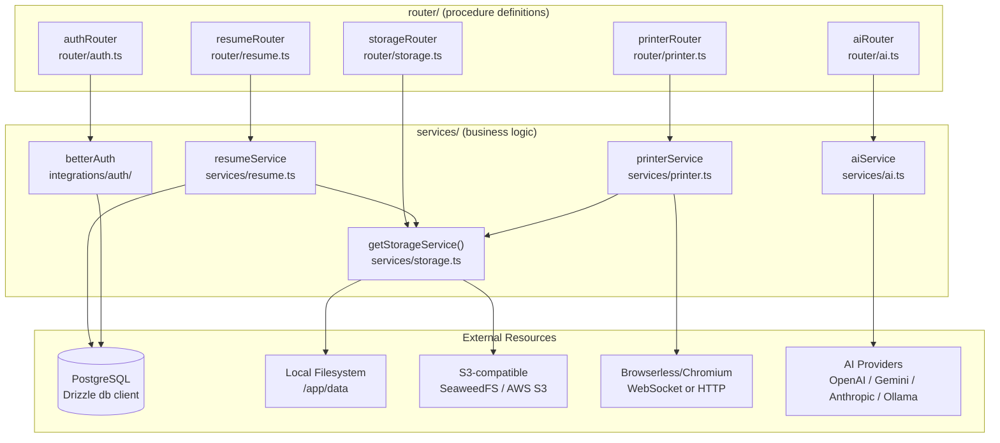
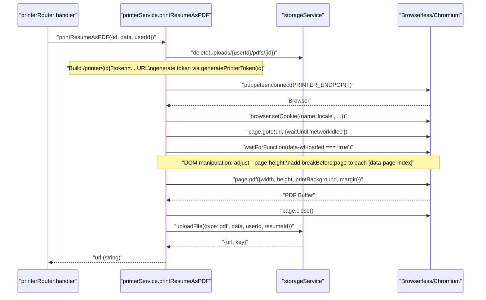
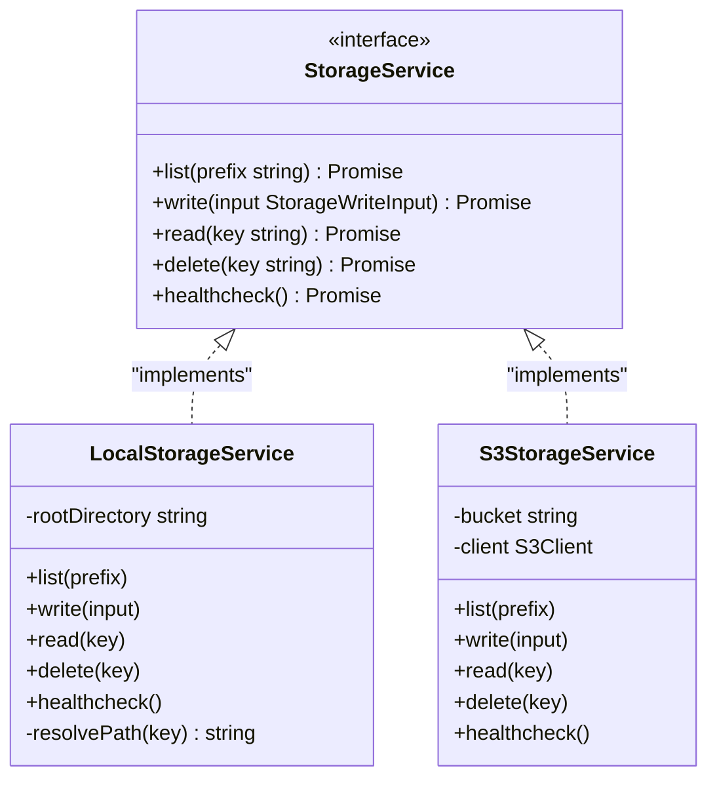

# Page: Backend Services

# Backend Services

<details>
<summary>Relevant source files</summary>

The following files were used as context for generating this wiki page:

- [.env.example](.env.example)
- [CLAUDE.md](CLAUDE.md)
- [compose.dev.yml](compose.dev.yml)
- [compose.yml](compose.yml)
- [docs/community/spotlight.mdx](docs/community/spotlight.mdx)
- [docs/contributing/development.mdx](docs/contributing/development.mdx)
- [docs/docs.json](docs/docs.json)
- [docs/getting-started/quickstart.mdx](docs/getting-started/quickstart.mdx)
- [docs/guides/using-the-patch-api.mdx](docs/guides/using-the-patch-api.mdx)
- [docs/self-hosting/docker.mdx](docs/self-hosting/docker.mdx)
- [docs/self-hosting/examples.mdx](docs/self-hosting/examples.mdx)
- [docs/self-hosting/sso.mdx](docs/self-hosting/sso.mdx)
- [package.json](package.json)
- [pnpm-lock.yaml](pnpm-lock.yaml)
- [src/components/resume/store/resume.ts](src/components/resume/store/resume.ts)
- [src/integrations/orpc/dto/resume.ts](src/integrations/orpc/dto/resume.ts)
- [src/integrations/orpc/router/printer.ts](src/integrations/orpc/router/printer.ts)
- [src/integrations/orpc/router/resume.ts](src/integrations/orpc/router/resume.ts)
- [src/integrations/orpc/router/storage.ts](src/integrations/orpc/router/storage.ts)
- [src/integrations/orpc/services/ai.ts](src/integrations/orpc/services/ai.ts)
- [src/integrations/orpc/services/printer.ts](src/integrations/orpc/services/printer.ts)
- [src/integrations/orpc/services/resume.ts](src/integrations/orpc/services/resume.ts)
- [src/integrations/orpc/services/storage.ts](src/integrations/orpc/services/storage.ts)
- [src/routes/__root.tsx](src/routes/__root.tsx)
- [src/routes/api/health.ts](src/routes/api/health.ts)
- [src/utils/env.ts](src/utils/env.ts)
- [src/utils/resume/move-item.ts](src/utils/resume/move-item.ts)
- [src/utils/resume/patch.ts](src/utils/resume/patch.ts)
- [src/utils/string.ts](src/utils/string.ts)
- [src/vite-env.d.ts](src/vite-env.d.ts)

</details>


## Purpose and Scope

This page documents the server-side architecture of Reactive Resume: the Nitro server runtime, the ORPC API layer, and the four primary service modules (resume, printer, storage, and AI). It covers procedure types, service logic, data flows, and startup behavior.

For the **database schema and Drizzle ORM configuration**, see [Data Layer](#2.3). For the **full ORPC procedure model and client-side bindings**, see [API Design](#2.4). For the **authentication system** (Better Auth), see [Authentication System](#3.4). For **storage system details**, see [Storage System](#3.5).

---

## Server Runtime

The application server runs on **Nitro** (a meta-framework built on top of Node.js). The production entry point is `.output/server/index.mjs`, started via `node .output/server/index.mjs`. During development, `vite dev` starts Nitro in watch mode.

### Database Migration Plugin

Database migrations run automatically on every server startup before any traffic is served. This is handled by a Nitro server plugin at `plugins/1.migrate.ts`. If the migration fails (typically a database connectivity issue), the container exits with an error.

### Health Check

The endpoint `GET /api/health` is the canonical liveness probe. It is defined in [src/routes/api/health.ts:17-38]() and runs three checks in parallel:

| Check | What is verified |
|---|---|
| `database` | A test query via Drizzle ORM |
| `printer` | An HTTP call to `PRINTER_ENDPOINT`'s `/json/version` |
| `storage` | R/W access to the configured storage backend |

The response includes `version`, `status`, `timestamp`, `uptime`, and sub-check results. If any sub-check reports `"unhealthy"`, the top-level `status` is set to `"unhealthy"`.

Sources: [src/routes/api/health.ts](), [CLAUDE.md]()

---

## ORPC API Layer

All server-side procedures are defined using ORPC, a type-safe RPC library. The layer is organized into three levels:

| Path | Role |
|---|---|
| `src/integrations/orpc/context.ts` | Defines the three base procedure types and the request context |
| `src/integrations/orpc/router/` | Declares procedures (HTTP method, path, validation, handler) |
| `src/integrations/orpc/services/` | Implements the business logic called by handlers |
| `src/integrations/orpc/dto/` | Zod schemas for procedure input/output shapes |

### Procedure Types

Three procedure builders are exported from `src/integrations/orpc/context.ts`:

| Procedure Type | Auth Required | Typical Use |
|---|---|---|
| `publicProcedure` | None | Public resume view, password verify, PDF export |
| `protectedProcedure` | Session cookie or `x-api-key` header | Resume CRUD, file upload, statistics |
| `serverOnlyProcedure` | Internal-only (no external access) | Printer fetching full resume data |

Each procedure is built with a fluent chain:

```ts
protectedProcedure
  .route({ method: "PUT", path: "/resumes/{id}", ... })
  .input(inputSchema)
  .output(outputSchema)
  .handler(async ({ context, input }) => { ... })
```

Sources: [CLAUDE.md:84-98](), [src/integrations/orpc/router/resume.ts:4](), [src/integrations/orpc/router/printer.ts:1-6]()

---

### Router and Service Topology

**Figure: ORPC Routers mapped to Services and External Resources**



Sources: [src/integrations/orpc/router/resume.ts](), [src/integrations/orpc/router/printer.ts](), [src/integrations/orpc/router/storage.ts](), [src/integrations/orpc/services/resume.ts](), [src/integrations/orpc/services/printer.ts](), [src/integrations/orpc/services/storage.ts]()

---

## Service Modules

### Resume Service

`resumeService` is defined in [src/integrations/orpc/services/resume.ts:82-433]() as a plain object with named methods. All database access goes through the Drizzle `db` client.

#### Method Reference

| Method | Procedure Type | HTTP | Description |
|---|---|---|---|
| `list` | protected | `GET /resumes` | List user's resumes (no `data` field) |
| `getById` | protected | `GET /resumes/{id}` | Fetch one resume with full `data` |
| `getByIdForPrinter` | serverOnly | — | Full resume + picture converted to base64 |
| `getBySlug` | public | `GET /resumes/{username}/{slug}` | Public resume by owner username + slug |
| `create` | protected | `POST /resumes` | Insert new resume row |
| `update` | protected | `PUT /resumes/{id}` | Full field update |
| `patch` | protected | `PATCH /resumes/{id}` | Apply RFC 6902 JSON Patch operations |
| `setLocked` | protected | `POST /resumes/{id}/lock` | Toggle `isLocked` flag |
| `setPassword` | protected | `PUT /resumes/{id}/password` | Hash and store a password |
| `verifyPassword` | public | `POST /resumes/{username}/{slug}/password/verify` | Validate password, grant session access |
| `removePassword` | protected | `DELETE /resumes/{id}/password` | Remove password protection |
| `delete` | protected | `DELETE /resumes/{id}` | Delete row + screenshots + PDFs from storage |
| `tags.list` | protected | `GET /resumes/tags` | Unique tags across user's resumes |
| `statistics.getById` | protected | `GET /resumes/{id}/statistics` | View/download counts |
| `statistics.increment` | public | — | Atomically increment view or download counter |

#### Locked Resumes

`update`, `patch`, and `delete` all check `isLocked` before proceeding. Any attempt to mutate a locked resume throws an `ORPCError("RESUME_LOCKED")`.

#### `getByIdForPrinter`

[src/integrations/orpc/services/resume.ts:136-167]() fetches the resume and converts the profile picture URL to a base64 data URI. This prevents the headless browser from needing to make authenticated HTTP requests back to the app to load the image.

#### JSON Patch

The `patch` method calls `applyResumePatches` from [src/utils/resume/patch.ts:101-124](). The function applies RFC 6902 operations using `fast-json-patch`, then validates the result against `resumeDataSchema`. See [JSON Patch API](#3.1.4) for full documentation.

Sources: [src/integrations/orpc/services/resume.ts](), [src/integrations/orpc/router/resume.ts](), [src/integrations/orpc/dto/resume.ts]()

---

### Printer Service

`printerService` is defined in [src/integrations/orpc/services/printer.ts:53-320]() and communicates with a headless Chromium browser over the Puppeteer protocol. The connection endpoint is configured via the `PRINTER_ENDPOINT` environment variable (WebSocket or HTTP).

#### Browser Connection

[src/integrations/orpc/services/printer.ts:16-33]() implements `getBrowser()`, which maintains a singleton `Browser` instance. It reconnects automatically if the connection is dropped. `SIGINT` and `SIGTERM` handlers close the browser cleanly.

#### `printResumeAsPDF`

[src/integrations/orpc/services/printer.ts:79-239]() generates a PDF in seven steps:

**Figure: PDF Generation Sequence**



For templates in `printMarginTemplates`, margin values from `data.metadata.page.marginX/Y` are converted from CSS pixels to PDF points before being applied as PDF margins.

#### `getResumeScreenshot`

[src/integrations/orpc/services/printer.ts:242-320]() captures a WebP screenshot of the first resume page. Screenshots are cached with a TTL of 6 hours (`SCREENSHOT_TTL = 1000 * 60 * 60 * 6`). On each call:

1. Existing screenshots for the resume are listed from storage.
2. If a screenshot exists and is within TTL, it is returned immediately.
3. If the screenshot is stale but the resume has not been modified since it was taken, the stale screenshot is still returned.
4. Otherwise, old screenshots are deleted and a new one is captured.

Sources: [src/integrations/orpc/services/printer.ts](), [src/integrations/orpc/router/printer.ts]()

---

### Storage Service

The storage layer abstracts over two backends behind the `StorageService` interface. The active backend is selected at runtime by the `getStorageService()` factory based on whether S3 credentials are present.

**Figure: Storage Service Class Structure**



#### `LocalStorageService`

[src/integrations/orpc/services/storage.ts:113-208]() Stores files under `process.cwd()/data`. Paths are sanitized to prevent traversal attacks. Directory creation is recursive. `delete` handles both files and directories.

Activated when `S3_ACCESS_KEY_ID`, `S3_SECRET_ACCESS_KEY`, and `S3_BUCKET` are not set. The `/app/data` directory should be mounted to a persistent volume in Docker deployments.

#### `S3StorageService`

[src/integrations/orpc/services/storage.ts:210-299]() Uses `@aws-sdk/client-s3`. Objects are uploaded with `ACL: "public-read"`. Requires `S3_ACCESS_KEY_ID`, `S3_SECRET_ACCESS_KEY`, and `S3_BUCKET`. `S3_FORCE_PATH_STYLE` should be set to `true` for SeaweedFS and MinIO.

#### Storage Key Conventions

[src/integrations/orpc/services/storage.ts:55-73]() Keys are organized by type under a per-user namespace:

| Type | Key Pattern |
|---|---|
| Profile picture | `uploads/{userId}/pictures/{timestamp}.webp` |
| Resume screenshot | `uploads/{userId}/screenshots/{resumeId}/{timestamp}.webp` |
| PDF export | `uploads/{userId}/pdfs/{resumeId}/{timestamp}.pdf` |

#### Image Processing

[src/integrations/orpc/services/storage.ts:89-111]() `processImageForUpload()` resizes uploaded images to 800×800 px (preserving aspect ratio) and converts them to WebP using `sharp`. If `FLAG_DISABLE_IMAGE_PROCESSING=true`, the file is stored as-is. This flag is useful on resource-constrained hosts (e.g. Raspberry Pi).

Sources: [src/integrations/orpc/services/storage.ts](), [src/integrations/orpc/router/storage.ts]()

---

### AI Service

`aiService` is defined in [src/integrations/orpc/services/ai.ts](). It is a provider-agnostic wrapper around the Vercel AI SDK.

#### Supported Providers

`aiProviderSchema` at [src/integrations/orpc/services/ai.ts:32]() enumerates the supported providers:

| Provider Key | SDK Package |
|---|---|
| `openai` | `@ai-sdk/openai` |
| `gemini` | `@ai-sdk/google` |
| `anthropic` | `@ai-sdk/anthropic` |
| `ollama` | `ai-sdk-ollama` |
| `vercel-ai-gateway` | `ai` (gateway) |

The `getModel()` function at [src/integrations/orpc/services/ai.ts:43-54]() uses `ts-pattern` to dispatch to the correct SDK factory.

#### Functions

| Function | Description |
|---|---|
| `testConnection` | Sends a one-token probe to verify credentials |
| `parsePdf` | Feeds a base64 PDF to the model, returns structured `ResumeData` |
| `parseDocx` | Same flow for DOCX files |
| `chat` | Streaming text generation with a `patchResume` tool call that applies JSON Patch operations to the current resume |

AI provider credentials (API key, base URL, model name) are stored per user and passed in with each request—there is no server-wide AI configuration required.

Sources: [src/integrations/orpc/services/ai.ts](), [CLAUDE.md:80]()

---

## Environment Variables

The full validated environment is defined in [src/utils/env.ts](). Key backend variables:

| Variable | Required | Default | Purpose |
|---|---|---|---|
| `APP_URL` | Yes | — | Canonical public URL; used for absolute URL generation |
| `PRINTER_APP_URL` | No | `APP_URL` | Internal URL the printer uses to reach the app (important in Docker) |
| `PRINTER_ENDPOINT` | Yes | — | WebSocket or HTTP endpoint for Browserless/Chromium |
| `DATABASE_URL` | Yes | — | PostgreSQL connection string |
| `AUTH_SECRET` | Yes | — | Secret for Better Auth session signing |
| `S3_ACCESS_KEY_ID` | No | — | Activates `S3StorageService` when set alongside `S3_SECRET_ACCESS_KEY` and `S3_BUCKET` |
| `SMTP_HOST` | No | — | Enables email sending; logs to console if unset |
| `FLAG_DEBUG_PRINTER` | No | `false` | Bypasses server-only restriction on `/printer/{id}` route |
| `FLAG_DISABLE_SIGNUPS` | No | `false` | Blocks new account registration |
| `FLAG_DISABLE_EMAIL_AUTH` | No | `false` | Disables email/password login entirely |
| `FLAG_DISABLE_IMAGE_PROCESSING` | No | `false` | Skips `sharp` image resize/convert on upload |

Sources: [src/utils/env.ts](), [.env.example]()

---

