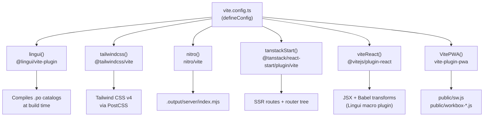
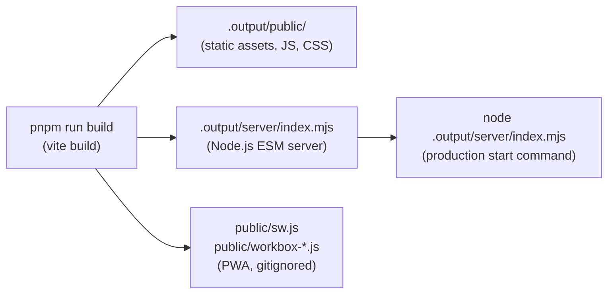
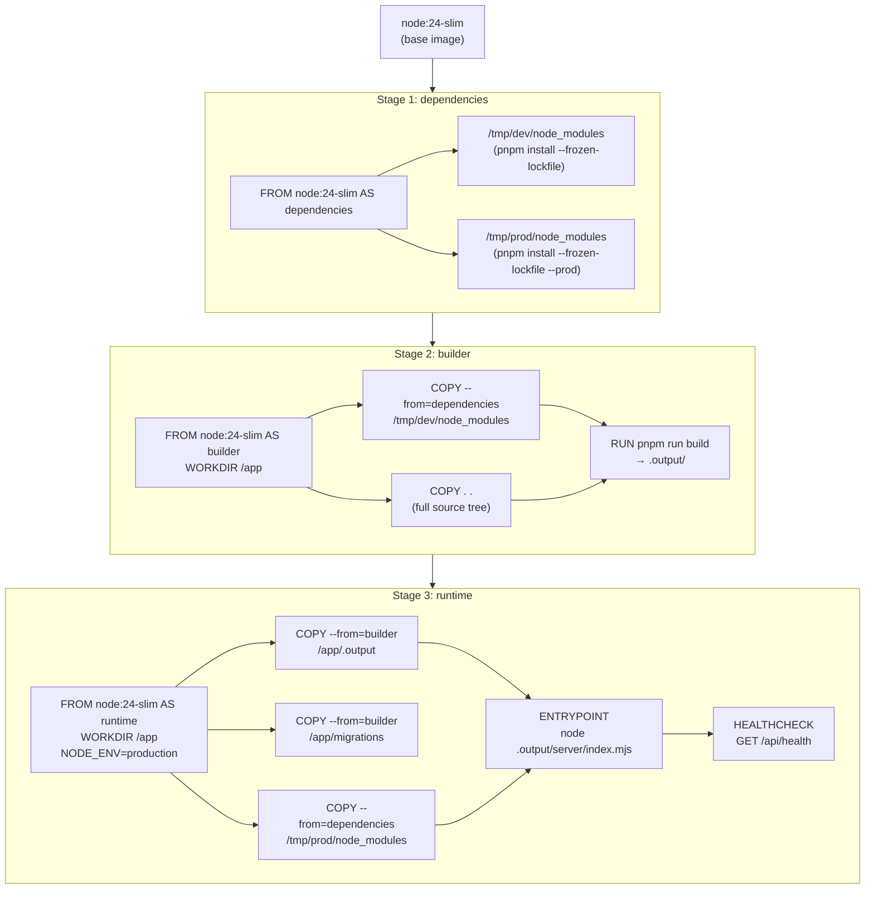
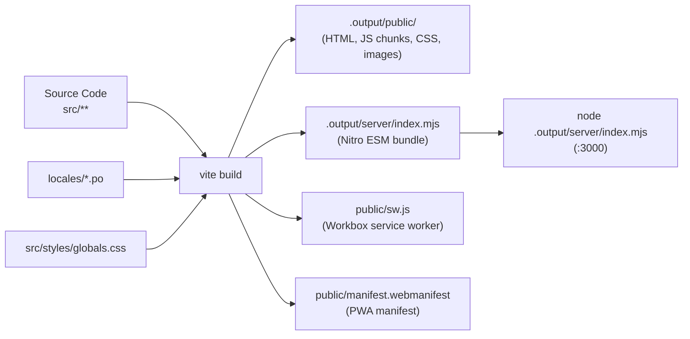

# Page: Build System

# Build System

<details>
<summary>Relevant source files</summary>

The following files were used as context for generating this wiki page:

- [.dockerignore](.dockerignore)
- [.env.example](.env.example)
- [.github/workflows/docker-build.yml](.github/workflows/docker-build.yml)
- [.gitignore](.gitignore)
- [.vscode/settings.json](.vscode/settings.json)
- [Dockerfile](Dockerfile)
- [docs/changelog/index.mdx](docs/changelog/index.mdx)
- [docs/guides/setting-up-passkeys.mdx](docs/guides/setting-up-passkeys.mdx)
- [docs/spec.json](docs/spec.json)
- [knip.json](knip.json)
- [package.json](package.json)
- [pnpm-lock.yaml](pnpm-lock.yaml)
- [scripts/fonts/generate.ts](scripts/fonts/generate.ts)
- [scripts/fonts/types.ts](scripts/fonts/types.ts)
- [src/components/resume/preview.module.css](src/components/resume/preview.module.css)
- [src/components/typography/combobox.tsx](src/components/typography/combobox.tsx)
- [src/components/typography/webfontlist.json](src/components/typography/webfontlist.json)
- [src/integrations/auth/client.ts](src/integrations/auth/client.ts)
- [src/integrations/auth/config.ts](src/integrations/auth/config.ts)
- [src/routes/auth/-components/social-auth.tsx](src/routes/auth/-components/social-auth.tsx)
- [src/routes/auth/login.tsx](src/routes/auth/login.tsx)
- [src/routes/auth/register.tsx](src/routes/auth/register.tsx)
- [src/routes/builder/$resumeId/-sidebar/right/sections/typography.tsx](src/routes/builder/$resumeId/-sidebar/right/sections/typography.tsx)
- [src/routes/dashboard/settings/authentication/-components/hooks.tsx](src/routes/dashboard/settings/authentication/-components/hooks.tsx)
- [vite.config.ts](vite.config.ts)

</details>


This page documents the build pipeline for Reactive Resume: the Vite configuration and its plugin stack, Nitro server bundling, pnpm script definitions, the three-stage Docker build, and PWA generation. For CI/CD workflows that consume the Docker image, see page [5.4](#5.4). For the local development environment setup, see page [6.1](#6.1).

---

## Overview

The project is a full-stack SSR application built with **TanStack Start**, which uses **Vite** as the build coordinator and **Nitro** as the server bundler. A single `pnpm run build` invocation drives both the client bundle and the server bundle through Vite, producing outputs in `.output/`.

```
pnpm run build
└── vite build
    ├── Client bundle  →  .output/public/
    └── Server bundle  →  .output/server/index.mjs  (Nitro)
```

Sources: [package.json:17-31](), [vite.config.ts:1-175]()

---

## Vite Configuration

The root configuration file is [vite.config.ts:1-175](). Every major build concern is handled by a Vite plugin.

### Plugin Stack

**Vite Plugin Stack in `vite.config.ts`**



Sources: [vite.config.ts:1-10](), [vite.config.ts:34-172]()

| Plugin | Import Source | Purpose |
|---|---|---|
| `lingui()` | `@lingui/vite-plugin` | Compiles PO locale files and enables Lingui message extraction |
| `tailwindcss()` | `@tailwindcss/vite` | Tailwind CSS v4 via Vite (no separate PostCSS config file) |
| `nitro()` | `nitro/vite` | Server bundle; runs the `plugins/1.migrate.ts` Nitro plugin on startup |
| `tanstackStart()` | `@tanstack/react-start/plugin/vite` | SSR code-splitting, route tree generation, hydration wiring |
| `viteReact()` | `@vitejs/plugin-react` | React JSX; Babel configured with `@lingui/babel-plugin-lingui-macro` |
| `VitePWA()` | `vite-plugin-pwa` | Generates Workbox service worker and Web App Manifest |

### Key Build Settings

[vite.config.ts:10-30]() sets:

- **`__APP_VERSION__`** global constant — injected from `process.env.npm_package_version` at build time.
- **`resolve.tsconfigPaths: true`** — enables TypeScript path aliases (`@/...`) in imports.
- **`build.sourcemap: true`** — source maps included in all output.
- **`build.chunkSizeWarningLimit: 10 * 1024`** — warning threshold raised to 10 MB (needed due to Monaco Editor and resume template bundles).
- **`server.port: 3000`** / **`strictPort: true`** — dev server always uses port 3000.

---

## Nitro Server Bundling

Nitro is used as a dev dependency (`nitro-nightly@latest`) and is invoked via the `nitro()` Vite plugin rather than its own CLI. The plugin declaration is:

```ts
nitro({ plugins: ["plugins/1.migrate.ts"] })
```

[vite.config.ts:37]()

The `plugins/1.migrate.ts` Nitro plugin runs database migrations automatically on server startup. This is how `drizzle-kit migrate` gets called in production without a separate migration step.

**Build Output Structure**



Sources: [package.json:17-31](), [.gitignore:1-15](), [Dockerfile:30-31]()

The `.output/` directory is gitignored and not committed. It is produced fresh in each Docker build.

---

## PWA Generation

`VitePWA` is configured in [vite.config.ts:40-171]() with the following notable settings:

| Setting | Value | Effect |
|---|---|---|
| `outDir` | `"public"` | Service worker written to `/public/sw.js` |
| `registerType` | `"autoUpdate"` | SW auto-updates without user prompt |
| `workbox.skipWaiting` | `true` | New SW activates immediately |
| `workbox.clientsClaim` | `true` | SW takes control of all open pages |
| `workbox.navigateFallback` | `null` | Navigation fallback disabled (required for SSR) |
| `workbox.maximumFileSizeToCacheInBytes` | `10 * 1024 * 1024` | 10 MB cache limit per file |
| `useCredentials` | `true` | SW fetch requests include cookies |

The manifest declares `display: "standalone"`, `orientation: "portrait"`, and icons at 64×64, 192×192, and 512×512. The generated `public/sw.js` and `public/workbox-*.js` files are listed in `.gitignore` and are regenerated on every build.

Sources: [vite.config.ts:40-171](), [.gitignore:15-17]()

---

## pnpm Scripts

All scripts are defined in [package.json:17-31]():

| Script | Command | Purpose |
|---|---|---|
| `dev` | `vite dev` | Start the dev server (port 3000, HMR) |
| `build` | `vite build` | Full production build (client + server) |
| `preview` | `vite preview` | Preview the production build locally |
| `start` | `node .output/server/index.mjs` | Run the production server |
| `db:generate` | `drizzle-kit generate` | Generate a new SQL migration file |
| `db:migrate` | `drizzle-kit migrate` | Apply pending migrations |
| `db:push` | `drizzle-kit push` | Push schema directly (dev only) |
| `db:pull` | `drizzle-kit pull` | Introspect existing schema |
| `db:studio` | `drizzle-kit studio` | Open Drizzle Studio UI |
| `lingui:extract` | `lingui extract --clean --overwrite` | Extract translatable strings to PO files |
| `lint` | `biome check --write` | Lint and format source files |
| `typecheck` | `tsgo --noEmit` | Type-check with the native TypeScript Go compiler |
| `knip` | `knip` | Detect unused exports and dependencies |

The `pnpm` package manager is pinned to version `10.30.2` in [package.json:7](). The `vite` package is overridden to the beta channel (`^8.0.0-beta.15`) via `pnpm.overrides` to align with TanStack Start's peer dependency requirements.

Sources: [package.json:17-31](), [package.json:142-154]()

---

## Three-Stage Docker Build

The [Dockerfile:1-61]() uses a three-stage build to minimize final image size and avoid shipping build tooling to production.

**Dockerfile Stage Dependency Graph**



Sources: [Dockerfile:1-61]()

### Stage Details

**Stage 1 — `dependencies`** ([Dockerfile:3-16]())

Installs packages twice in parallel paths:
- `/tmp/dev` — full install (includes dev dependencies, needed for the build)
- `/tmp/prod` — production-only install (`--prod` flag)

Only `package.json` and `pnpm-lock.yaml` are copied, so Docker layer caching avoids re-running `pnpm install` unless the lockfile changes.

**Stage 2 — `builder`** ([Dockerfile:18-30]())

Copies the dev `node_modules` from stage 1, then copies the full source tree, and runs `pnpm run build`. The build produces `.output/` containing both the client static assets and the server bundle.

**Stage 3 — `runtime`** ([Dockerfile:32-60]())

The final image copies only:
- `.output/` from the builder (compiled app)
- `migrations/` from the builder (SQL files run at startup)
- `node_modules/` from the production-only install

Build tools (`vite`, `nitro`, TypeScript, etc.) are not present in the runtime image. The image installs `curl` via `apt-get` for the healthcheck command only.

| Runtime attribute | Value |
|---|---|
| Base image | `node:24-slim` |
| Exposed port | `3000/tcp` |
| `NODE_ENV` | `production` |
| Entrypoint | `node .output/server/index.mjs` |
| Healthcheck | `curl -f http://localhost:3000/api/health` every 30s |
| Healthcheck grace period | 60s |

Sources: [Dockerfile:44-60]()

---

## Build Outputs Summary

**What each build step produces**



Sources: [vite.config.ts:1-175](), [.gitignore:1-15](), [package.json:30]()

The `.dockerignore` file ([.dockerignore:1-14]()) ensures that `.output/`, `.nitro/`, `node_modules`, `docs/`, and environment files are excluded from the Docker build context, keeping the context transfer small.

---

