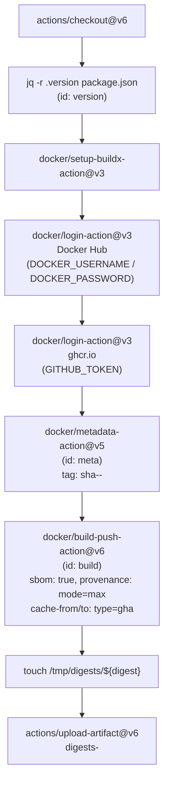
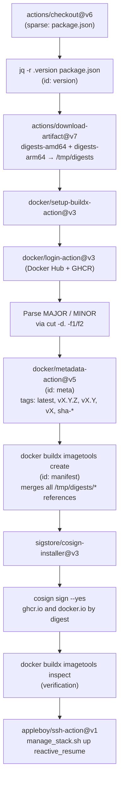

# Page: CI/CD Pipeline

# CI/CD Pipeline

<details>
<summary>Relevant source files</summary>

The following files were used as context for generating this wiki page:

- [.dockerignore](.dockerignore)
- [.github/workflows/docker-build.yml](.github/workflows/docker-build.yml)
- [Dockerfile](Dockerfile)
- [crowdin.yml](crowdin.yml)

</details>


## Purpose and Scope

This document covers the GitHub Actions workflows that automate multi-architecture Docker image builds, container registry publishing, image signing, and production deployments for Reactive Resume.

For Docker container configuration and orchestration, see page 5.1. For environment variables used during deployment, see page 5.3.

---

## Pipeline Overview

The CI/CD pipeline is implemented through GitHub Actions and consists of two primary workflows:

1. **Docker Build Workflow** - Builds, signs, and deploys multi-architecture container images
2. **Translation Sync** - Automates Crowdin translation imports (covered in [Translation Workflow](#4.1))

The Docker build workflow ([.github/workflows/docker-build.yml]()) follows a two-stage process: parallel architecture builds followed by manifest creation and signing.

### Workflow Job Graph

**Diagram: `docker-build.yml` — Jobs and Dependencies**

```mermaid
graph TB
    subgraph "docker-build.yml"
        Trigger["workflow_dispatch"]

        subgraph "job: build (matrix)"]
            AMD64["build\nplatform: linux/amd64\nrunner: ubuntu-latest"]
            ARM64["build\nplatform: linux/arm64\nrunner: ubuntu-24.04-arm"]
        end

        subgraph "job: merge"
            Merge["merge\nneeds: build\nrunner: ubuntu-latest"]
        end
    end

    subgraph "Artifacts"
        ArtAMD64["digests-amd64"]
        ArtARM64["digests-arm64"]
    end

    subgraph "Registries"
        GHCR["ghcr.io/$IMAGE"]
        DockerHub["docker.io/$IMAGE"]
    end

    Trigger --> AMD64
    Trigger --> ARM64
    AMD64 -- "upload-artifact" --> ArtAMD64
    ARM64 -- "upload-artifact" --> ArtARM64
    ArtAMD64 -- "download-artifact" --> Merge
    ArtARM64 -- "download-artifact" --> Merge
    AMD64 -- "push by digest" --> GHCR
    AMD64 -- "push by digest" --> DockerHub
    ARM64 -- "push by digest" --> GHCR
    ARM64 -- "push by digest" --> DockerHub
    Merge -- "imagetools create (manifest)" --> GHCR
    Merge -- "imagetools create (manifest)" --> DockerHub
    Merge -- "cosign sign" --> GHCR
    Merge -- "cosign sign" --> DockerHub
    Merge -- "appleboy/ssh-action: manage_stack.sh" --> Deploy["Production Server"]
```

Sources: [.github/workflows/docker-build.yml:1-215]()

---

## Workflow Trigger and Concurrency

The Docker build workflow is triggered exclusively via `workflow_dispatch` (manual dispatch), preventing unintended builds on every commit.

### Concurrency Control

Concurrency is controlled at [.github/workflows/docker-build.yml:6-8]():

```
group: ${{ github.workflow }}-${{ github.ref }}
cancel-in-progress: true
```

This cancels any in-progress build for the same branch when a new one starts, conserving CI minutes.

Sources: [.github/workflows/docker-build.yml:3-8]()

---

## Multi-Architecture Build Job

The `build` job executes in parallel across two architectures using a matrix strategy.

### Build Matrix Configuration

| Platform | Runner | Arch | Timeout |
|----------|--------|------|---------|
| `linux/amd64` | `ubuntu-latest` | `amd64` | 30 min |
| `linux/arm64` | `ubuntu-24.04-arm` | `arm64` | 30 min |

`fail-fast: false` ensures both architectures complete independently even if one fails.

Sources: [.github/workflows/docker-build.yml:13-27]()

### Build Job Step Sequence

**Diagram: `build` job steps — Actions and their roles**



Sources: [.github/workflows/docker-build.yml:35-96]()

### Key Build Details

**Version Extraction** — [.github/workflows/docker-build.yml:39-41]()

The version is read from `package.json` using `jq -r .version package.json`. This value is used for image tagging and annotations.

**Registry Authentication**

| Registry | Credential Source |
|----------|------------------|
| `ghcr.io` | `GITHUB_TOKEN` (built-in) |
| `docker.io` | `DOCKER_USERNAME` / `DOCKER_PASSWORD` secrets |

**`docker/build-push-action@v6` Options** — [.github/workflows/docker-build.yml:69-83]()

| Option | Value | Purpose |
|--------|-------|---------|
| `sbom` | `true` | Software Bill of Materials |
| `provenance` | `mode=max` | Full build attestation |
| `cache-from` | `type=gha,scope=$IMAGE-$arch` | Per-arch layer cache read |
| `cache-to` | `type=gha,mode=max,scope=$IMAGE-$arch` | Per-arch layer cache write |

During the build stage, images are pushed with architecture-specific SHA tags (`sha-<commit>-amd64`, `sha-<commit>-arm64`). They are referenced in the merge stage by digest.

### Digest Export and Upload

Each build step writes its digest to `/tmp/digests/` and uploads it as a GitHub Actions artifact (`digests-amd64` or `digests-arm64`). The digest (`sha256:...`) is the immutable identifier used to reference the architecture-specific image in the manifest merge step.

Sources: [.github/workflows/docker-build.yml:84-96]()

---

## Manifest Creation and Signing

The `merge` job (declared with `needs: build`) combines architecture-specific images into a multi-architecture manifest list and applies semantic versioning tags.

### Merge Job Step Sequence

**Diagram: `merge` job steps — Actions and their roles**



Sources: [.github/workflows/docker-build.yml:98-215]()

### Semantic Version Parsing

The version from `package.json` is split into `MAJOR` and `MINOR` components using `cut -d. -f1` and `cut -d. -f2`. This feeds the multi-tag strategy.

Sources: [.github/workflows/docker-build.yml:143-151]()

### Tag Strategy

`docker/metadata-action@v5` generates the following tags applied to both `ghcr.io/$IMAGE` and `docker.io/$IMAGE`:

| Tag | Example | Update Behavior |
|-----|---------|-----------------|
| `latest` | `latest` | Tracks newest release |
| `vX.Y.Z` | `v4.1.8` | Pinned to exact version |
| `vX.Y` | `v4.1` | Auto-updates on patch releases |
| `vX` | `v4` | Auto-updates on minor/patch releases |
| `sha-<commit>` | `sha-a1b2c3d` | Immutable git commit reference |

Sources: [.github/workflows/docker-build.yml:153-165]()

### Manifest List Creation

`docker buildx imagetools create` is used to combine architecture-specific images into a single multi-arch manifest. It reads tags from `$DOCKER_METADATA_OUTPUT_JSON` (emitted by `docker/metadata-action`), adds OCI-compliant annotations (license, title, source URL, version), and references all digest files in `/tmp/digests/` for both registries.

See: [.github/workflows/docker-build.yml:167-189]()

### Digest Extraction for Signing

After manifest creation, `docker buildx imagetools inspect` retrieves the digest of the multi-architecture manifest index (not the individual per-arch images). These digests are stored as step outputs (`steps.manifest.outputs.ghcr_digest` and `steps.manifest.outputs.docker_digest`) and passed directly to Cosign.

Sources: [.github/workflows/docker-build.yml:186-189]()

---

## Image Signing with Cosign

`sigstore/cosign-installer@v3` installs Cosign, which signs both the GHCR and Docker Hub multi-arch manifests using keyless signing.

### Signing Details

`cosign sign --yes` is invoked with the manifest digest (not a tag), targeting both registries:

- `ghcr.io/$IMAGE@$steps.manifest.outputs.ghcr_digest`
- `docker.io/$IMAGE@$steps.manifest.outputs.docker_digest`

The `--yes` flag performs keyless signing using the GitHub Actions OIDC token (enabled by the `id-token: write` permission). The signature is stored in the registry alongside the image and is recorded in the Sigstore Rekor transparency log.

**Verification** — Users can verify the signature with:

```
cosign verify ghcr.io/<image>:latest \
  --certificate-identity-regexp="https://github.com/amruthpillai/reactive-resume/.*" \
  --certificate-oidc-issuer="https://token.actions.githubusercontent.com"
```

Sources: [.github/workflows/docker-build.yml:191-200]()

---

## SSH Deployment

After image signing, `appleboy/ssh-action@v1` connects to the production server and runs a deployment script.

The remote script executed is:

```
cd docker
./manage_stack.sh up reactive_resume
```

`manage_stack.sh` is a server-side script (not tracked in this repository) that pulls the latest images and recreates the stack.

**Required GitHub Secrets:**

| Secret | Purpose |
|--------|---------|
| `SSH_KEY` | Private key for authentication |
| `SSH_HOST` | Production server hostname or IP |
| `SSH_USER` | SSH username |

Sources: [.github/workflows/docker-build.yml:207-215]()

---

## Translation Automation

The `crowdin.yml` configuration file controls Crowdin's automated translation sync behavior.

### Crowdin Configuration Summary

| Setting | Value | Effect |
|---------|-------|--------|
| `preserve_hierarchy` | `true` | Preserves source directory structure |
| `commit_message` | `[ci skip]` | Prevents CI from running on translation commits |
| `pull_request_title` | `Sync Translations from Crowdin` | Title for auto-generated PRs |
| `pull_request_labels` | `["l10n"]` | Tag for filtering localization PRs |
| `pull_request_reviewers` | `["amruthpillai"]` | Auto-assigned reviewer |
| Source file | `/locales/en-US.po` | Canonical English source |
| Translation pattern | `/locales/%locale%.%file_extension%` | Output path per locale |

Sources: [crowdin.yml:1-11]()

For the full translation pipeline, see page 4.1.

---

## Permissions and Security

Both the `build` and `merge` jobs declare identical fine-grained permissions.

### Job Permissions

| Permission | Purpose |
|------------|---------|
| `contents: read` | Checkout source code |
| `packages: write` | Push images to `ghcr.io` |
| `id-token: write` | Issue OIDC token for keyless `cosign sign` |
| `attestations: write` | Attach SBOM and provenance attestations |

`id-token: write` is the critical permission enabling keyless Cosign signing via GitHub's OIDC provider — no long-lived signing keys are required.

Sources: [.github/workflows/docker-build.yml:29-34](), [.github/workflows/docker-build.yml:103-107]()

---

## Caching Strategy

The `build` job uses `type=gha` (GitHub Actions cache) for Docker layer caching, configured in `docker/build-push-action@v6`:

| Parameter | Value | Effect |
|-----------|-------|--------|
| `cache-from` | `type=gha,scope=$IMAGE-$arch` | Reads cached layers per arch |
| `cache-to` | `type=gha,mode=max,scope=$IMAGE-$arch` | Writes all intermediate layers |

Each architecture uses a distinct cache scope (`$IMAGE-amd64`, `$IMAGE-arm64`) to prevent cache collisions. `mode=max` stores all intermediate layers, not just the final image, maximizing layer reuse across builds.

Sources: [.github/workflows/docker-build.yml:81-82]()

---

## Summary

The CI/CD pipeline implements a robust, secure, and efficient build and deployment process:

| Feature | Implementation |
|---------|----------------|
| Multi-Architecture | Parallel builds for amd64 and arm64 |
| Container Registries | GHCR and Docker Hub with same tags |
| Versioning | Semantic versioning with multiple tag patterns |
| Security | Cosign keyless signing with OIDC |
| Transparency | SBOM and provenance attestations |
| Deployment | Automated SSH deployment after signing |
| Translations | Crowdin auto-PR with `[ci skip]` |
| Caching | Per-architecture GitHub Actions cache |

The two-stage build process (individual builds + manifest merge) ensures efficient resource usage while maintaining full compatibility across architectures.

**Sources:** [.github/workflows/docker-build.yml:1-215](), [crowdin.yml:1-11]()

---

