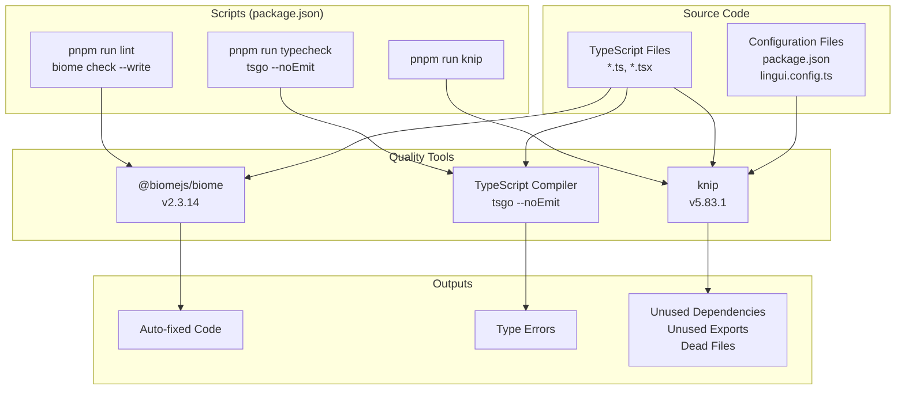
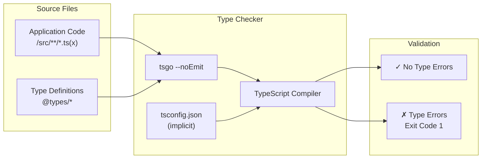
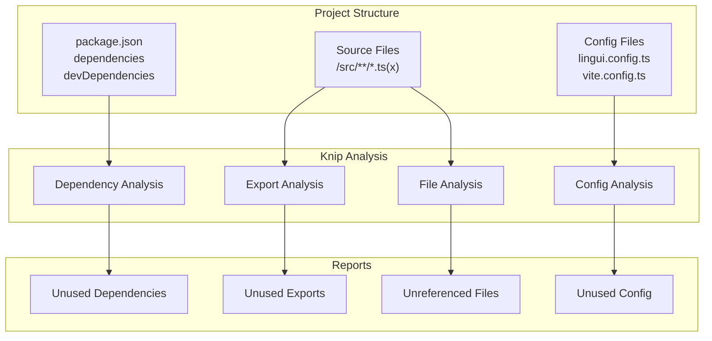
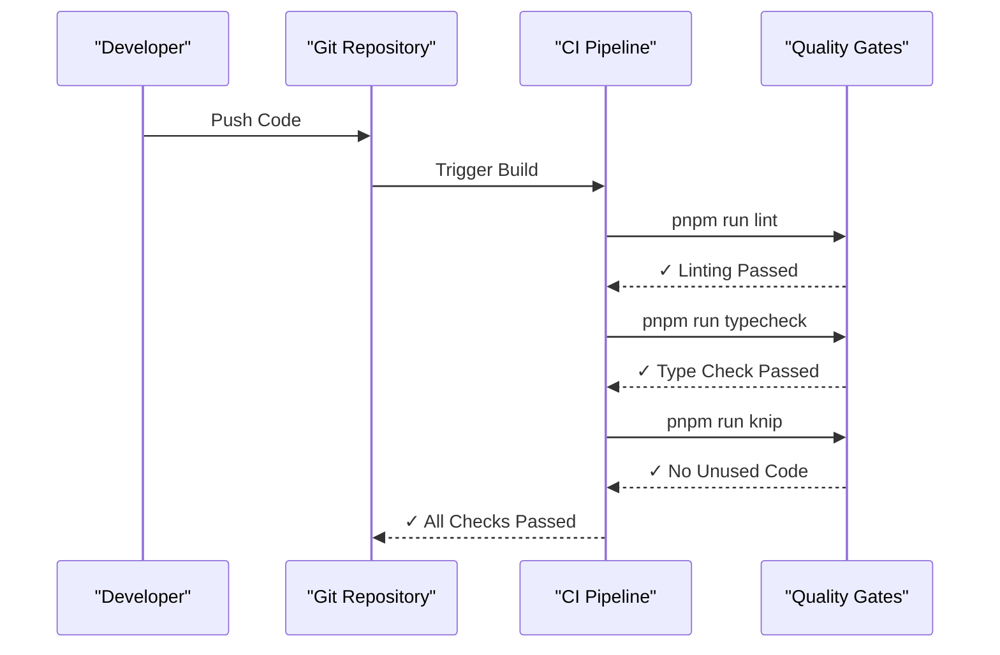

# Page: Code Quality

# Code Quality

<details>
<summary>Relevant source files</summary>

The following files were used as context for generating this wiki page:

- [.env.example](.env.example)
- [.gitignore](.gitignore)
- [.vscode/settings.json](.vscode/settings.json)
- [docs/changelog/index.mdx](docs/changelog/index.mdx)
- [docs/guides/setting-up-passkeys.mdx](docs/guides/setting-up-passkeys.mdx)
- [docs/spec.json](docs/spec.json)
- [knip.json](knip.json)
- [lingui.config.ts](lingui.config.ts)
- [package.json](package.json)
- [pnpm-lock.yaml](pnpm-lock.yaml)
- [scripts/fonts/generate.ts](scripts/fonts/generate.ts)
- [scripts/fonts/types.ts](scripts/fonts/types.ts)
- [src/components/resume/preview.module.css](src/components/resume/preview.module.css)
- [src/components/typography/combobox.tsx](src/components/typography/combobox.tsx)
- [src/components/typography/webfontlist.json](src/components/typography/webfontlist.json)
- [src/integrations/auth/client.ts](src/integrations/auth/client.ts)
- [src/integrations/auth/config.ts](src/integrations/auth/config.ts)
- [src/routes/auth/-components/social-auth.tsx](src/routes/auth/-components/social-auth.tsx)
- [src/routes/auth/login.tsx](src/routes/auth/login.tsx)
- [src/routes/auth/register.tsx](src/routes/auth/register.tsx)
- [src/routes/builder/$resumeId/-sidebar/right/sections/typography.tsx](src/routes/builder/$resumeId/-sidebar/right/sections/typography.tsx)
- [src/routes/dashboard/settings/authentication/-components/hooks.tsx](src/routes/dashboard/settings/authentication/-components/hooks.tsx)
- [vite.config.ts](vite.config.ts)

</details>


This document covers the code quality tools and practices used in Reactive Resume, including linting, formatting, type checking, and unused code detection. These tools ensure consistency, catch errors early, and maintain a clean codebase. For information about the build system and compilation process, see [Build System](#6.2). For dependency management strategies, see [Dependencies](#6.3).

## Purpose and Scope

Reactive Resume uses three primary tools to enforce code quality:

1. **Biome** - Unified linting and formatting tool that replaces ESLint and Prettier
2. **TypeScript** - Static type checking with strict mode enabled
3. **Knip** - Detection of unused dependencies, exports, files, and other dead code

These tools are integrated into the development workflow through npm scripts and can be executed locally or as part of CI/CD pipelines.

## Code Quality Toolchain

The following diagram shows the complete code quality toolchain and how each tool operates on the codebase:



**Sources:** [package.json:117-142](), [package.json:17-32]()

## Biome: Linting and Formatting

Biome is a fast, unified toolchain for JavaScript/TypeScript that combines linting and formatting capabilities. It replaces the traditional ESLint + Prettier stack with a single tool.

### Configuration

Biome is installed as a dev dependency at version `^2.3.14`:

```
@biomejs/biome: ^2.3.14
```

### Usage

The lint script executes Biome with auto-fix enabled:

```bash
pnpm run lint
```

This runs `biome check --write`, which:
- Checks code for linting issues
- Formats code according to Biome's style rules
- Automatically fixes issues where possible
- Writes changes directly to files (due to `--write` flag)

### Capabilities

| Feature | Description |
|---------|-------------|
| **Linting** | Detects code issues, unused variables, potential bugs |
| **Formatting** | Enforces consistent code style (indentation, semicolons, etc.) |
| **Auto-fix** | Automatically corrects fixable issues |
| **Performance** | Significantly faster than ESLint/Prettier combination |
| **Zero Config** | Works out-of-box with sensible defaults |

**Sources:** [package.json:261-263](), [package.json:29]()

## TypeScript: Type Checking

TypeScript provides static type analysis to catch type errors before runtime. The project uses TypeScript with a custom type checker wrapper called `tsgo`.

### Type Checking Script

```bash
pnpm run typecheck
```

This executes `tsgo --noEmit`, which:
- Runs TypeScript compiler in type-checking mode
- Does not emit JavaScript output (`--noEmit`)
- Reports type errors to the console
- Exits with non-zero code if errors are found

### TypeScript Configuration Flow



### TypeScript Ecosystem Integration

The project uses comprehensive TypeScript support across all major libraries:

| Package | Version | Purpose |
|---------|---------|---------|
| `@types/node` | ^25.2.2 | Node.js type definitions |
| `@types/react` | ^19.2.13 | React type definitions |
| `@types/react-dom` | ^19.2.3 | React DOM type definitions |
| `@types/bcrypt` | ^6.0.0 | Bcrypt type definitions |
| `@types/pg` | ^8.16.0 | PostgreSQL client type definitions |
| `@types/nodemailer` | ^7.0.9 | Nodemailer type definitions |
| `@types/js-cookie` | ^3.0.6 | JS Cookie type definitions |

The TypeScript preview build is also included for testing future TypeScript features:

```
@typescript/native-preview: 7.0.0-dev.20260209.1
```

**Sources:** [package.json:282-296](), [package.json:31](), [pnpm-lock.yaml:297-300]()

## Knip: Unused Code Detection

Knip is a comprehensive tool for finding unused files, dependencies, and exports in TypeScript projects. It helps maintain a clean dependency graph and identifies dead code.

### Knip Execution

```bash
pnpm run knip
```

This command analyzes the project and reports:
- Unused npm dependencies
- Unused devDependencies
- Unused exports from modules
- Unreferenced files
- Unused configuration entries

### Knip Configuration

Knip is installed at version `^5.83.1`:

```
knip: ^5.83.1
```

### What Knip Analyzes



### Integration with Monorepo

Knip works across the entire project, analyzing dependencies listed in `package.json` and tracing their usage through import/export statements. This is particularly valuable given the large dependency list (100+ production dependencies).

**Sources:** [package.json:309-311](), [package.json:27](), [package.json:33-115]()

## Development Workflow Integration

The code quality tools integrate into the development workflow at multiple stages:

### Local Development

Developers can run quality checks locally before committing:

```bash
# Format and lint code with auto-fix
pnpm run lint

# Check TypeScript types
pnpm run typecheck

# Find unused dependencies and exports
pnpm run knip
```

### Pre-commit Checks

While not explicitly shown in the configuration files, these scripts are typically integrated into:
- Git pre-commit hooks (via Husky or similar)
- IDE/editor integrations (VSCode, Cursor)
- Developer workflows

### CI/CD Integration

These same scripts can be executed in CI/CD pipelines (see [CI/CD Pipeline](#5.4)) to enforce quality gates:



**Sources:** [package.json:17-32]()

## Tool-Specific Features

### Biome Features

Biome provides several advantages over traditional tooling:

- **Single Tool**: Replaces ESLint + Prettier with one dependency
- **Performance**: Written in Rust, significantly faster than JavaScript-based tools
- **Compatibility**: Mostly compatible with ESLint and Prettier configurations
- **Incremental**: Only checks changed files by default
- **IDE Support**: Extensions available for major editors

### TypeScript Compiler Features

The TypeScript compiler in `--noEmit` mode:

- Validates type correctness across the entire codebase
- Checks React component prop types
- Validates API contracts (ORPC types, Zod schemas)
- Ensures database schema types (Drizzle ORM)
- Catches null/undefined errors
- Verifies generic type constraints

### Knip Detection Capabilities

Knip can detect various types of unused code:

| Category | Detection |
|----------|-----------|
| **Dependencies** | Packages in package.json not imported anywhere |
| **Dev Dependencies** | Build tools not referenced in scripts or configs |
| **Exports** | Functions/classes exported but never imported |
| **Files** | TypeScript files not reached from entry points |
| **Types** | Type definitions that are never used |
| **Config Values** | Configuration options that don't affect behavior |

**Sources:** [package.json:117-142](), [package.json:261-263](), [package.json:309-311]()

## Package Manager Configuration

The project uses pnpm with specific configuration for handling dependencies:

```json
"pnpm": {
  "overrides": {
    "vite": "^8.0.0-beta.13"
  },
  "onlyBuiltDependencies": [
    "@prisma/engines",
    "bcrypt",
    "esbuild",
    "msw",
    "prisma",
    "sharp"
  ]
}
```

This configuration:
- Forces specific versions of dependencies via overrides
- Controls which dependencies should be built from source
- Ensures reproducible builds across environments

The `pnpm-lock.yaml` file locks all transitive dependencies to exact versions, ensuring that `pnpm install --frozen-lockfile` always produces identical results.

**Sources:** [package.json:143-155](), [Dockerfile:15-16]()

## Quality Metrics

The codebase maintains quality through:

1. **Zero Runtime Type Errors**: TypeScript strict mode catches type issues at compile time
2. **Consistent Code Style**: Biome enforces uniform formatting across all files
3. **No Dead Code**: Knip identifies unused dependencies and exports for removal
4. **Fast Feedback**: All tools run in seconds, enabling rapid iteration
5. **IDE Integration**: Tools work with VSCode, Cursor, and other editors for real-time feedback

### Dependency Quality

The project explicitly pins certain dependencies that require native compilation to ensure compatibility:

```
onlyBuiltDependencies: [
  "@prisma/engines",  // Database ORM engine
  "bcrypt",           // Password hashing
  "esbuild",          // JavaScript bundler
  "msw",              // Mock Service Worker
  "prisma",           // Database toolkit
  "sharp"             // Image processing
]
```

This prevents issues with pre-built binaries that may not match the target platform.

**Sources:** [package.json:147-154](), [pnpm-lock.yaml:1-9]()

---

