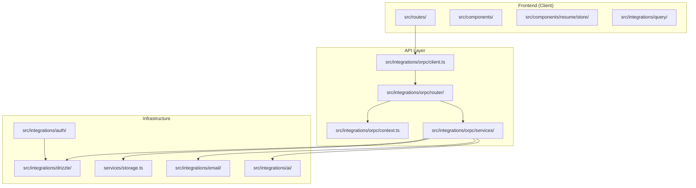
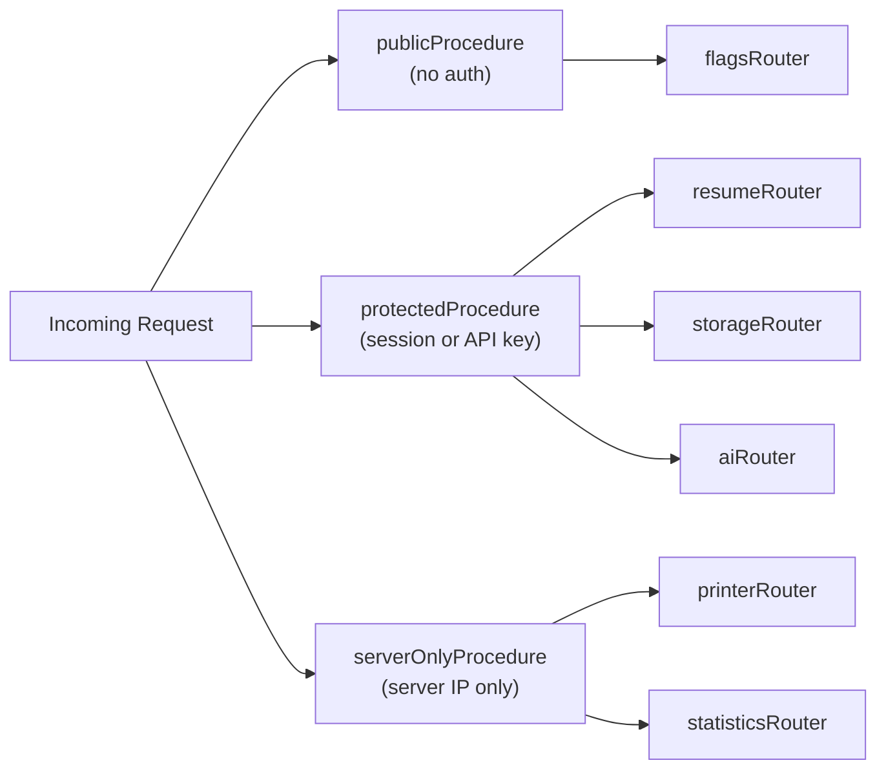
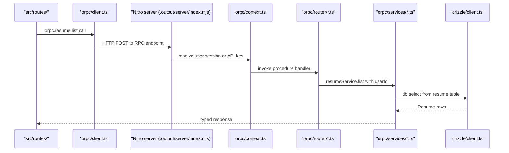

# Page: Core Application

# Core Application

<details>
<summary>Relevant source files</summary>

The following files were used as context for generating this wiki page:

- [.env.example](.env.example)
- [CLAUDE.md](CLAUDE.md)
- [README.md](README.md)
- [compose.dev.yml](compose.dev.yml)
- [compose.yml](compose.yml)
- [docs/contributing/development.mdx](docs/contributing/development.mdx)
- [docs/getting-started/quickstart.mdx](docs/getting-started/quickstart.mdx)
- [docs/self-hosting/docker.mdx](docs/self-hosting/docker.mdx)
- [docs/self-hosting/examples.mdx](docs/self-hosting/examples.mdx)
- [package.json](package.json)
- [pnpm-lock.yaml](pnpm-lock.yaml)
- [src/integrations/orpc/router/storage.ts](src/integrations/orpc/router/storage.ts)
- [src/integrations/orpc/services/storage.ts](src/integrations/orpc/services/storage.ts)
- [src/routes/__root.tsx](src/routes/__root.tsx)
- [src/routes/api/health.ts](src/routes/api/health.ts)
- [src/utils/env.ts](src/utils/env.ts)
- [src/vite-env.d.ts](src/vite-env.d.ts)

</details>


This page describes the major code layers of Reactive Resume and how they are organized within the repository. Each subsystem covered here is documented in depth in a dedicated child page.

- Frontend routing, React components, and client state: see [Frontend Architecture](#2.1)
- Backend service modules (resume, printer, storage, AI): see [Backend Services](#2.2)
- Database schema, Drizzle ORM, and migrations: see [Data Layer](#2.3)
- ORPC routers, procedures, and Zod validation: see [API Design](#2.4)

---

## Tech Stack Summary

| Layer | Technology | Notes |
|-------|-----------|-------|
| Frontend framework | TanStack Start + React 19 + Vite 8 | SSR-capable, file-based routing |
| Server runtime | Nitro | HTTP server, plugin system |
| API layer | ORPC (`@orpc/server`, `@orpc/client`) | Type-safe RPC, Zod schemas |
| Database | PostgreSQL + Drizzle ORM | Schema in `src/integrations/drizzle/schema.ts` |
| Auth | Better Auth (`better-auth`) | Sessions, OAuth, 2FA, passkeys, API keys |
| UI | Radix UI + Tailwind CSS v4 + shadcn | Zinc color base, Phosphor Icons |
| Client state | Zustand + Immer + Zundo | Resume editor store with undo/redo |
| Server state | TanStack Query + ORPC adapter | Cache and data fetching |
| i18n | Lingui + Crowdin | 58 locales, compiled `.po` files |

Sources: [package.json:33-115](), [CLAUDE.md:1-10]()

---

## Codebase Layout

The entire application lives in a single repository. Frontend and backend code co-exist under `src/`, with Nitro bundling the server at build time into `.output/server/index.mjs`.

```
reactive-resume/
├── src/
│   ├── routes/                  # TanStack Router file-based routes
│   ├── components/
│   │   ├── ui/                  # shadcn components (Radix UI + Phosphor Icons)
│   │   └── resume/              # Resume builder, templates, store (Zustand)
│   ├── dialogs/                 # Modal dialog components
│   ├── hooks/                   # Custom React hooks
│   ├── integrations/
│   │   ├── auth/                # Better Auth config and session helpers
│   │   ├── drizzle/             # Drizzle ORM client and schema
│   │   ├── orpc/
│   │   │   ├── context.ts       # publicProcedure, protectedProcedure, serverOnlyProcedure
│   │   │   ├── router/          # ORPC server routers (resume, printer, storage, ai, flags)
│   │   │   ├── services/        # Business logic (resumeService, printerService, storage.ts)
│   │   │   ├── dto/             # Shared input/output types
│   │   │   └── client.ts        # Client-side ORPC proxy (orpc, client)
│   │   ├── query/               # TanStack Query client setup
│   │   ├── ai/                  # AI provider adapters (OpenAI, Gemini, Anthropic, Ollama)
│   │   ├── email/               # Nodemailer wrapper
│   │   └── import/              # Resume file parsers (PDF, DOCX)
│   ├── schema/                  # Zod schemas (ResumeData, sections, metadata)
│   ├── utils/                   # Shared utilities (env.ts, locale.ts, theme.ts)
│   └── styles/                  # Global CSS
├── plugins/                     # Nitro server plugins (1.migrate.ts auto-runs migrations)
├── migrations/                  # Drizzle-generated SQL migration files
├── locales/                     # Lingui .po translation files (58 locales)
├── public/                      # Static assets (template thumbnails, icons)
└── data/                        # Runtime local file storage (dev + S3 fallback)
```

Sources: [CLAUDE.md:57-73](), [docs/contributing/development.mdx:155-185]()

---

## Application Layers

The codebase is divided into three logical tiers. The diagram below maps each concept to its actual file location.

**Diagram: Architectural layers mapped to source paths**



Sources: [CLAUDE.md:57-145](), [src/integrations/orpc/services/storage.ts:113-323](), [src/integrations/orpc/router/storage.ts:1-91]()

---

## The `src/integrations/` Directory

This directory is the boundary between the application core and all external systems. Each sub-folder owns its configuration and client initialization.

| Sub-directory | External system | Key exports |
|---------------|----------------|-------------|
| `auth/` | Better Auth | `auth`, `getSession`, `authClient` |
| `drizzle/` | PostgreSQL | `db`, `schema` |
| `orpc/context.ts` | — (procedure factories) | `publicProcedure`, `protectedProcedure`, `serverOnlyProcedure` |
| `orpc/router/` | — (route definitions) | `resumeRouter`, `printerRouter`, `storageRouter`, `aiRouter` |
| `orpc/services/` | — (business logic) | `resumeService`, `printerService`, `getStorageService()` |
| `orpc/client.ts` | ORPC server | `client`, `orpc` |
| `query/` | TanStack Query | `queryClient` |
| `ai/` | OpenAI / Gemini / Anthropic / Ollama | Provider instances |
| `email/` | SMTP (Nodemailer) | `sendEmail` |
| `import/` | PDF, DOCX parsers | Import handlers |

Sources: [CLAUDE.md:73-83](), [src/integrations/orpc/services/storage.ts:308-323]()

---

## ORPC Procedure Types

Every API endpoint is defined using one of three procedure factories created in `src/integrations/orpc/context.ts`. The factory chosen determines what authentication is required before the handler runs.

**Diagram: Procedure types and their router assignments**



Procedures follow a builder pattern (as documented in `CLAUDE.md`):

```
protectedProcedure
  .route({ method: "GET", path: "/resumes/{id}", tags: [...] })
  .input(zodSchema)
  .output(zodSchema)
  .handler(async ({ context, input }) => { ... })
```

The `context` object in each handler provides the resolved user session (or API key identity) and is constructed by the procedure factory before the handler is called.

Sources: [CLAUDE.md:84-98](), [src/integrations/orpc/router/storage.ts:14-91]()

---

## Request Lifecycle

**Diagram: End-to-end request flow with file path annotations**



On the server, TanStack Start routes can also define `server.handlers` (GET, POST, etc.) directly for non-ORPC endpoints like `/api/health`. See [src/routes/api/health.ts:80-87]() for an example.

Sources: [CLAUDE.md:84-100](), [src/routes/__root.tsx:88-97](), [src/routes/api/health.ts:80-87]()

---

## Server Startup and Plugins

The Nitro server executes files in the `plugins/` directory before accepting requests. The primary plugin is `plugins/1.migrate.ts`, which applies all pending Drizzle database migrations on every start. This means no manual migration step is needed in production containers.

| Script | Command |
|--------|---------|
| Development server | `pnpm dev` (via `vite dev`) |
| Production build | `pnpm build` (via `vite build`) |
| Production start | `pnpm start` → `node .output/server/index.mjs` |
| Generate migrations | `pnpm db:generate` (drizzle-kit) |
| Apply migrations | `pnpm db:migrate` (drizzle-kit) |

Sources: [CLAUDE.md:52-53](), [CLAUDE.md:185-190](), [package.json:17-32]()

---

## Environment Validation

All environment variables are declared and validated at server startup in `src/utils/env.ts` using `@t3-oss/env-core` with Zod schemas. The exported `env` object is the single source of truth for configuration throughout the server.

| Variable | Required | Purpose |
|----------|----------|---------|
| `APP_URL` | Yes | Canonical public URL; used in auth flows and storage URL construction |
| `DATABASE_URL` | Yes | PostgreSQL connection string |
| `AUTH_SECRET` | Yes | Better Auth signing secret |
| `PRINTER_ENDPOINT` | Yes | WebSocket or HTTP endpoint to the Chromium printer sidecar |
| `PRINTER_APP_URL` | No | Internal URL override for the printer to reach the app (Docker setups) |
| `S3_ACCESS_KEY_ID`, `S3_SECRET_ACCESS_KEY`, `S3_BUCKET` | No | Activates `S3StorageService`; absent values fall back to `LocalStorageService` |
| `SMTP_HOST` | No | Email delivery; absent falls back to console logging |
| `FLAG_DISABLE_SIGNUPS` | No | Block new account creation |
| `FLAG_DISABLE_EMAIL_AUTH` | No | Force SSO-only login |
| `FLAG_DISABLE_IMAGE_PROCESSING` | No | Skip `sharp` image resizing on upload |
| `FLAG_DEBUG_PRINTER` | No | Bypass server-only check on the printer route |

Sources: [src/utils/env.ts:1-72](), [.env.example:1-78]()

---

## Health Check Endpoint

The `/api/health` route at [src/routes/api/health.ts:1-87]() is a server-only GET handler. It probes three subsystems in parallel and aggregates the results into a single JSON response.

| Check | Implementation |
|-------|---------------|
| `database` | Executes `sql\`SELECT 1\`` via the Drizzle `db` client |
| `printer` | Calls `printerService.healthcheck()` |
| `storage` | Calls `getStorageService().healthcheck()` |

HTTP 200 is returned when all checks pass; HTTP 500 if any check reports `status: "unhealthy"`. The Docker Compose configuration uses this endpoint as the container health probe (see [compose.yml:107]()).

Sources: [src/routes/api/health.ts:1-87](), [compose.yml:99-111]()

---

