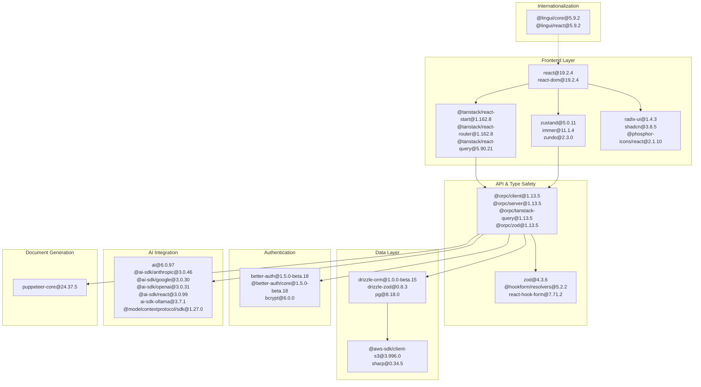
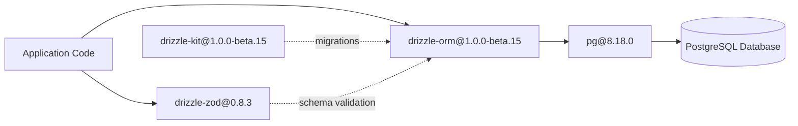
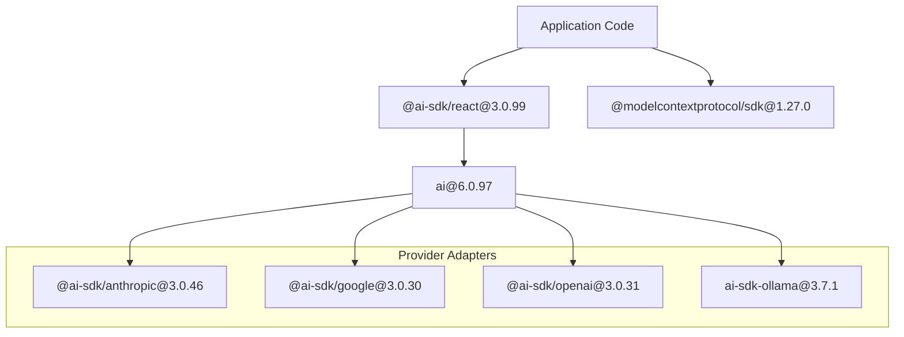
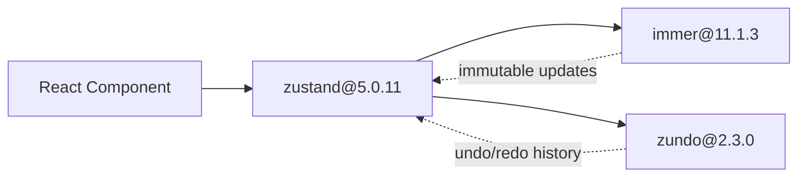

# Page: Dependencies

# Dependencies

<details>
<summary>Relevant source files</summary>

The following files were used as context for generating this wiki page:

- [.env.example](.env.example)
- [README.md](README.md)
- [package.json](package.json)
- [pnpm-lock.yaml](pnpm-lock.yaml)

</details>


This page documents the dependency structure and management for Reactive Resume, including the package manager configuration, core library selections, dependency categories, and version management strategies. For information about the build system and how dependencies are compiled, see [Build System](#6.2). For development environment setup including service dependencies, see [Development Setup](#6.1).

## Package Manager

Reactive Resume uses **pnpm** (Performant NPM) as its package manager, specified in [package.json:7](). The exact version is pinned using the `packageManager` field:

```json
"packageManager": "pnpm@10.30.2+sha512.36cdc707..."
```

This enables Corepack, ensuring all developers and CI environments use the identical pnpm version. The project uses pnpm's workspace features, though configured as a single-package monorepo.

**Sources:** [package.json:1-156](), [Dockerfile:6-23]()

## Dependency Architecture

The following diagram shows the major dependency categories and their relationships within the application:



**Sources:** [package.json:33-116]()

## Core Dependencies by Category

### Frontend Framework & Routing

| Package | Version | Purpose |
|---------|---------|---------|
| `react` | 19.2.4 | Core UI library |
| `react-dom` | 19.2.4 | DOM rendering |
| `@tanstack/react-start` | 1.162.8 | SSR framework with Vite integration |
| `@tanstack/react-router` | 1.162.8 | Type-safe routing |
| `@tanstack/react-router-ssr-query` | 1.162.8 | SSR + TanStack Query integration |
| `@tanstack/react-query` | 5.90.21 | Server state management and caching |
| `@tanstack/zod-adapter` | 1.162.8 | Zod adapter for TanStack Router search params |

The application uses React 19's latest features with TanStack Start providing server-side rendering capabilities. TanStack Router provides file-based routing with full type safety, while TanStack Query handles API state synchronization.

**Sources:** [package.json:94-101]()

### API & Type Safety

| Package | Version | Purpose |
|---------|---------|---------|
| `@orpc/client` | 1.13.5 | Type-safe RPC client |
| `@orpc/server` | 1.13.5 | Type-safe RPC server |
| `@orpc/tanstack-query` | 1.13.5 | TanStack Query integration |
| `@orpc/zod` | 1.13.5 | Zod schema integration |
| `@orpc/json-schema` | 1.13.5 | JSON Schema generation |
| `@orpc/openapi` | 1.13.5 | OpenAPI spec generation |
| `zod` | 4.3.6 | Runtime type validation |

ORPC provides end-to-end type safety between client and server, eliminating the need for manual API type definitions. All API calls are validated using Zod schemas at runtime.

**Sources:** [package.json:48-53](), [package.json:112]()

### Database & ORM



| Package | Version | Purpose |
|---------|---------|---------|
| `drizzle-orm` | 1.0.0-beta.15 | TypeScript ORM |
| `drizzle-zod` | 0.8.3 | Generate Zod schemas from Drizzle schemas |
| `drizzle-kit` | 1.0.0-beta.15 (dev) | Migration generation and management |
| `pg` | 8.18.0 | PostgreSQL client |

Drizzle ORM provides type-safe database queries with a lightweight footprint. The `drizzle-zod` integration generates Zod schemas from database schemas, ensuring consistency between database structure and validation rules.

**Sources:** [package.json:77-78](), [package.json:90](), [package.json:133]()

### Authentication

| Package | Version | Purpose |
|---------|---------|---------|
| `better-auth` | 1.5.0-beta.18 | Authentication framework |
| `@better-auth/core` | 1.5.0-beta.18 | Core auth utilities |
| `bcrypt` | 6.0.0 | Password hashing |
| `js-cookie` | 3.0.5 | Cookie management |
| `qrcode.react` | 4.2.0 | QR code generation for 2FA |
| `input-otp` | 1.4.2 | OTP input component |

Better Auth provides email/password authentication, social OAuth (Google, GitHub), custom OAuth providers, two-factor authentication (TOTP), passkeys (WebAuthn), and API key authentication.

**Sources:** [package.json:39](), [package.json:72](), [package.json:71](), [package.json:85-86](), [package.json:92]()

### AI Integration



The Vercel AI SDK (`ai`) provides a unified interface for multiple AI providers. Provider-specific adapters enable runtime selection between Anthropic Claude, Google Gemini, OpenAI GPT, and local Ollama models. The Model Context Protocol SDK enables external AI tools to interact with resumes programmatically.

**Sources:** [package.json:34-37](), [package.json:69-70](), [package.json:79]()

### Document Generation

| Package | Version | Purpose |
|---------|---------|---------|
| `puppeteer-core` | 24.37.2 | Headless Chrome control |
| `sharp` | 0.34.5 | Image processing |
| `dompurify` | 3.3.1 | HTML sanitization |

Puppeteer Core provides PDF and screenshot generation by controlling a headless Chrome instance. Sharp handles image processing and optimization. DOMPurify sanitizes HTML content before rendering.

**Sources:** [package.json:91](), [package.json:102](), [package.json:76]()

### State Management



| Package | Version | Purpose |
|---------|---------|---------|
| `zustand` | 5.0.11 | Lightweight state management |
| `immer` | 11.1.4 | Immutable state updates |
| `zundo` | 2.3.0 | Undo/redo middleware for Zustand |

Zustand manages local application state with a simple, hooks-based API. Immer enables writing mutative code that produces immutable updates. Zundo adds undo/redo functionality with 100-state history tracking.

**Sources:** [package.json:115](), [package.json:84](), [package.json:114]()

### Internationalization

| Package | Version | Purpose |
|---------|---------|---------|
| `@lingui/core` | 5.9.2 | i18n runtime |
| `@lingui/react` | 5.9.2 | React integration |
| `@lingui/cli` | 5.9.2 (dev) | Translation extraction |
| `@lingui/vite-plugin` | 5.9.2 (dev) | Vite build integration |
| `@lingui/babel-plugin-lingui-macro` | 5.9.2 (dev) | Macro transformation |

Lingui provides ICU MessageFormat-based internationalization with support for 58+ languages. The CLI extracts translatable strings, while the Vite plugin compiles translations at build time.

**Sources:** [package.json:45-46](), [package.json:118-121]()

### UI Components & Styling

| Package | Version | Purpose |
|---------|---------|---------|
| `radix-ui` | 1.4.3 | Unstyled accessible components |
| `shadcn` | 3.8.5 | Component CLI |
| `tailwindcss` | 4.2.1 | Utility-first CSS |
| `tailwind-merge` | 3.5.0 | Merge Tailwind classes |
| `class-variance-authority` | 0.7.1 | Variant management |
| `@phosphor-icons/react` | 2.1.10 | Icon library |
| `motion` | 12.34.3 | Animation library |

The UI layer combines Radix UI primitives with Tailwind CSS styling. Shadcn provides a component system built on these foundations. Class Variance Authority manages component variants systematically.

**Sources:** [package.json:93](), [package.json:101](), [package.json:105](), [package.json:104](), [package.json:73](), [package.json:54](), [package.json:88]()

### Rich Text Editing

| Package | Version | Purpose |
|---------|---------|---------|
| `@tiptap/react` | 3.20.0 | React integration |
| `@tiptap/starter-kit` | 3.20.0 | Core editor functionality |
| `@tiptap/extension-highlight` | 3.20.0 | Text highlighting |
| `@tiptap/extension-table` | 3.20.0 | Table support |
| `@tiptap/extension-text-align` | 3.20.0 | Text alignment |
| `@tiptap/pm` | 3.20.0 | ProseMirror core |

TipTap provides a customizable rich text editor built on ProseMirror, used for resume content editing.

**Sources:** [package.json:63-68]()

### Additional Libraries

| Package | Version | Purpose |
|---------|---------|---------|
| `@dnd-kit/core` | 6.3.1 | Drag and drop core |
| `@dnd-kit/sortable` | 10.0.0 | Sortable lists |
| `fast-json-patch` | 3.1.1 | JSON Patch (RFC 6902) |
| `@sindresorhus/slugify` | 3.0.0 | URL-safe string generation |
| `fuse.js` | 7.1.0 | Fuzzy search |
| `cmdk` | 1.1.1 | Command palette |
| `sonner` | 2.0.7 | Toast notifications |
| `monaco-editor` | 0.55.1 | Code editor |
| `@monaco-editor/react` | 4.8.0-rc.3 | Monaco React wrapper |

**Sources:** [package.json:40-42](), [package.json:82](), [package.json:56](), [package.json:83](), [package.json:75](), [package.json:103](), [package.json:87](), [package.json:47]()

## Dependency Management

### Lockfile and Installation

The [pnpm-lock.yaml:1-9]() lockfile ensures deterministic installations across all environments. Key configuration:

```yaml
lockfileVersion: '9.0'
settings:
  autoInstallPeers: true
  excludeLinksFromLockfile: false
overrides:
  vite: ^8.0.0-beta.15
```

The `autoInstallPeers` setting automatically installs peer dependencies, simplifying dependency management. The override section forces Vite to use a specific beta version across all packages.

**Sources:** [pnpm-lock.yaml:1-9]()

### Version Overrides

The [package.json:142-145]() `pnpm.overrides` section forces specific versions:

```json
"pnpm": {
  "overrides": {
    "vite": "^8.0.0-beta.15"
  }
}
```

This ensures all packages use Vite 8.0 beta, even if their own `package.json` specifies an older version.

**Sources:** [package.json:142-145]()

### Native Module Dependencies

The [package.json:147-155]() `onlyBuiltDependencies` configuration specifies packages requiring native compilation:

```json
"onlyBuiltDependencies": [
  "@prisma/engines",
  "bcrypt",
  "esbuild",
  "msw",
  "prisma",
  "sharp"
]
```

This optimization tells pnpm to only build native modules for these packages, reducing installation time.

**Sources:** [package.json:147-155]()

## Production vs Development Dependencies

### Development-Only Dependencies

| Package | Version | Purpose |
|---------|---------|---------|
| `@biomejs/biome` | 2.4.4 | Linting and formatting |
| `drizzle-kit` | 1.0.0-beta.15 | Database migration tool |
| `knip` | 5.85.0 | Unused dependency detection |
| `vite` | 8.0.0-beta.15 | Build tool and dev server |
| `@vitejs/plugin-react` | 5.1.4 | React plugin for Vite |
| `@tailwindcss/vite` | 4.2.1 | Tailwind CSS Vite plugin |
| `tsx` | 4.21.0 | TypeScript executor (used by scripts) |
| `@typescript/native-preview` | 7.0.0-dev.20260224.1 | Native TypeScript compiler (`tsgo`) |
| `npm-check-updates` | 19.4.1 | Dependency update checker |
| `node-addon-api` | 8.5.0 | Native addon compilation |
| `node-gyp` | 12.2.0 | Native addon build tool |

`@typescript/native-preview` provides the `tsgo` binary, used by the `typecheck` script. `node-addon-api` and `node-gyp` support native module builds for packages like `bcrypt` and `sharp`.

Development dependencies are excluded from production builds to minimize image size and attack surface.

**Sources:** [package.json:116-141]()

### Docker Dependency Installation

The [Dockerfile:3-16]() uses a multi-stage approach for dependency installation:

```dockerfile
# Development dependencies
COPY package.json pnpm-lock.yaml /tmp/dev/
RUN cd /tmp/dev && pnpm install --frozen-lockfile  

# Production dependencies only
COPY package.json pnpm-lock.yaml /tmp/prod/
RUN cd /tmp/prod && pnpm install --frozen-lockfile --prod
```

The `--frozen-lockfile` flag ensures exact versions from `pnpm-lock.yaml` are installed. The `--prod` flag excludes `devDependencies`, reducing the final image size.

The builder stage uses development dependencies [Dockerfile:27-28](), while the runtime stage copies only production dependencies [Dockerfile:53]().

**Sources:** [Dockerfile:3-16](), [Dockerfile:27-28](), [Dockerfile:53]()

## Package Scripts

| Script | Command | Purpose |
|--------|---------|---------|
| `dev` | `vite dev` | Start development server |
| `build` | `vite build` | Build production bundle |
| `start` | `node .output/server/index.mjs` | Run production server |
| `preview` | `vite preview` | Preview production build |
| `lint` | `biome check --write` | Lint and format code |
| `typecheck` | `tsgo --noEmit` | Type-check without emitting |
| `knip` | `knip` | Detect unused dependencies |
| `db:generate` | `drizzle-kit generate` | Generate database migrations |
| `db:migrate` | `drizzle-kit migrate` | Run database migrations |
| `db:push` | `drizzle-kit push` | Push schema changes |
| `db:studio` | `drizzle-kit studio` | Open database GUI |
| `lingui:extract` | `lingui extract --clean --overwrite` | Extract translation strings |

**Sources:** [package.json:17-32]()

## Environment-Specific Configuration

The [.env.example:1-78]() file documents required environment variables but does not directly configure dependencies. However, it shows which external services the dependencies interact with:

- `DATABASE_URL` - PostgreSQL connection for `drizzle-orm` and `pg`
- `S3_*` variables - S3 configuration for `@aws-sdk/client-s3`
- `SMTP_*` variables - Email configuration for `nodemailer`
- `PRINTER_ENDPOINT` - WebSocket endpoint for `puppeteer-core` integration

**Sources:** [.env.example:1-78]()

## Dependency Update Strategy

The project uses `npm-check-updates@19.3.2` for checking available updates. With 100+ dependencies, version management follows these practices:

1. **Lockfile Commits** - [pnpm-lock.yaml]() is committed to ensure reproducible builds
2. **Version Pinning** - Major packages use exact versions (`@tanstack/react-query: 5.90.20`)
3. **Override Control** - Critical dependencies like Vite are overridden project-wide
4. **Beta Participation** - Some packages use beta versions (`better-auth@1.5.0-beta.13`, `vite@8.0.0-beta.13`)

**Sources:** [package.json:138](), [pnpm-lock.yaml:1-9]()

---

