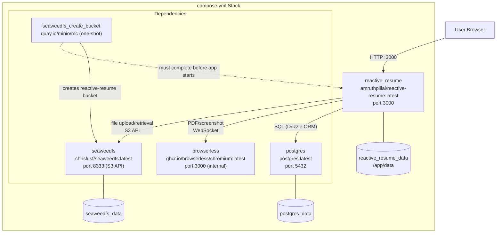
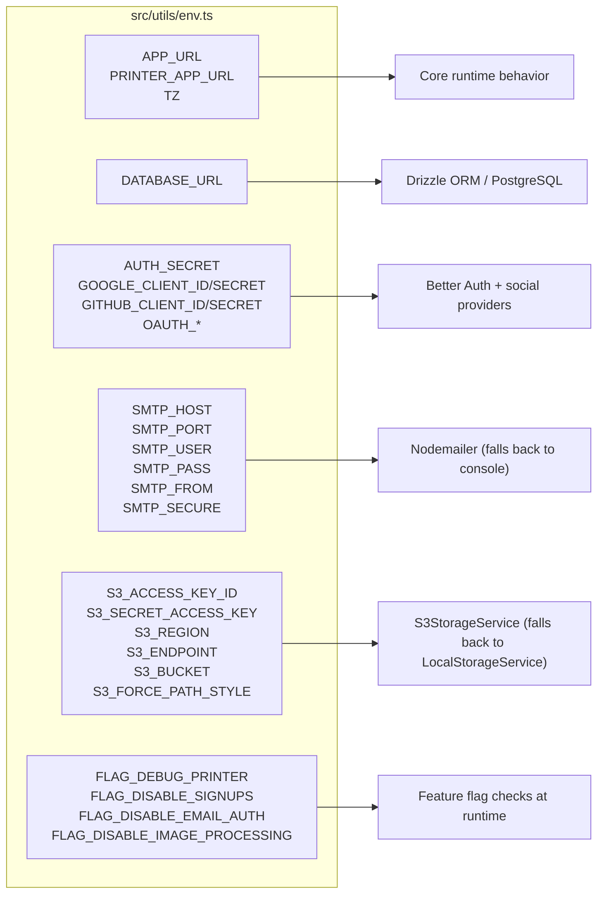

# Page: Deployment

# Deployment

<details>
<summary>Relevant source files</summary>

The following files were used as context for generating this wiki page:

- [CLAUDE.md](CLAUDE.md)
- [README.md](README.md)
- [compose.dev.yml](compose.dev.yml)
- [compose.yml](compose.yml)
- [docs/contributing/development.mdx](docs/contributing/development.mdx)
- [docs/getting-started/quickstart.mdx](docs/getting-started/quickstart.mdx)
- [docs/self-hosting/docker.mdx](docs/self-hosting/docker.mdx)
- [docs/self-hosting/examples.mdx](docs/self-hosting/examples.mdx)
- [src/integrations/orpc/router/storage.ts](src/integrations/orpc/router/storage.ts)
- [src/integrations/orpc/services/storage.ts](src/integrations/orpc/services/storage.ts)
- [src/routes/__root.tsx](src/routes/__root.tsx)
- [src/routes/api/health.ts](src/routes/api/health.ts)
- [src/utils/env.ts](src/utils/env.ts)
- [src/vite-env.d.ts](src/vite-env.d.ts)

</details>


This page introduces the deployment options and tooling for Reactive Resume. It covers what deployment artifacts are produced, the service dependencies required at runtime, and where to find the environment variables, Docker configuration, and CI/CD pipeline details.

For local development setup (not production deployment), see [Development Setup](#6.1). For the internal architecture of the running application, see [Architecture Overview](#1.2).

---

## What Gets Deployed

Reactive Resume builds into a single Node.js server bundle via Nitro. The build output lands in `.output/`, with the entry point at `.output/server/index.mjs`. The application is distributed as a Docker image and is always run with a set of required sidecar services.

| Artifact | Description |
|---|---|
| `.output/server/index.mjs` | Nitro server bundle, started with `node` |
| `amruthpillai/reactive-resume:latest` | Docker Hub image |
| `ghcr.io/amruthpillai/reactive-resume:latest` | GitHub Container Registry image |

The image is built for two architectures: `linux/amd64` and `linux/arm64`.

Sources: [CLAUDE.md:183-190](), [README.md:186-194]()

---

## Runtime Service Dependencies

The application requires three external services to function. These are declared in [compose.yml]() as a Docker Compose stack.

**Production Docker Compose service topology:**



The `reactive_resume` service has `depends_on` conditions requiring `postgres` and `browserless` to be healthy, and `seaweedfs_create_bucket` to have completed successfully before it starts. All services use Docker health checks; the app's check polls `GET /api/health`.

Sources: [compose.yml:1-116]()

---

## Health Check

The application exposes `GET /api/health` implemented in [src/routes/api/health.ts](). It runs three checks in parallel and returns a JSON body:

| Check | How it works |
|---|---|
| `database` | Executes `SELECT 1` via Drizzle ORM |
| `printer` | Calls `printerService.healthcheck()` |
| `storage` | Calls `storageService.healthcheck()` on whichever backend is active |

If any sub-check has `status: "unhealthy"`, the endpoint returns HTTP 500; otherwise HTTP 200.

The Docker Compose health check for the app container:

```yaml
healthcheck:
  test: ["CMD", "curl", "-f", "http://localhost:3000/api/health"]
  start_period: 10s
  interval: 30s
  timeout: 10s
  retries: 3
```

Sources: [src/routes/api/health.ts:1-87](), [compose.yml:107-111]()

---

## Environment Variable Groups

All environment variables are validated at startup using `createEnv` from `@t3-oss/env-core` in [src/utils/env.ts](). Invalid or missing required values cause the process to exit immediately.

**Required variables:**

| Variable | Purpose |
|---|---|
| `APP_URL` | Canonical public URL; used for redirects and auth callbacks |
| `DATABASE_URL` | PostgreSQL connection string (`postgresql://...`) |
| `PRINTER_ENDPOINT` | WebSocket or HTTP URL of the headless Chromium service |
| `AUTH_SECRET` | Signing secret for Better Auth sessions |

**Optional variable groups and what they enable:**



If all `S3_*` variables are absent, storage falls back to `LocalStorageService` writing to `/app/data` (the `reactive_resume_data` volume). If `SMTP_HOST` is absent, email is logged to the server console instead of sent.

Sources: [src/utils/env.ts:1-72](), [src/vite-env.d.ts:10-57]()

---

## Deployment Approaches

| Approach | File | Notes |
|---|---|---|
| Standard Docker Compose | `compose.yml` | Full stack including SeaweedFS; suitable for a single host |
| Docker + Traefik | `docs/self-hosting/examples.mdx` | Adds automatic SSL via Let's Encrypt |
| Docker + nginx | `docs/self-hosting/examples.mdx` | Manual SSL certificate management |
| Docker Swarm | `docs/self-hosting/examples.mdx` | Multi-node with rolling updates and replicas |
| Development | `compose.dev.yml` | Infrastructure only; app runs locally via `pnpm dev` |

Database migrations run automatically on every container start via the Nitro plugin at `plugins/1.migrate.ts`. No manual migration step is needed for production upgrades.

Sources: [docs/self-hosting/docker.mdx:255-259](), [docs/self-hosting/examples.mdx:1-496](), [CLAUDE.md:53-53]()

---

## Sub-pages

The following pages cover each deployment concern in detail:

| Page | Contents |
|---|---|
| [Docker Deployment](#5.1) | Official Docker image, multi-arch build, production Compose stack, health checks, volumes |
| [Self-Hosting Guide](#5.2) | Standard setup, Traefik/nginx/Swarm configurations, update and backup procedures |
| [Environment Configuration](#5.3) | Every environment variable, its accepted values, defaults, and the subsystem it configures |
| [CI/CD Pipeline](#5.4) | GitHub Actions workflows: multi-arch builds, image signing with Cosign, GHCR and Docker Hub publishing |

---

