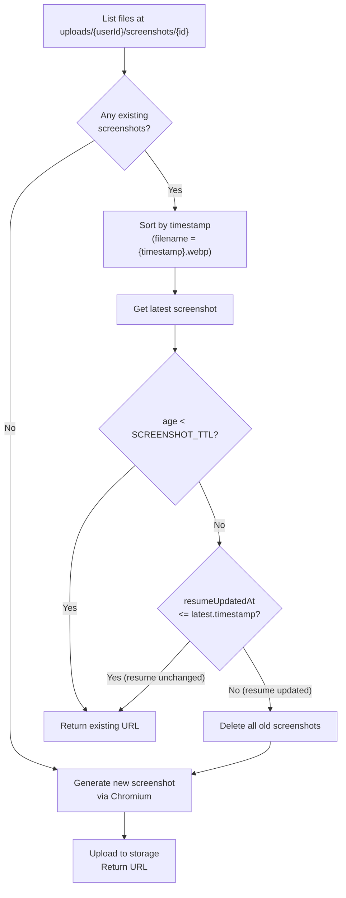
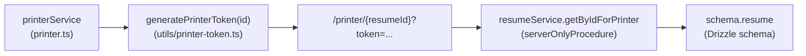
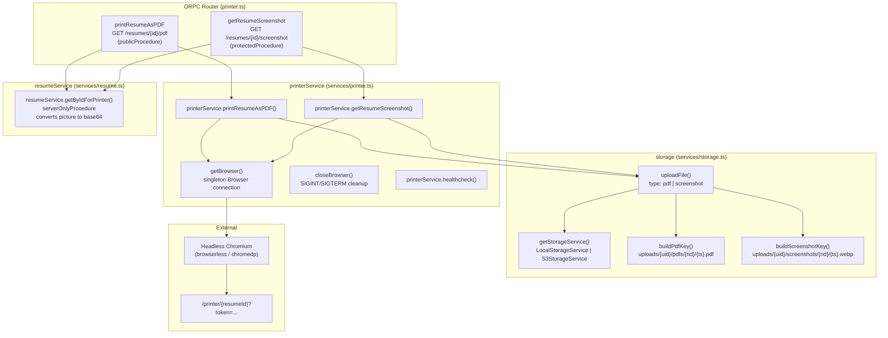

# Page: Document Generation

# Document Generation

<details>
<summary>Relevant source files</summary>

The following files were used as context for generating this wiki page:

- [.devcontainer/Dockerfile](.devcontainer/Dockerfile)
- [.devcontainer/devcontainer.json](.devcontainer/devcontainer.json)
- [.devcontainer/docker-compose.yml](.devcontainer/docker-compose.yml)
- [CLAUDE.md](CLAUDE.md)
- [README.md](README.md)
- [compose.dev.yml](compose.dev.yml)
- [compose.yml](compose.yml)
- [docs/community/spotlight.mdx](docs/community/spotlight.mdx)
- [docs/contributing/development.mdx](docs/contributing/development.mdx)
- [docs/docs.json](docs/docs.json)
- [docs/getting-started/quickstart.mdx](docs/getting-started/quickstart.mdx)
- [docs/guides/using-the-patch-api.mdx](docs/guides/using-the-patch-api.mdx)
- [docs/self-hosting/docker.mdx](docs/self-hosting/docker.mdx)
- [docs/self-hosting/examples.mdx](docs/self-hosting/examples.mdx)
- [docs/self-hosting/sso.mdx](docs/self-hosting/sso.mdx)
- [src/components/resume/store/resume.ts](src/components/resume/store/resume.ts)
- [src/integrations/orpc/dto/resume.ts](src/integrations/orpc/dto/resume.ts)
- [src/integrations/orpc/router/printer.ts](src/integrations/orpc/router/printer.ts)
- [src/integrations/orpc/router/resume.ts](src/integrations/orpc/router/resume.ts)
- [src/integrations/orpc/router/storage.ts](src/integrations/orpc/router/storage.ts)
- [src/integrations/orpc/services/ai.ts](src/integrations/orpc/services/ai.ts)
- [src/integrations/orpc/services/printer.ts](src/integrations/orpc/services/printer.ts)
- [src/integrations/orpc/services/resume.ts](src/integrations/orpc/services/resume.ts)
- [src/integrations/orpc/services/storage.ts](src/integrations/orpc/services/storage.ts)
- [src/routes/__root.tsx](src/routes/__root.tsx)
- [src/routes/api/health.ts](src/routes/api/health.ts)
- [src/utils/env.ts](src/utils/env.ts)
- [src/utils/resume/move-item.ts](src/utils/resume/move-item.ts)
- [src/utils/resume/patch.ts](src/utils/resume/patch.ts)
- [src/utils/string.ts](src/utils/string.ts)
- [src/vite-env.d.ts](src/vite-env.d.ts)

</details>


This page covers how Reactive Resume generates PDF exports and resume screenshots. It documents the `printerService` abstraction, the headless Chromium sidecar, PDF rendering mechanics, screenshot caching behavior, and how generated files are persisted through the storage layer.

For the underlying storage backend used to persist generated files, see [Storage System](#3.5). For the ORPC API layer that exposes these operations to clients, see [API Design](#2.4). For the resume template rendering that the printer navigates to, see [Resume Templates](#3.1.1).

---

## Architecture Overview

Document generation is handled entirely server-side. The application server instructs a headless Chromium process to navigate to a special `/printer/{resumeId}` route, waits for the page to signal readiness, then captures the result as a PDF or screenshot. Generated files are uploaded to the configured storage backend and their URLs are returned to the caller.

**Document Generation Data Flow**

```mermaid
sequenceDiagram
    participant "Client" as Client
    participant "printerRouter" as printerRouter
    participant "resumeService" as resumeService
    participant "printerService" as printerService
    participant "getBrowser()" as getBrowser
    participant "/printer/{id}" as PrinterRoute
    participant "uploadFile()" as uploadFile
    participant "StorageService" as StorageService

    Client->>"printerRouter": "GET /resumes/{id}/pdf"
    "printerRouter"->>"resumeService": "getByIdForPrinter({ id })"
    "resumeService"-->>"printerRouter": "resume (with base64 picture)"
    "printerRouter"->>"printerService": "printResumeAsPDF({ id, data, userId })"
    "printerService"->>"StorageService": "delete existing PDF prefix"
    "printerService"->>"getBrowser()": "connect/reuse browser instance"
    "getBrowser()"-->>"printerService": "Browser"
    "printerService"->>"PrinterRoute": "page.goto(/printer/{id}?token=...)"
    "PrinterRoute"-->>"printerService": "networkidle0 + data-wf-loaded=true"
    "printerService"->>"printerService": "evaluate() DOM adjustments"
    "printerService"->>"printerService": "page.pdf()"
    "printerService"->>"uploadFile()": "Uint8Array, application/pdf"
    "uploadFile()"->>"StorageService": "write({ key, data, contentType })"
    "StorageService"-->>"uploadFile()": "done"
    "uploadFile()"-->>"printerService": "{ url, key }"
    "printerService"-->>"printerRouter": "url"
    "printerRouter"-->>"Client": "{ url }"
```

Sources: [src/integrations/orpc/router/printer.ts:1-56](), [src/integrations/orpc/services/printer.ts:1-321]()

---

## ORPC Endpoints

The printer functionality is exposed through two procedures in `printerRouter`.

| Procedure | HTTP | Path | Auth | Description |
|---|---|---|---|---|
| `printResumeAsPDF` | GET | `/resumes/{id}/pdf` | Optional | Generates PDF, returns download URL. Increments download count for unauthenticated callers. |
| `getResumeScreenshot` | GET | `/resumes/{id}/screenshot` | Required | Returns screenshot URL. Applies TTL caching. Returns `null` on failure. |

Both procedures call `resumeService.getByIdForPrinter` first, which fetches the resume and converts the profile picture URL to a base64 data URI so Chromium does not need to make network requests for it during rendering.

Sources: [src/integrations/orpc/router/printer.ts:1-56](), [src/integrations/orpc/services/resume.ts:136-168]()

---

## Printer Service

All rendering logic lives in `printerService` in [src/integrations/orpc/services/printer.ts]().

### Browser Connection Management

A singleton `Browser` instance from `puppeteer-core` is maintained across requests to avoid the cost of establishing a new connection for every export.

```
browserInstance: Browser | null  (module-level singleton)
```

The `getBrowser()` function checks `browserInstance?.connected` before connecting. If the instance is disconnected or null, it connects to the endpoint configured in `PRINTER_ENDPOINT`.

**Connection behavior by protocol:**

| `PRINTER_ENDPOINT` protocol | Connection method |
|---|---|
| `ws://` or `wss://` | `connectOptions.browserWSEndpoint` |
| `http://` or `https://` | `connectOptions.browserURL` |

Launch arguments are appended as a `launch` query parameter:
- `--disable-dev-shm-usage`
- `--disable-features=LocalNetworkAccessChecks,site-per-process,FedCm`

The browser is closed and the singleton nulled on `SIGINT` and `SIGTERM` via `closeBrowser()`.

Sources: [src/integrations/orpc/services/printer.ts:11-51]()

---

### PDF Generation (`printResumeAsPDF`)

**Key function signature:**
```
printResumeAsPDF(input: Pick<InferSelectModel<typeof schema.resume>, "id" | "data" | "userId">): Promise<string>
```

Returns the URL of the uploaded PDF.

**Steps:**

**Step 1 — Delete existing PDF.** The existing PDF is deleted before generating a new one using the prefix `uploads/{userId}/pdfs/{id}`.

**Step 2 — Prepare the printer URL.** The URL is `{PRINTER_APP_URL ?? APP_URL}/printer/{id}?token={token}`. The token is generated by `generatePrinterToken(id)` from [src/utils/printer-token.ts](). A locale cookie is set on the browser so the resume renders in the correct language.

> `PRINTER_APP_URL` is used when the Chromium sidecar must reach the app via an internal Docker network address rather than the public `APP_URL`.

**Step 3 — Calculate PDF margins.** Templates listed in `printMarginTemplates` (from [src/schema/templates.ts]()) apply margins at the PDF level rather than via CSS padding. The CSS-pixel margin values are converted to PDF points by dividing by `0.75` (since 1pt = 0.75px at 72 dpi).

**Step 4 — Navigate and wait for readiness.** The page is loaded with:
- `emulateMediaType("print")`
- Viewport set to `pageDimensionsAsPixels[format]`
- `waitUntil: "networkidle0"`
- `waitForFunction(() => document.body.getAttribute("data-wf-loaded") === "true", { timeout: 5_000 })`

**Step 5 — DOM adjustments via `page.evaluate()`.** The behavior differs by page format:

| Format | DOM Adjustment |
|---|---|
| `free-form` | Adds `marginBottom` between pages. Measures total content height. |
| `a4` / `letter` | Reduces `--page-height` CSS variable by the margin amount. Adds `breakBefore: "page"` on elements with `data-page-index > 0`. |

**Step 6 — Generate PDF.** Calls `page.pdf()` with:
- `tagged: true` — Adds PDF accessibility tags.
- `waitForFonts: true` — Ensures all fonts are loaded.
- `printBackground: true` — Includes backgrounds and images.
- `margin: { top: marginY, right: marginX, left: marginX, bottom: 0 }`
- For free-form: height is the measured content height. For others: fixed from `pageDimensionsAsPixels[format].height`.

**Step 7 — Upload to storage.** Calls `uploadFile({ userId, resumeId: id, data, contentType: "application/pdf", type: "pdf" })`. The storage key is `uploads/{userId}/pdfs/{resumeId}/{timestamp}.pdf`.

Sources: [src/integrations/orpc/services/printer.ts:53-240](), [src/integrations/orpc/services/storage.ts:62-69]()

---

### Screenshot Generation and Caching (`getResumeScreenshot`)

**Key function signature:**
```
getResumeScreenshot(input: Pick<..., "userId" | "id" | "data" | "updatedAt">): Promise<string>
```

Returns the URL of the screenshot.

**TTL constant:**
```
SCREENSHOT_TTL = 1000 * 60 * 60 * 6  // 6 hours in milliseconds
```

**Caching Logic:**

The caching decision is made before any browser interaction.



This two-condition check means a stale screenshot (past TTL) is still reused if the resume was not edited after the screenshot was taken. This avoids unnecessary regeneration on quiet instances.

**Rendering parameters for screenshots:**
- Viewport: `pageDimensionsAsPixels.a4` (always A4, regardless of resume format)
- Format: `webp` at quality `80`
- Storage key: `uploads/{userId}/screenshots/{resumeId}/{timestamp}.webp`

Sources: [src/integrations/orpc/services/printer.ts:242-321](), [src/integrations/orpc/services/storage.ts:56-69]()

---

## Printer Route and Token Authentication

The Chromium instance navigates to `/printer/{resumeId}?token={token}`. This route is a special server-side render of the resume, separate from the public-facing builder and preview routes.

The `getByIdForPrinter` procedure in `resumeService` is used to load the resume data for this route. It is a `serverOnlyProcedure` — it cannot be called from the client directly.



The `getByIdForPrinter` function also replaces the profile picture URL with a base64-encoded data URI. This prevents the Chromium instance from needing to make a network request for the image, which avoids issues with internal Docker networking and CORS.

Sources: [src/integrations/orpc/router/printer.ts:102-107](), [src/integrations/orpc/services/resume.ts:136-168]()

---

## Storage Paths for Generated Files

All generated files follow a consistent prefix structure rooted under `uploads/`.

| File type | Storage key pattern |
|---|---|
| PDF | `uploads/{userId}/pdfs/{resumeId}/{timestamp}.pdf` |
| Screenshot | `uploads/{userId}/screenshots/{resumeId}/{timestamp}.webp` |

The timestamp in the filename is used to determine the age of cached screenshots during the TTL check. The `list()` operation on the storage service is used to enumerate all screenshots for a given resume prefix.

When a resume is deleted, `resumeService.delete` removes both the `screenshots` and `pdfs` prefixes via `Promise.allSettled`.

Sources: [src/integrations/orpc/services/storage.ts:56-69](), [src/integrations/orpc/services/resume.ts:418-432]()

---

## Sidecar Service: Headless Chromium

The printer requires an external headless Chromium process. The application does not embed Chromium; it connects to it over the DevTools Protocol.

Two supported images are documented in `compose.yml`:

| Image | Protocol | Example endpoint |
|---|---|---|
| `ghcr.io/browserless/chromium` | WebSocket | `ws://browserless:3000?token=1234567890` |
| `chromedp/headless-shell` | HTTP | `http://chrome:9222` |

The `PRINTER_ENDPOINT` variable accepts both `ws://` and `http://` (and their TLS variants).

**Health check in `printerService.healthcheck()`:**  
Converts the WebSocket endpoint to HTTP, appends `/json/version`, and makes a GET request. This is used by the `/api/health` route.

Sources: [src/integrations/orpc/services/printer.ts:53-65](), [compose.yml:20-40](), [src/routes/api/health.ts:55-66]()

---

## Environment Variables

| Variable | Required | Purpose |
|---|---|---|
| `PRINTER_ENDPOINT` | Yes | WebSocket or HTTP URL of the Chromium instance. |
| `PRINTER_APP_URL` | No | Override base URL that Chromium navigates to. Defaults to `APP_URL`. Required when Chromium is in Docker but the app runs on the host. |
| `FLAG_DEBUG_PRINTER` | No | Bypasses token authentication on `/printer/{id}` for debugging. |

Sources: [src/utils/env.ts:15-20](), [src/integrations/orpc/services/printer.ts:90-101]()

---

## Code Entity Map



Sources: [src/integrations/orpc/router/printer.ts:1-56](), [src/integrations/orpc/services/printer.ts:1-321](), [src/integrations/orpc/services/storage.ts:341-370]()

---

