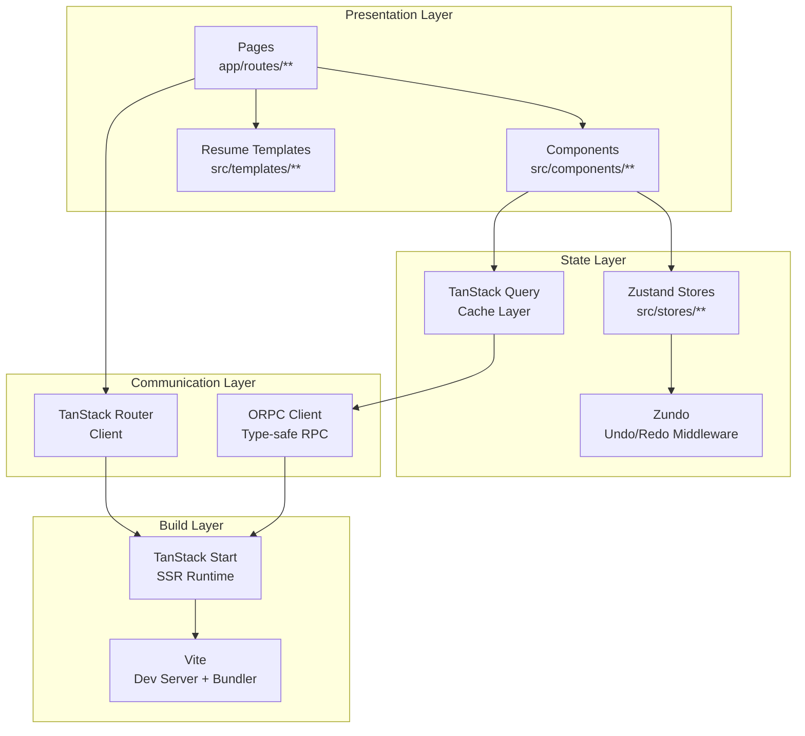
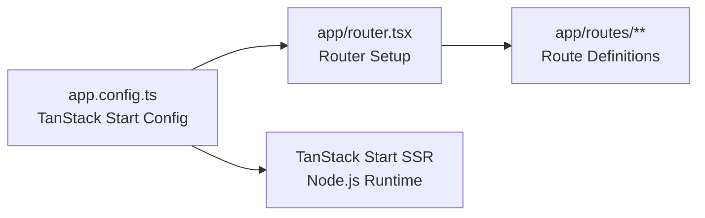
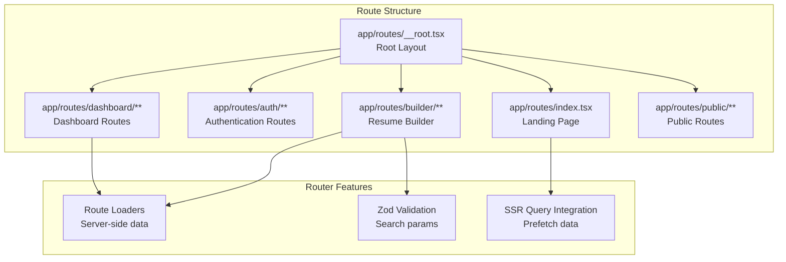
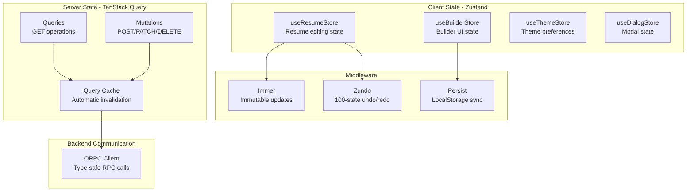
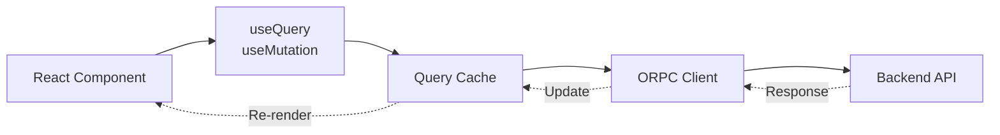
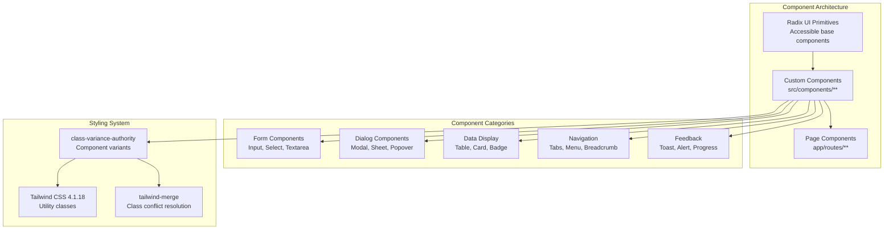
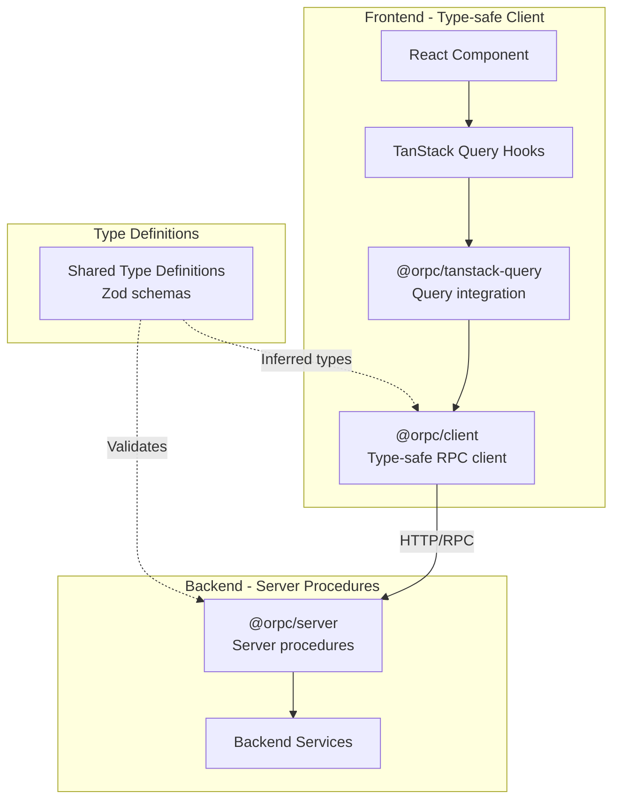
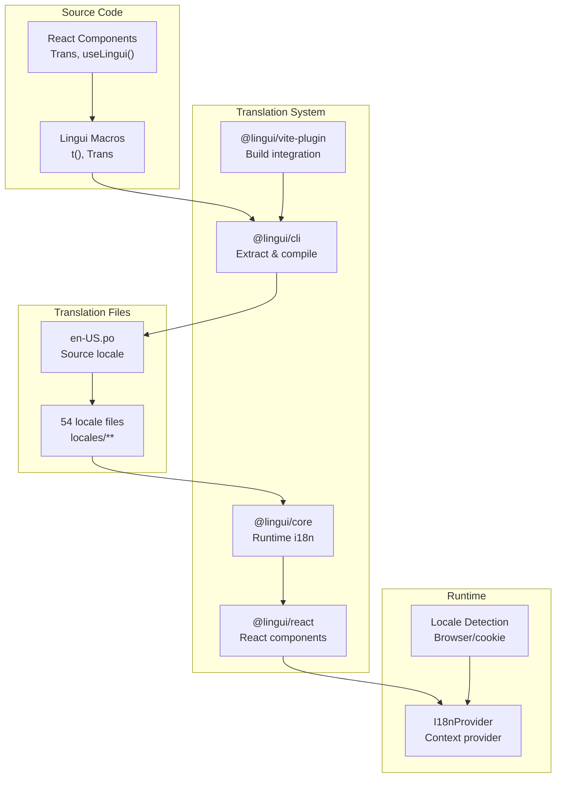
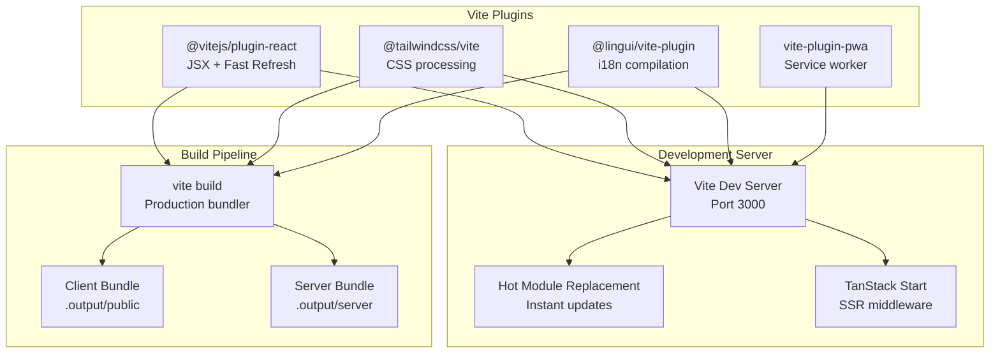
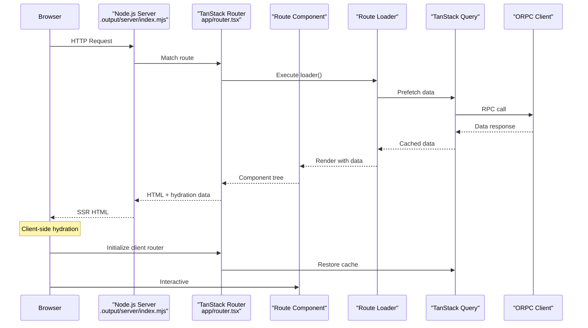

# Page: Frontend Architecture

# Frontend Architecture

<details>
<summary>Relevant source files</summary>

The following files were used as context for generating this wiki page:

- [.env.example](.env.example)
- [.gitignore](.gitignore)
- [.vscode/settings.json](.vscode/settings.json)
- [CLAUDE.md](CLAUDE.md)
- [compose.dev.yml](compose.dev.yml)
- [compose.yml](compose.yml)
- [docs/changelog/index.mdx](docs/changelog/index.mdx)
- [docs/contributing/development.mdx](docs/contributing/development.mdx)
- [docs/getting-started/quickstart.mdx](docs/getting-started/quickstart.mdx)
- [docs/guides/setting-up-passkeys.mdx](docs/guides/setting-up-passkeys.mdx)
- [docs/self-hosting/docker.mdx](docs/self-hosting/docker.mdx)
- [docs/self-hosting/examples.mdx](docs/self-hosting/examples.mdx)
- [docs/spec.json](docs/spec.json)
- [knip.json](knip.json)
- [package.json](package.json)
- [pnpm-lock.yaml](pnpm-lock.yaml)
- [scripts/fonts/generate.ts](scripts/fonts/generate.ts)
- [scripts/fonts/types.ts](scripts/fonts/types.ts)
- [src/components/level/display.tsx](src/components/level/display.tsx)
- [src/components/resume/preview.module.css](src/components/resume/preview.module.css)
- [src/components/resume/templates/azurill.tsx](src/components/resume/templates/azurill.tsx)
- [src/components/resume/templates/bronzor.tsx](src/components/resume/templates/bronzor.tsx)
- [src/components/resume/templates/chikorita.tsx](src/components/resume/templates/chikorita.tsx)
- [src/components/resume/templates/ditgar.tsx](src/components/resume/templates/ditgar.tsx)
- [src/components/resume/templates/ditto.tsx](src/components/resume/templates/ditto.tsx)
- [src/components/resume/templates/gengar.tsx](src/components/resume/templates/gengar.tsx)
- [src/components/resume/templates/glalie.tsx](src/components/resume/templates/glalie.tsx)
- [src/components/resume/templates/kakuna.tsx](src/components/resume/templates/kakuna.tsx)
- [src/components/resume/templates/lapras.tsx](src/components/resume/templates/lapras.tsx)
- [src/components/resume/templates/leafish.tsx](src/components/resume/templates/leafish.tsx)
- [src/components/resume/templates/onyx.tsx](src/components/resume/templates/onyx.tsx)
- [src/components/resume/templates/pikachu.tsx](src/components/resume/templates/pikachu.tsx)
- [src/components/resume/templates/rhyhorn.tsx](src/components/resume/templates/rhyhorn.tsx)
- [src/components/typography/combobox.tsx](src/components/typography/combobox.tsx)
- [src/components/typography/webfontlist.json](src/components/typography/webfontlist.json)
- [src/integrations/auth/client.ts](src/integrations/auth/client.ts)
- [src/integrations/auth/config.ts](src/integrations/auth/config.ts)
- [src/integrations/orpc/router/storage.ts](src/integrations/orpc/router/storage.ts)
- [src/integrations/orpc/services/storage.ts](src/integrations/orpc/services/storage.ts)
- [src/routes/__root.tsx](src/routes/__root.tsx)
- [src/routes/api/health.ts](src/routes/api/health.ts)
- [src/routes/auth/-components/social-auth.tsx](src/routes/auth/-components/social-auth.tsx)
- [src/routes/auth/login.tsx](src/routes/auth/login.tsx)
- [src/routes/auth/register.tsx](src/routes/auth/register.tsx)
- [src/routes/builder/$resumeId/-sidebar/right/sections/typography.tsx](src/routes/builder/$resumeId/-sidebar/right/sections/typography.tsx)
- [src/routes/dashboard/settings/authentication/-components/hooks.tsx](src/routes/dashboard/settings/authentication/-components/hooks.tsx)
- [src/utils/env.ts](src/utils/env.ts)
- [src/vite-env.d.ts](src/vite-env.d.ts)
- [vite.config.ts](vite.config.ts)

</details>


## Purpose and Scope

This document describes the frontend architecture of Reactive Resume, covering the React 19 application stack, server-side rendering capabilities, routing system, state management, and UI component structure. For information about backend services and API design, see [Backend Services](#2.2) and [API Design](#2.4). For state management implementation details specific to the resume builder, see [State Management](#3.1.2).

---

## Technology Stack Overview

The frontend is built on a modern React stack with server-side rendering capabilities:

| Component | Technology | Version | Purpose |
|-----------|-----------|---------|---------|
| Framework | TanStack Start | 1.159.5 | SSR-enabled React framework |
| UI Library | React | 19.2.4 | Component rendering |
| Router | TanStack Router | 1.159.5 | File-based routing with type safety |
| Build Tool | Vite | 8.0.0-beta.13 | Development server and bundler |
| State Management | Zustand | 5.0.11 | Client-side global state |
| Server State | TanStack Query | 5.90.20 | Async state and caching |
| RPC Client | ORPC | 1.13.4 | Type-safe server communication |
| UI Components | Radix UI | 1.4.3 | Accessible primitives |
| Styling | Tailwind CSS | 4.1.18 | Utility-first CSS |
| Forms | React Hook Form | 7.71.1 | Form state management |
| Rich Text | Tiptap | 3.19.0 | WYSIWYG editor |
| Drag & Drop | dnd-kit | 6.3.1 | Drag and drop interactions |
| Internationalization | Lingui | 5.9.0 | Translation framework |

**Sources:** [package.json:33-115]()

---

## Application Architecture

The frontend follows a layered architecture with clear separation between presentation, state, and communication:



**Sources:** [package.json:33-115](), [README.md:152-164]()

---

## TanStack Start Framework

TanStack Start is the server-side rendering framework that powers Reactive Resume. It provides:

- **Universal Rendering**: Components render on both server and client
- **File-Based Routing**: Routes are defined by the file system structure in `app/routes/`
- **Type-Safe Navigation**: Full TypeScript support across routing
- **Data Loading**: Server-side data fetching with streaming support
- **SSR Integration**: Seamless hydration of server-rendered content

The application entry point is defined in the `app.config.ts` configuration:



The framework integrates with Vite for the development server and production builds. During development, Vite provides hot module replacement (HMR), while in production, TanStack Start generates optimized server and client bundles.

**Sources:** [package.json:98-101](), [README.md:156]()

---

## Routing System

TanStack Router provides the routing infrastructure with file-based routing and type-safe navigation:



### Route Configuration

Routes are defined using file-based conventions:
- `__root.tsx` - Root layout with global providers
- `index.tsx` - Route index pages
- `$param.tsx` - Dynamic route parameters
- `_layout.tsx` - Layout routes without path segments

Each route can export:
- `loader` - Server-side data fetching function
- `component` - React component to render
- `validateSearch` - Zod schema for search parameter validation

**Sources:** [package.json:92-103]()

---

## State Management Architecture

State management is divided between client state (Zustand) and server state (TanStack Query):



### Zustand Store Implementation

Zustand stores provide global client state with middleware for immutability and time-travel debugging:

| Middleware | Purpose | Configuration |
|------------|---------|---------------|
| Immer | Immutable state updates | Automatic draft mode |
| Zundo | Undo/redo functionality | 100 state history |
| Persist | LocalStorage sync | Selected stores only |

State updates are debounced (500ms) before syncing to the server via ORPC mutations.

### TanStack Query Integration

TanStack Query manages all server state with automatic caching and invalidation:



The `@orpc/tanstack-query` package provides integration between ORPC's type-safe client and TanStack Query's caching layer.

**Sources:** [package.json:58-62,71-76,113-115,254-259]()

---

## UI Component System

The UI is built using Radix UI primitives with custom components and Tailwind CSS styling:



### Component Patterns

Components follow consistent patterns:

1. **Primitive Composition**: Radix UI primitives provide accessibility and behavior
2. **Variant Management**: `class-variance-authority` defines component variants
3. **Style Composition**: `tailwind-merge` resolves conflicting utility classes
4. **Form Integration**: React Hook Form provides form state management
5. **Responsive Design**: Tailwind's responsive utilities handle breakpoints

### Specialized Components

| Component Type | Technology | Purpose |
|----------------|-----------|---------|
| Rich Text Editor | Tiptap | Resume content editing |
| Drag & Drop | dnd-kit | Section reordering |
| Resizable Panels | react-resizable-panels | Split pane layouts |
| Virtual Lists | react-window | Performance for large lists |
| Command Palette | cmdk | Keyboard-driven navigation |

**Sources:** [package.json:40-42,73-76,93,96-100,134-142]()

---

## Client-Server Communication

ORPC provides type-safe communication between the frontend and backend:



### Type Safety Flow

1. **Schema Definition**: Zod schemas define input/output types
2. **Type Inference**: TypeScript infers types from schemas
3. **Client Generation**: ORPC client has full type information
4. **Runtime Validation**: Zod validates requests/responses
5. **Editor Support**: Full autocomplete and type checking

### Query Patterns

The ORPC + TanStack Query integration provides hooks for data fetching:

- `useQuery()` - Fetch data with automatic caching
- `useMutation()` - Modify data with optimistic updates
- `useInfiniteQuery()` - Paginated data fetching
- `useSuspenseQuery()` - Suspense-enabled queries for SSR

All queries are automatically typed based on the server procedure definitions.

**Sources:** [package.json:48-53,71-76]()

---

## Internationalization

Lingui provides internationalization with 54 supported locales:



### Translation Workflow

1. **Development**: Developers use `Trans` components and `t()` macro
2. **Extraction**: `pnpm lingui:extract` extracts translatable strings
3. **Translation**: Translators update `.po` files via Crowdin
4. **Compilation**: Lingui compiles `.po` files to optimized JavaScript
5. **Runtime**: Application loads appropriate locale at startup

The system supports:
- Pluralization rules per locale
- Component interpolation in translations
- Context-specific translations
- ICU MessageFormat syntax

**Sources:** [package.json:28,45-52,119-122,264-272](), [lingui.config.ts:1-74]()

---

## Build System

Vite powers the development experience and production builds:



### Development Configuration

The development server provides:
- **Instant HMR**: Changes reflect immediately without full reload
- **SSR Development**: Server-side rendering in development mode
- **Source Maps**: Full source map support for debugging
- **HTTPS Support**: Optional HTTPS for local development

### Production Build

The production build process:

1. **Client Build**: Generates static assets with code splitting
2. **Server Build**: Bundles SSR runtime with TanStack Start
3. **Asset Optimization**: Minification, tree-shaking, compression
4. **Static Analysis**: TypeScript checking and linting

Build output structure:
```
.output/
├── server/
│   └── index.mjs          # SSR entry point
└── public/
    ├── assets/            # Bundled JS/CSS
    └── _build/            # TanStack Router assets
```

**Sources:** [package.json:17-31,117-142,140,300-302,327-332](), [Dockerfile:18-30]()

---

## Entry Points and Application Flow

The application bootstrap process follows this sequence:



### Server Entry Point

The server entry point is located at [.output/server/index.mjs]() after build. This file:
- Initializes the Node.js HTTP server
- Configures TanStack Start SSR middleware
- Handles static asset serving
- Implements health check endpoint at `/api/health`

### Client Hydration

After SSR, the client:
1. Downloads client bundle from `_build/` directory
2. Hydrates React component tree
3. Restores TanStack Query cache from SSR state
4. Activates client-side routing
5. Enables interactive features

**Sources:** [package.json:30](), [Dockerfile:51-60]()

---

## Performance Optimizations

The frontend implements several performance optimizations:

| Optimization | Implementation | Benefit |
|--------------|----------------|---------|
| Code Splitting | TanStack Router routes | Smaller initial bundle |
| Tree Shaking | Vite production build | Remove unused code |
| Asset Caching | TanStack Query | Reduce API calls |
| Virtual Lists | react-window | Handle large datasets |
| Debounced Updates | 500ms debounce | Reduce server requests |
| Image Processing | Sharp (server-side) | Optimized image delivery |
| SSR Streaming | TanStack Start | Faster time-to-interactive |

### Bundle Optimization

The build process automatically:
- Splits vendor dependencies into separate chunks
- Generates unique hashes for cache busting
- Compresses assets with gzip/brotli
- Inlines critical CSS for faster first paint

**Sources:** [package.json:102,140-141,209-211]()

---

## Development Workflow

Development workflow uses the following commands:

```bash
# Start development server with HMR
pnpm dev

# Type checking (no emit)
pnpm typecheck

# Linting and formatting
pnpm lint

# Extract translation strings
pnpm lingui:extract

# Build for production
pnpm build

# Preview production build
pnpm preview
```

The development server runs on `http://localhost:3000` by default, with full hot module replacement for instant feedback during development.

**Sources:** [package.json:17-31](), [README.md:132-146]()

---

