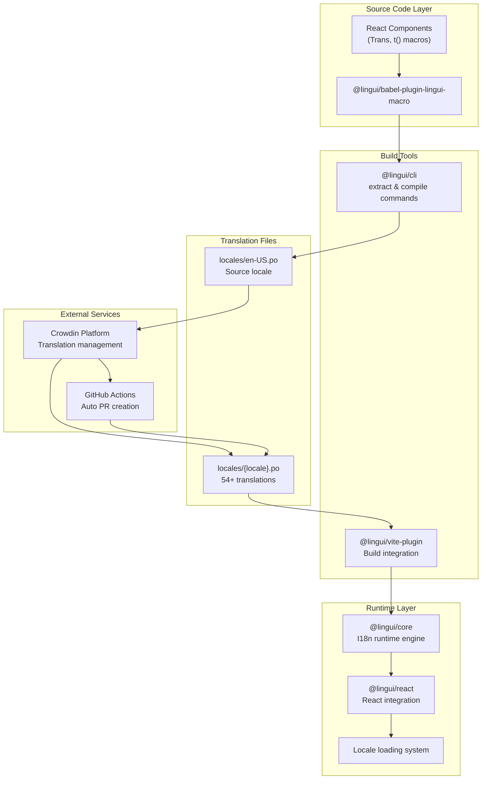
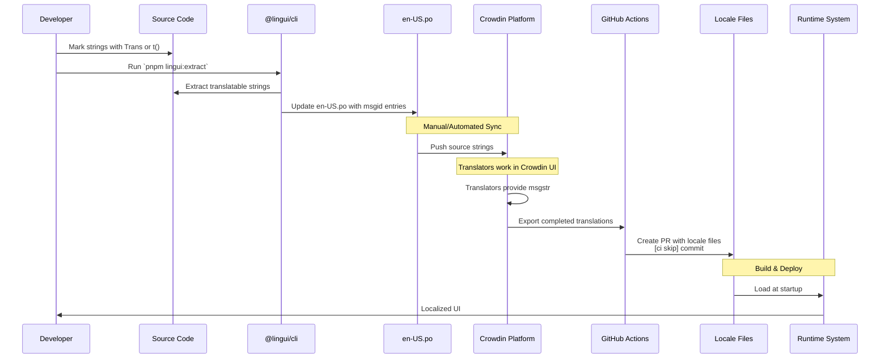
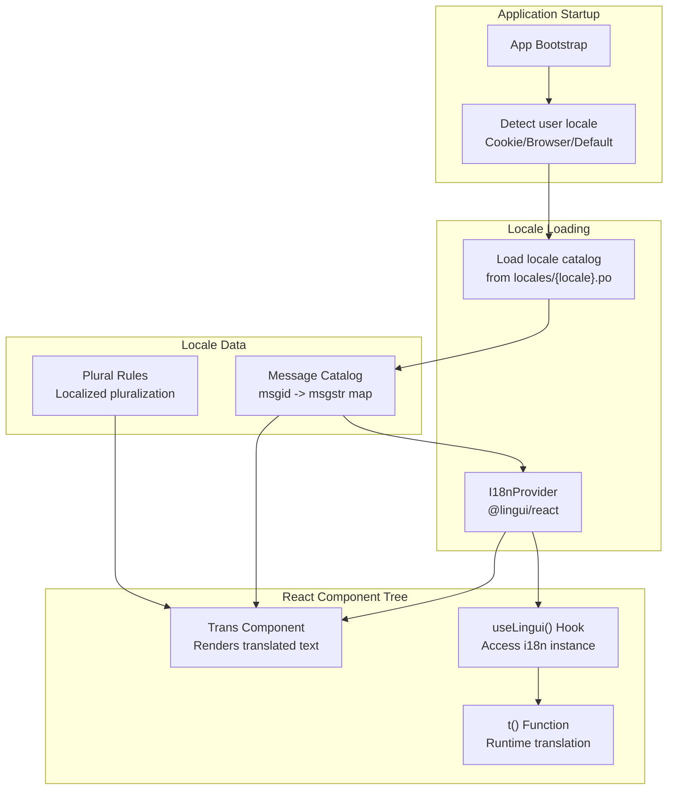
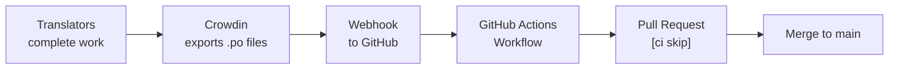

# Page: Internationalization

# Internationalization

<details>
<summary>Relevant source files</summary>

The following files were used as context for generating this wiki page:

- [lingui.config.ts](lingui.config.ts)
- [locales/am-ET.po](locales/am-ET.po)
- [locales/ar-SA.po](locales/ar-SA.po)
- [locales/az-AZ.po](locales/az-AZ.po)
- [locales/bg-BG.po](locales/bg-BG.po)
- [locales/bn-BD.po](locales/bn-BD.po)
- [locales/ca-ES.po](locales/ca-ES.po)
- [locales/cs-CZ.po](locales/cs-CZ.po)
- [locales/da-DK.po](locales/da-DK.po)
- [locales/de-DE.po](locales/de-DE.po)
- [locales/el-GR.po](locales/el-GR.po)
- [locales/es-ES.po](locales/es-ES.po)
- [locales/fr-FR.po](locales/fr-FR.po)
- [locales/it-IT.po](locales/it-IT.po)

</details>


This document describes the internationalization (i18n) system in Reactive Resume, which provides comprehensive multi-language support for 54+ locales using the Lingui framework and Crowdin translation management platform. The system enables developers to mark strings for translation using React components and macros, automatically extracts translatable content, manages translations through Crowdin, and delivers localized UI to users at runtime.

For deployment-related locale configuration, see [Environment Configuration](#5.3).

---

## System Architecture

Reactive Resume uses **Lingui** as its i18n framework, which provides a complete solution for marking, extracting, managing, and rendering translations in React applications. The system integrates at multiple levels: build-time extraction, translation management, and runtime rendering.

### Core Components



**Sources:** [package.json:45-46](), [package.json:119-121]()

### Key Dependencies

| Package | Version | Purpose |
|---------|---------|---------|
| `@lingui/core` | ^5.9.0 | Core i18n runtime, message catalog loading |
| `@lingui/react` | ^5.9.0 | React components (Trans) and hooks (useLingui) |
| `@lingui/cli` | ^5.9.0 | CLI for extraction and compilation |
| `@lingui/vite-plugin` | ^5.9.0 | Vite build integration |
| `@lingui/babel-plugin-lingui-macro` | ^5.9.0 | Babel macro for t() and Trans |

**Sources:** [package.json:45-46](), [package.json:119-121]()

---

## Translation Workflow

The translation workflow follows a complete cycle from source code to delivered translations, with automation at key stages to minimize manual work.

### End-to-End Translation Pipeline



**Sources:** [package.json:28](), [crowdin.yml:1-11]()

### Developer Workflow: Marking Strings for Translation

Developers use two primary methods to mark strings for translation:

**Method 1: Trans Component** (for JSX content)

```typescript
import { Trans } from "@lingui/react"

<Trans>Welcome to Reactive Resume</Trans>
```

**Method 2: t() Macro** (for plain strings, attributes, variables)

```typescript
import { t } from "@lingui/core/macro"

const placeholder = t`Enter your name`
```

After marking strings, developers run the extraction command:

```bash
pnpm lingui:extract
```

This executes `lingui extract --clean --overwrite`, which:
1. Scans all source files for Trans components and t() macros
2. Extracts msgid entries
3. Updates [locales/en-US.po:1-∞]() with new/modified strings
4. Removes obsolete entries (--clean flag)

**Sources:** [package.json:28](), [locales/en-US.po:1-50]()

### Crowdin Integration

Crowdin serves as the translation management system, providing a web interface for translators to work on localized content.

**Configuration:** [crowdin.yml:1-11]()

```yaml
preserve_hierarchy: true
commit_message: "[ci skip]"
pull_request_title: "Sync Translations from Crowdin"
pull_request_labels: ["l10n"]
pull_request_reviewers: ["amruthpillai"]

files:
  - source: /locales/en-US.po
    translation: /locales/%locale%.%file_extension%
```

**Key features:**
- **Source file:** English (en-US.po) serves as the base
- **Translation pattern:** Each locale gets its own file (it-IT.po, es-ES.po, etc.)
- **Auto PR creation:** Crowdin automatically creates pull requests with translations
- **CI skip:** The `[ci skip]` commit message prevents unnecessary CI runs

**Sources:** [crowdin.yml:1-11]()

---

## Locale File Format

Translation files use the **gettext .po format**, a widely-adopted standard for managing translations.

### File Structure

Each .po file begins with metadata headers:

```po
msgid ""
msgstr ""
"POT-Creation-Date: 2025-11-04 23:14+0100\n"
"MIME-Version: 1.0\n"
"Content-Type: text/plain; charset=UTF-8\n"
"Content-Transfer-Encoding: 8bit\n"
"X-Generator: @lingui/cli\n"
"Language: it\n"
"Project-Id-Version: reactive-resume\n"
"Plural-Forms: nplurals=2; plural=(n != 1);\n"
"X-Crowdin-Project: reactive-resume\n"
"X-Crowdin-Project-ID: 503410\n"
```

**Sources:** [locales/it-IT.po:1-19](), [locales/es-ES.po:1-19]()

### Message Entry Types

**Simple Translation:**

```po
#: src/routes/auth/register.tsx
msgid "Create a new account"
msgstr "Crea un nuovo account"
```

**With Context (msgctxt):**

```po
#: src/dialogs/resume/sections/award.tsx
msgctxt "(noun) person, organization, or entity that gives an award"
msgid "Awarder"
msgstr "Premiatore"
```

**Pluralization:**

```po
#: src/routes/builder/$resumeId/-sidebar/left/sections/custom.tsx
msgid "{0, plural, one {# item} other {# items}}"
msgstr "{0, plural, one {# elemento} other {# elementi}}"
```

**JSX Content with Placeholders:**

```po
msgid "<0>Finally,</0><1>A free and open-source resume builder</1>"
msgstr "<0>Finalmente,</0><1>un generatore di curriculum gratuito e open source</1>"
```

**Sources:** [locales/it-IT.po:21-53](), [locales/es-ES.po:21-53]()

### Pluralization Rules

Each locale defines plural forms in the header. Different languages have different pluralization rules:

| Language | Plural Forms | Rule |
|----------|--------------|------|
| English | 2 | `(n != 1)` |
| Italian | 2 | `(n != 1)` |
| Spanish | 2 | `(n != 1)` |
| Czech | 4 | `(n==1) ? 0 : (n>=2 && n<=4) ? 1 : 3` |
| Bulgarian | 2 | `(n != 1)` |

**Sources:** [locales/it-IT.po:14](), [locales/cs-CZ.po:14]()

---

## Runtime Locale System

At runtime, Reactive Resume loads locale catalogs and provides language-switching capabilities through the Lingui framework.

### Locale Loading and Initialization



**Sources:** [package.json:45-46]()

### Locale Utilities and Language Switching

The application provides utilities for managing locale state and switching between languages.

**Locale Definition:** [src/utils/locale.ts:1-∞]()

This file exports:
- A list of all supported locale codes
- A mapping from locale codes to human-readable language names (e.g., "it-IT" → "Italian")
- Functions for locale detection and validation

**Language Names Table:**

| Locale Code | Language Name | Locale Code | Language Name |
|-------------|---------------|-------------|---------------|
| en-US | English (US) | it-IT | Italian |
| es-ES | Spanish | fr-FR | French |
| de-DE | German | pt-BR | Portuguese (Brazil) |
| zh-CN | Chinese (Simplified) | zh-TW | Chinese (Traditional) |
| ar-SA | Arabic | ja-JP | Japanese |
| ko-KR | Korean | ru-RU | Russian |
| az-AZ | Azerbaijani | bn-BD | Bengali |
| am-ET | Amharic | el-GR | Greek |
| da-DK | Danish | cs-CZ | Czech |
| ca-ES | Catalan | bg-BG | Bulgarian |

**Sources:** [src/utils/locale.ts:1-∞](), [locales/it-IT.po:1-10](), [locales/es-ES.po:1-10]()

### Language Switching UI

The application provides multiple entry points for changing language:

1. **Header Component:** [src/routes/_home/-sections/header.tsx:1-∞]()
   - Language selector in the home page header

2. **Command Palette:** [src/components/command-palette/pages/preferences/index.tsx:1-∞]()
   - "Change language to..." command

When a user switches language:
1. The locale preference is stored (typically in a cookie or localStorage)
2. The new locale catalog is loaded
3. The I18nProvider updates its context
4. All Trans components and t() calls re-render with new translations

**Sources:** [src/routes/_home/-sections/header.tsx:1-∞](), [src/components/command-palette/pages/preferences/index.tsx:1-∞]()

---

## File Organization

The locale system follows a clear file structure:

```
reactive-resume/
├── locales/
│   ├── en-US.po          # Source locale (English)
│   ├── it-IT.po          # Italian translations
│   ├── es-ES.po          # Spanish translations
│   ├── fr-FR.po          # French translations
│   ├── de-DE.po          # German translations
│   ├── pt-BR.po          # Portuguese (Brazil)
│   ├── ar-SA.po          # Arabic
│   ├── zh-CN.po          # Chinese (Simplified)
│   ├── zh-TW.po          # Chinese (Traditional)
│   ├── ja-JP.po          # Japanese
│   ├── ko-KR.po          # Korean
│   ├── ru-RU.po          # Russian
│   ├── az-AZ.po          # Azerbaijani
│   ├── bn-BD.po          # Bengali
│   ├── am-ET.po          # Amharic
│   ├── el-GR.po          # Greek
│   ├── da-DK.po          # Danish
│   ├── cs-CZ.po          # Czech
│   ├── ca-ES.po          # Catalan
│   ├── bg-BG.po          # Bulgarian
│   └── (50+ other locales)
│
├── src/
│   └── utils/
│       └── locale.ts      # Locale utilities and definitions
│
├── crowdin.yml            # Crowdin configuration
└── package.json           # Scripts: lingui:extract
```

**Sources:** [crowdin.yml:8-10](), [package.json:28]()

---

## Supported Languages

Reactive Resume supports 54+ languages, making it accessible to users worldwide. Below is a comprehensive list of supported locales:

| Locale | Language | Locale | Language |
|--------|----------|--------|----------|
| af-ZA | Afrikaans | sq-AL | Albanian |
| am-ET | Amharic | ar-SA | Arabic |
| az-AZ | Azerbaijani | bn-BD | Bengali |
| bg-BG | Bulgarian | ca-ES | Catalan |
| zh-CN | Chinese (Simplified) | zh-TW | Chinese (Traditional) |
| cs-CZ | Czech | da-DK | Danish |
| nl-NL | Dutch | en-US | English |
| fi-FI | Finnish | fr-FR | French |
| de-DE | German | el-GR | Greek |
| he-IL | Hebrew | hi-IN | Hindi |
| hu-HU | Hungarian | id-ID | Indonesian |
| it-IT | Italian | ja-JP | Japanese |
| kn-IN | Kannada | ko-KR | Korean |
| lv-LV | Latvian | ml-IN | Malayalam |
| mr-IN | Marathi | ne-NP | Nepali |
| no-NO | Norwegian | pl-PL | Polish |
| pt-BR | Portuguese (Brazil) | pt-PT | Portuguese (Portugal) |
| ro-RO | Romanian | ru-RU | Russian |
| sr-RS | Serbian | sk-SK | Slovak |
| es-ES | Spanish | sv-SE | Swedish |
| ta-IN | Tamil | te-IN | Telugu |
| th-TH | Thai | tr-TR | Turkish |
| uk-UA | Ukrainian | ur-PK | Urdu |
| vi-VN | Vietnamese | | |

**Translation Status:** Each locale file contains complete translations for all UI strings, including:
- Authentication flows
- Resume builder interface
- Settings pages
- Feature descriptions
- Error messages
- Help text

**Sources:** [locales/it-IT.po:1-10](), [locales/es-ES.po:1-10](), [locales/az-AZ.po:1-10](), [locales/bn-BD.po:1-10](), [locales/am-ET.po:1-10](), [locales/el-GR.po:1-10](), [locales/de-DE.po:1-10](), [locales/da-DK.po:1-10](), [locales/cs-CZ.po:1-10](), [locales/ca-ES.po:1-10](), [locales/bg-BG.po:1-10]()

---

## CI/CD Integration

The internationalization system integrates with the CI/CD pipeline through GitHub Actions automation.

### Automated Translation Sync

When translations are completed in Crowdin:

1. **Crowdin Export:** Crowdin generates updated .po files for all locales
2. **GitHub Actions Trigger:** Crowdin triggers a webhook to GitHub Actions
3. **PR Creation:** GitHub Actions creates a pull request with the title "Sync Translations from Crowdin"
4. **Commit Message:** The commit message includes `[ci skip]` to prevent unnecessary CI runs
5. **Labels:** The PR is automatically labeled with `l10n` for localization
6. **Review Assignment:** The PR is assigned to reviewers specified in crowdin.yml

**Workflow diagram:**



**Sources:** [crowdin.yml:2-6]()

This automation ensures that translations flow seamlessly from Crowdin to the codebase without requiring manual file management, while the `[ci skip]` tag prevents wasting CI resources on translation-only updates.

---

