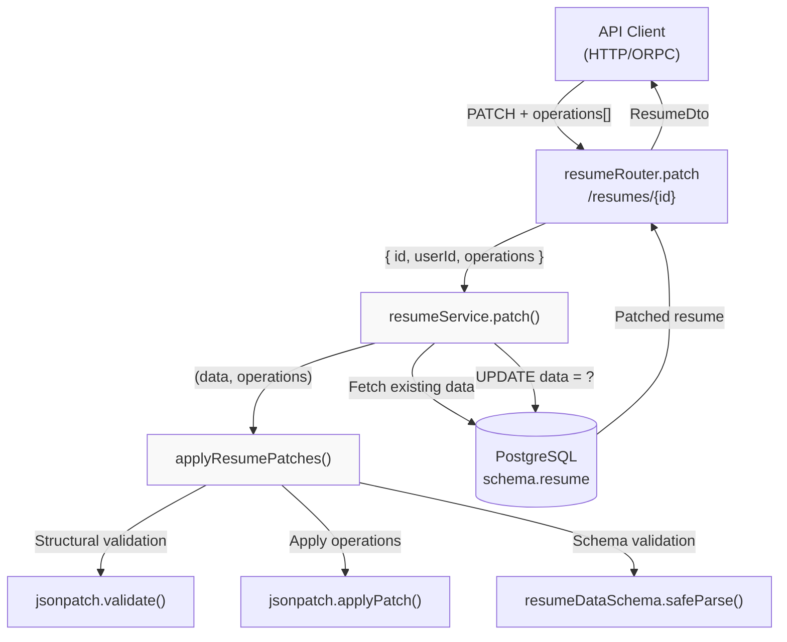
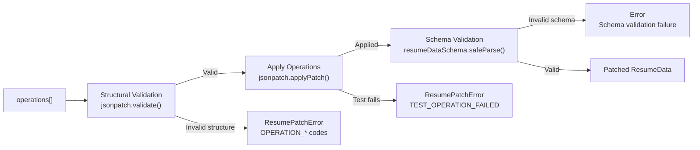
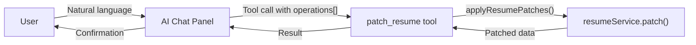

# Page: JSON Patch API

# JSON Patch API

<details>
<summary>Relevant source files</summary>

The following files were used as context for generating this wiki page:

- [docs/community/spotlight.mdx](docs/community/spotlight.mdx)
- [docs/docs.json](docs/docs.json)
- [docs/guides/using-the-patch-api.mdx](docs/guides/using-the-patch-api.mdx)
- [docs/self-hosting/sso.mdx](docs/self-hosting/sso.mdx)
- [src/components/resume/store/resume.ts](src/components/resume/store/resume.ts)
- [src/integrations/orpc/dto/resume.ts](src/integrations/orpc/dto/resume.ts)
- [src/integrations/orpc/router/printer.ts](src/integrations/orpc/router/printer.ts)
- [src/integrations/orpc/router/resume.ts](src/integrations/orpc/router/resume.ts)
- [src/integrations/orpc/services/ai.ts](src/integrations/orpc/services/ai.ts)
- [src/integrations/orpc/services/printer.ts](src/integrations/orpc/services/printer.ts)
- [src/integrations/orpc/services/resume.ts](src/integrations/orpc/services/resume.ts)
- [src/utils/resume/move-item.ts](src/utils/resume/move-item.ts)
- [src/utils/resume/patch.ts](src/utils/resume/patch.ts)
- [src/utils/string.ts](src/utils/string.ts)

</details>


## Purpose and Scope

The JSON Patch API provides atomic, partial updates to resume data using [RFC 6902 JSON Patch](https://datatracker.ietf.org/doc/html/rfc6902) operations. Instead of replacing the entire `ResumeData` object with a full `PUT` request, clients can send a sequence of targeted operations (`add`, `remove`, `replace`, `move`, `copy`, `test`) that modify specific fields or array elements.

This approach reduces payload size, enables optimistic concurrency control via `test` operations, and allows precise mutations without the risk of accidentally overwriting concurrent changes. The patch API only modifies the resume `data` JSONB column; for top-level resume properties like `name`, `slug`, or `tags`, see the standard update endpoint documented in [Resume Builder](#3.1).

**Sources:** [docs/guides/using-the-patch-api.mdx:1-192](), [src/utils/resume/patch.ts:1-123]()

---

## Architecture Overview

The patch API sits in the business logic layer between the ORPC router and the database. It validates incoming operations structurally and semantically before applying them to the resume data.



**Diagram: JSON Patch API Request Flow**

The router delegates to the service layer, which fetches the current resume data from PostgreSQL. The `applyResumePatches()` utility performs two-phase validation (structural integrity via `fast-json-patch`, then schema conformance via Zod) before persisting the result.

**Sources:** [src/integrations/orpc/router/resume.ts:220-245](), [src/integrations/orpc/services/resume.ts:322-368](), [src/utils/resume/patch.ts:82-122]()

---

## API Endpoint

| Property | Value |
|----------|-------|
| **Method** | `PATCH` |
| **Path** | `/api/openapi/resumes/{id}` |
| **Authentication** | Required (API key or session) |
| **Content-Type** | `application/json` |

### Request Schema

```typescript
{
  id: string,              // Resume ID (from URL path)
  operations: Operation[]  // Array of JSON Patch operations
}
```

Each `Operation` is a discriminated union validated by `jsonPatchOperationSchema`:

| Operation | Required Fields | Description |
|-----------|----------------|-------------|
| `add` | `op`, `path`, `value` | Insert or append a value |
| `remove` | `op`, `path` | Delete a value |
| `replace` | `op`, `path`, `value` | Overwrite a value |
| `move` | `op`, `path`, `from` | Move a value from one location to another |
| `copy` | `op`, `path`, `from` | Duplicate a value to another location |
| `test` | `op`, `path`, `value` | Assert a value matches (fails entire patch if not) |

### Response Schema

Returns the full patched resume object:

```typescript
{
  id: string,
  name: string,
  slug: string,
  tags: string[],
  data: ResumeData,
  isPublic: boolean,
  isLocked: boolean,
  hasPassword: boolean
}
```

**Sources:** [src/integrations/orpc/router/resume.ts:220-245](), [src/integrations/orpc/dto/resume.ts:81-92](), [src/utils/resume/patch.ts:11-18]()

---

## Validation Pipeline

The patch system performs validation in two stages to ensure both structural correctness and semantic validity.



**Diagram: Two-Phase Validation Pipeline**

### Phase 1: Structural Validation

The `jsonpatch.validate()` function from `fast-json-patch` checks:
- Operations are well-formed objects with required fields
- JSON Pointers in `path` and `from` are syntactically valid
- Target paths exist (for `remove`, `replace`, `test`, `move`, `copy`)
- Array indices are valid unsigned integers

If structural validation fails, a `ResumePatchError` is thrown with one of these codes:

| Error Code | Description |
|------------|-------------|
| `OPERATION_NOT_AN_OBJECT` | Operation is not a valid object |
| `OPERATION_OP_INVALID` | `op` field is not a valid RFC 6902 operation |
| `OPERATION_PATH_INVALID` | `path` is not a valid JSON Pointer |
| `OPERATION_PATH_UNRESOLVABLE` | Target path does not exist |
| `OPERATION_VALUE_REQUIRED` | `value` is missing for `add`/`replace`/`test` |
| `OPERATION_FROM_REQUIRED` | `from` is missing for `move`/`copy` |
| `OPERATION_FROM_UNRESOLVABLE` | Source path does not exist |
| `OPERATION_PATH_ILLEGAL_ARRAY_INDEX` | Array index is not a valid integer |
| `OPERATION_VALUE_OUT_OF_BOUNDS` | Array index exceeds array length |

### Phase 2: Semantic Validation

After applying operations, the result is validated against `resumeDataSchema` to ensure:
- All required fields are present
- Field types match the schema (e.g., `basics.name` is a string)
- Enums have valid values (e.g., `metadata.template` is a recognized template name)
- Nested objects conform to their schemas (e.g., `sections.experience.items[]` have valid structure)

If schema validation fails, a generic `Error` is thrown with the Zod error message.

**Sources:** [src/utils/resume/patch.ts:42-122](), [src/utils/resume/patch.ts:62-80]()

---

## Error Handling

### ResumePatchError Class

Structured errors thrown during patch application inherit from the custom `ResumePatchError` class:

```typescript
class ResumePatchError extends Error {
  code: string;        // Error code from fast-json-patch
  index: number;       // Zero-based index of failing operation
  operation: Operation; // The operation that caused the failure
}
```

This design prevents leaking the full document tree in error responses, exposing only the minimal context needed for debugging.

**Implementation:** [src/utils/resume/patch.ts:24-39]()

### HTTP Error Responses

The ORPC router maps exceptions to HTTP status codes:

| Status | Error Code | Description |
|--------|------------|-------------|
| `400` | `INVALID_PATCH_OPERATIONS` | Structural or schema validation failed |
| `401` | `UNAUTHORIZED` | Missing or invalid API key |
| `403` | `RESUME_LOCKED` | Resume is locked and cannot be modified |
| `404` | `NOT_FOUND` | Resume does not exist or user lacks access |

All operations in a request are applied atomically via database transaction. If any operation fails (including a `test`), the entire patch is rolled back.

**Sources:** [src/integrations/orpc/services/resume.ts:335-348](), [src/integrations/orpc/router/resume.ts:233-238]()

---

## Operation Examples

### Path Syntax

JSON Patch paths use JSON Pointer notation (RFC 6901):
- `/basics/name` - Top-level field in `basics` object
- `/sections/experience/items/0` - First item in experience array
- `/sections/skills/items/-` - Special `-` index appends to array
- `/metadata/design/colors/primary` - Nested object property

### Common Operations

**Replace a scalar value:**
```json
{
  "op": "replace",
  "path": "/basics/headline",
  "value": "Senior Software Engineer"
}
```

**Add an item to an array:**
```json
{
  "op": "add",
  "path": "/sections/experience/items/-",
  "value": {
    "id": "uuid-here",
    "hidden": false,
    "company": "Acme Corp",
    "position": "Staff Engineer",
    ...
  }
}
```

**Remove an array element:**
```json
{
  "op": "remove",
  "path": "/sections/skills/items/2"
}
```

**Move an item within an array:**
```json
{
  "op": "move",
  "from": "/sections/experience/items/0",
  "path": "/sections/experience/items/3"
}
```

**Test-then-replace (optimistic locking):**
```json
[
  {
    "op": "test",
    "path": "/basics/name",
    "value": "Current Name"
  },
  {
    "op": "replace",
    "path": "/basics/name",
    "value": "New Name"
  }
]
```

**Sources:** [docs/guides/using-the-patch-api.mdx:59-171]()

---

## Integration Points

### REST API

The primary consumer is the HTTP API at `PATCH /api/openapi/resumes/{id}`. Clients authenticate with an API key in the `x-api-key` header.

**Router:** [src/integrations/orpc/router/resume.ts:220-245]()  
**Service:** [src/integrations/orpc/services/resume.ts:322-368]()

### AI Chat Tool

The AI chat panel (introduced in v5.0.7) uses the patch API via a tool-calling interface. The `patch_resume` tool receives natural language instructions from the AI and translates them into JSON Patch operations.



**Diagram: AI Chat Integration**

**Sources:** [src/integrations/ai/tools/patch-resume.ts](), [src/integrations/ai/services/ai.ts:160-189](), [docs/changelog/index.mdx:19-21]()

### MCP Server

The Model Context Protocol (MCP) server exposes resume management capabilities to external AI tools like Claude Desktop or Cursor. It uses the patch API internally for the `patch_resume` tool.

**Sources:** [docs/changelog/index.mdx:19](), [docs/guides/using-the-mcp-server.mdx]()

### Frontend State Management

While the frontend primarily uses the full `PUT` endpoint via the debounced `syncResume()` function, the AI chat integration calls the patch endpoint directly for real-time conversational edits.

**Store:** [src/components/resume/store/resume.ts:32-36]()

---

## Implementation Details

### Core Utility: applyResumePatches()

The main patching logic lives in `applyResumePatches()`:

```typescript
export function applyResumePatches(
  data: ResumeData,
  operations: Operation[]
): ResumeData
```

**Implementation:** [src/utils/resume/patch.ts:101-122]()

**Process:**
1. Clone the input data (does not mutate original)
2. Validate operations structurally with `jsonpatch.validate()`
3. Apply operations with `jsonpatch.applyPatch(data, operations, false, false)`
   - First `false`: Do not mutate original (already cloned)
   - Second `false`: Do not validate (already validated)
4. Parse result with `resumeDataSchema.safeParse()`
5. Return validated `ResumeData` or throw error

### Service Layer: resumeService.patch()

The service method orchestrates database interaction:

**Implementation:** [src/integrations/orpc/services/resume.ts:322-368]()

**Process:**
1. Fetch existing resume data and lock status
2. Throw `RESUME_LOCKED` if resume is locked
3. Call `applyResumePatches()` to compute new data
4. Update database with patched data
5. Return full resume object with metadata

### Router Layer: resumeRouter.patch

The ORPC route handler defines the API contract:

**Implementation:** [src/integrations/orpc/router/resume.ts:220-245]()

**Responsibilities:**
- Define HTTP method (`PATCH`), path (`/resumes/{id}`), and OpenAPI metadata
- Validate input against `resumeDto.patch.input` schema
- Delegate to `resumeService.patch()`
- Map errors to ORPC error codes

### Schema Definitions

**jsonPatchOperationSchema:** [src/utils/resume/patch.ts:11-18]()  
A discriminated union on the `op` field ensures required fields are validated at the request boundary.

**resumeDto.patch:** [src/integrations/orpc/dto/resume.ts:81-92]()  
Defines input (resume ID + operations array) and output (full resume object) schemas for the API endpoint.

---

## Related Documentation

- For the full resume update endpoint (`PUT /resumes/{id}`), see the Resume Service documentation in [Backend Services](#2.2)
- For AI integration and the `patch_resume` tool, see [AI Integration](#3.3)
- For the MCP server's resume patching capabilities, see the MCP Server guide
- For user-facing documentation on using the patch API, see [docs/guides/using-the-patch-api.mdx]()

**Sources:** [docs/docs.json:73-78](), [docs/guides/using-the-patch-api.mdx:1-192]()

---

