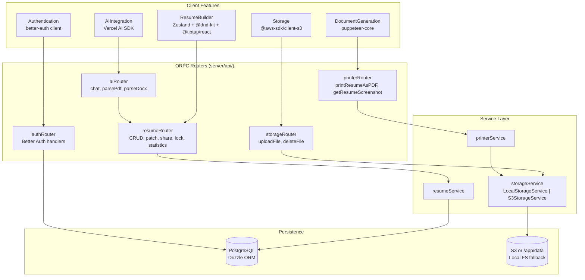
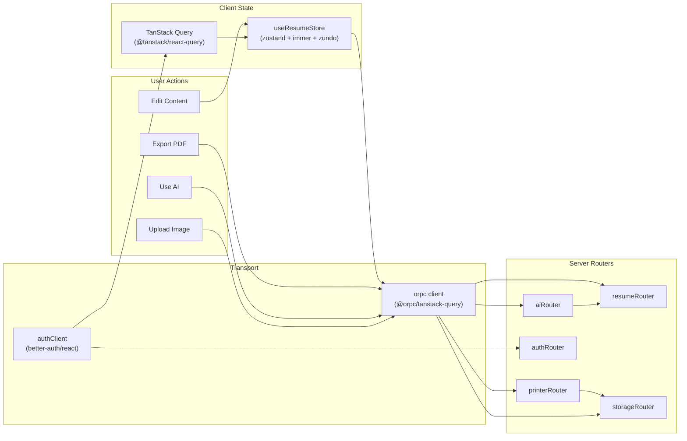

# Page: Key Features

# Key Features

<details>
<summary>Relevant source files</summary>

The following files were used as context for generating this wiki page:

- [.env.example](.env.example)
- [README.md](README.md)
- [package.json](package.json)
- [pnpm-lock.yaml](pnpm-lock.yaml)

</details>


This page provides an overview of the five major feature areas in Reactive Resume. Each feature is implemented as a distinct subsystem with well-defined responsibilities and interfaces.

For detailed documentation of each feature:
- Resume building interface and data management: see page 3.1
- PDF and screenshot generation: see page 3.2
- Multi-provider AI capabilities: see page 3.3
- User authentication and session management: see page 3.4
- File upload and storage: see page 3.5

## Feature Architecture Overview

**Feature subsystems mapped to ORPC routers and services**



**Feature Architecture Overview**
Each of the five feature subsystems maps to a named ORPC router and service. Authentication uses Better Auth's own handler rather than a standard ORPC procedure. The `aiRouter` ultimately delegates structured resume edits back to `resumeRouter` via JSON Patch.

Sources: [package.json:1-156](), [README.md:34-66]()

## Core Feature Technologies

| Feature | Key Dependencies | Primary Purpose |
|---------|-----------------|-----------------|
| Resume Builder | `zustand`, `immer`, `zundo`, `react-hook-form`, `@tiptap/react`, `@dnd-kit/core` | Client-side state management, form handling, rich text editing, drag-and-drop |
| Document Generation | `puppeteer-core`, `sharp` | PDF/PNG export via headless Chromium, image optimization |
| AI Integration | `ai`, `@ai-sdk/openai`, `@ai-sdk/anthropic`, `@ai-sdk/google`, `ai-sdk-ollama`, `@modelcontextprotocol/sdk` | Multi-provider AI, document parsing, conversational editing, MCP server |
| Authentication | `better-auth`, `bcrypt`, `input-otp`, `qrcode.react` | Multi-provider auth, password hashing, 2FA, passkeys |
| Storage | `@aws-sdk/client-s3`, `sharp` | S3-compatible object storage, image processing |

Sources: [package.json:33-115]()

## Feature Interaction Flow

**Typical user workflows and how they traverse feature boundaries**

```mermaid
sequenceDiagram
    participant User
    participant UI["React Components\n(app/routes/**)"]
    participant Store["useResumeStore\n(Zustand + Immer + Zundo)"]
    participant ORPC["orpc client\n(@orpc/tanstack-query)"]
    participant resumeService["resumeService"]
    participant printerService["printerService"]
    participant aiRouter["aiRouter"]
    participant DB["PostgreSQL\n(Drizzle ORM)"]

    User->>UI: Edit resume field
    UI->>Store: update state
    Store->>Store: Immer mutation + Zundo history
    Note over Store,ORPC: Debounced sync (~500ms)
    Store->>ORPC: resumeRouter.patch (RFC 6902 operations)
    ORPC->>resumeService: apply JSON Patch
    resumeService->>DB: persist

    User->>UI: Export PDF
    UI->>ORPC: printerRouter.printResumeAsPDF
    ORPC->>printerService: render via puppeteer-core
    printerService->>DB: store PDF URL
    printerService-->>UI: return download link

    User->>UI: AI chat message
    UI->>ORPC: aiRouter.chat
    ORPC->>aiRouter: stream response + tool calls
    aiRouter->>resumeService: apply patch operations
    resumeService->>DB: persist
    DB-->>UI: invalidate TanStack Query cache
```

**Feature Interaction Flow**
The three primary workflows (edit, export, AI-assist) all flow through the `orpc` client. Resume edits are batched as RFC 6902 JSON Patch operations. AI edits route through `aiRouter` before delegating to `resumeService`.

Sources: [package.json:84-115](), [README.md:38-65]()

## 1. Resume Builder

The resume builder provides a rich editing interface with real-time preview and persistent state management.

**Key Capabilities:**
- State management via `zustand` with `immer` for immutable updates
- Undo/redo history via `zundo`
- Form validation using `react-hook-form` with `@hookform/resolvers`
- Rich text editing via `@tiptap/react` and `@tiptap/starter-kit`
- Drag-and-drop section reordering via `@dnd-kit/sortable`
- Debounced API synchronization

**Technical Implementation:**
- Client state lives in Zustand stores with Immer middleware for immutability
- Changes are debounced and synced to the server via ORPC procedures using RFC 6902 JSON Patch
- Resume data follows a structured schema validated by Zod
- Supports custom sections with flexible field types
- 14 named templates: Azurill, Bronzor, Chikorita, Ditto, Ditgar, Gengar, Glalie, Kakuna, Lapras, Leafish, Onyx, Pikachu, Rhyhorn

See page 3.1 for detailed documentation.

Sources: [package.json:84-115](), [README.md:38-42]()

## 2. Document Generation

PDF and screenshot generation is handled by a dedicated `printerService` using headless Chromium.

**Key Capabilities:**
- PDF export via `puppeteer-core` (headless Chromium)
- Screenshot generation for resume thumbnail previews
- Multiple page formats: A4, Letter, Free-form
- Automatic pagination with page break handling
- Image optimization via `sharp`

**Technical Implementation:**
- Printer runs as a separate Browserless/Chromium sidecar container; the main app connects via `PRINTER_ENDPOINT` (WebSocket URL)
- `printerService` exposes `printResumeAsPDF` and `getResumeScreenshot`, both called through `printerRouter`
- Generated files are stored via `storageService`

See page 3.2 for detailed documentation.

Sources: [package.json:91-102](), [.env.example:12-13](), [README.md:184]()

## 3. AI Integration

AI features provide document parsing, conversational editing, and external tool access via MCP.

**Key Capabilities:**
- Multi-provider support: OpenAI, Google Gemini, Anthropic Claude, Ollama
- Document parsing: `parsePdf` and `parseDocx` procedures in `aiRouter`
- AI chat for conversational resume editing with structured tool calls
- Tool calling maps to JSON Patch operations applied via `resumeService`
- MCP server for external AI tool access (Claude Desktop, Cursor)

**Technical Implementation:**
- Unified interface via Vercel AI SDK (`ai` package)
- Provider-specific adapters: `@ai-sdk/openai`, `@ai-sdk/anthropic`, `@ai-sdk/google`, `ai-sdk-ollama`
- Structured output with Zod schema validation
- MCP server implemented via `@modelcontextprotocol/sdk`
- AI provider API keys are configured per-user at runtime via the UI, not via server environment variables

See page 3.3 for detailed documentation.

Sources: [package.json:34-37,69-70,79](), [README.md:60]()

## 4. Authentication System

Authentication is powered by `better-auth`, supporting multiple authentication methods and security features.

**Key Capabilities:**
- Email/password authentication with email verification (can be disabled via `FLAG_DISABLE_EMAIL_AUTH`)
- Social login: Google (`GOOGLE_CLIENT_ID`), GitHub (`GITHUB_CLIENT_ID`)
- Custom OIDC/OAuth2 provider via `OAUTH_PROVIDER_NAME`, `OAUTH_DISCOVERY_URL`
- Two-factor authentication (TOTP) via `input-otp`
- Passkey support (WebAuthn)
- API key authentication with rate limiting
- Session management via cookies

**Technical Implementation:**
- Core: `better-auth` and `@better-auth/core` packages
- Password hashing with `bcrypt`
- PostgreSQL adapter via Drizzle ORM (shares the same database as the rest of the app)
- QR code generation for 2FA setup via `qrcode.react`
- Environment-based provider configuration

See page 3.4 for detailed documentation.

Sources: [package.json:39,71-72,85-86,92](), [.env.example:18-36](), [README.md:65]()

## 5. Storage System

File storage supports both S3-compatible object storage and local filesystem via a `storageService` abstraction.

**Key Capabilities:**
- S3-compatible storage via `@aws-sdk/client-s3`
- Local filesystem fallback to `/app/data`
- Image processing and optimization via `sharp`
- Support for SeaweedFS as the default S3-compatible backend

**Technical Implementation:**
- `storageService` has two concrete implementations:
  - `S3StorageService` — used when `S3_ACCESS_KEY_ID` is configured
  - `LocalStorageService` — used as fallback when S3 credentials are absent
- `storageRouter` exposes `uploadFile` and `deleteFile` procedures
- Image uploads are optionally processed with `sharp` (can be disabled via `FLAG_DISABLE_IMAGE_PROCESSING`)
- PDF/screenshot files are written by `printerService` through `storageService`

See page 3.5 for detailed documentation.

Sources: [package.json:38,102](), [.env.example:46-56](), [README.md:184]()

## Feature Flags

Feature behavior can be controlled via environment variables:

| Flag | Default | Purpose |
|------|---------|---------|
| `FLAG_DEBUG_PRINTER` | `false` | Bypass server-only check for printer routes (debugging) |
| `FLAG_DISABLE_SIGNUPS` | `false` | Disable new user registration |
| `FLAG_DISABLE_EMAIL_AUTH` | `false` | Disable email/password login (social auth only) |
| `FLAG_DISABLE_IMAGE_PROCESSING` | `false` | Disable image processing (resource-constrained deployments) |

Sources: [.env.example:58-71]()

## Data Flow Across Features

**Client-to-server data flow with named code entities**



**Cross-Feature Data Flow**
All features communicate via the typed `orpc` client, which maps to ORPC server routers. Authentication uses `authClient` from `better-auth/react` separately, then feeds session state into TanStack Query.

Sources: [package.json:48-78,84-115]()

## Environment Configuration

Each feature requires specific environment variables for configuration:

```bash
# Resume Builder (no specific env vars, uses APP_URL)
APP_URL="http://localhost:3000"

# Document Generation
PRINTER_ENDPOINT="ws://localhost:4000?token=1234567890"
PRINTER_APP_URL="http://host.docker.internal:3000"

# AI Integration (optional, provider-specific)
# Configured at runtime via UI, no env vars required

# Authentication
AUTH_SECRET="change-me-to-a-secure-secret-key"
GOOGLE_CLIENT_ID="..."
GOOGLE_CLIENT_SECRET="..."
GITHUB_CLIENT_ID="..."
GITHUB_CLIENT_SECRET="..."

# Storage
S3_ACCESS_KEY_ID="seaweedfs"
S3_SECRET_ACCESS_KEY="seaweedfs"
S3_ENDPOINT="http://localhost:8333"
S3_BUCKET="reactive-resume"
```

Sources: [.env.example:1-78]()

---

