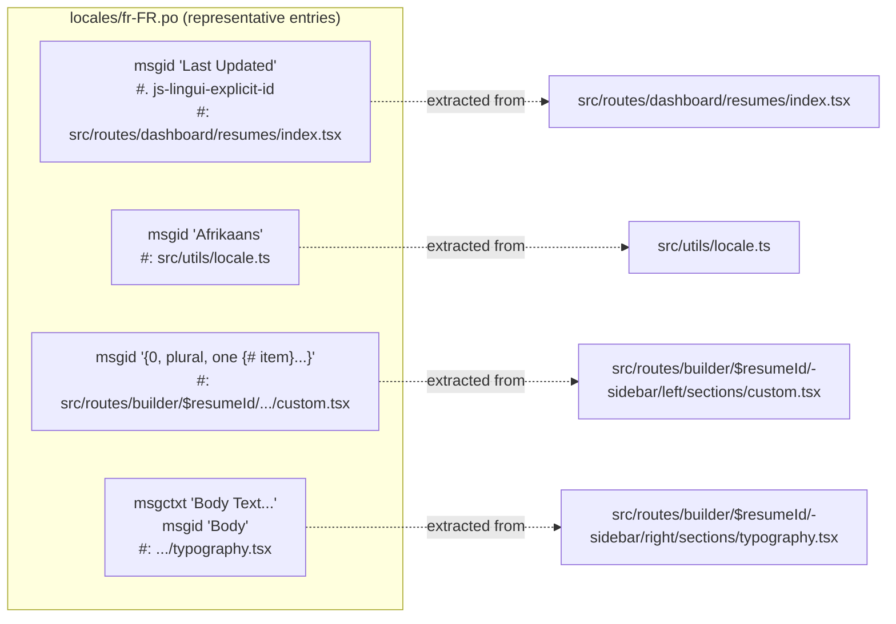
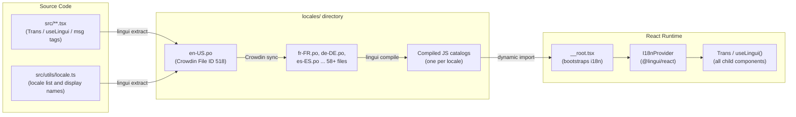
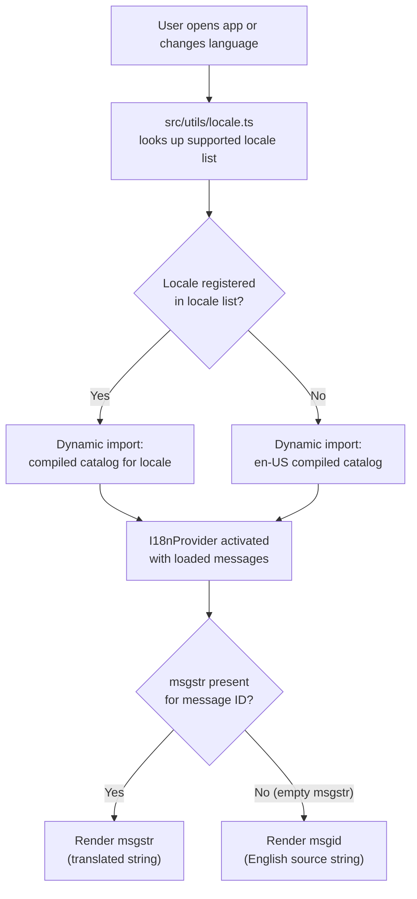

# Page: Locale Files

# Locale Files

<details>
<summary>Relevant source files</summary>

The following files were used as context for generating this wiki page:

- [lingui.config.ts](lingui.config.ts)
- [locales/af-ZA.po](locales/af-ZA.po)
- [locales/am-ET.po](locales/am-ET.po)
- [locales/ar-SA.po](locales/ar-SA.po)
- [locales/az-AZ.po](locales/az-AZ.po)
- [locales/bg-BG.po](locales/bg-BG.po)
- [locales/bn-BD.po](locales/bn-BD.po)
- [locales/ca-ES.po](locales/ca-ES.po)
- [locales/cs-CZ.po](locales/cs-CZ.po)
- [locales/da-DK.po](locales/da-DK.po)
- [locales/de-DE.po](locales/de-DE.po)
- [locales/el-GR.po](locales/el-GR.po)
- [locales/es-ES.po](locales/es-ES.po)
- [locales/fr-FR.po](locales/fr-FR.po)
- [locales/it-IT.po](locales/it-IT.po)
- [locales/ta-IN.po](locales/ta-IN.po)

</details>


This page documents the PO file format used by the translation catalog, the 58+ supported locale files, the `zu-ZA` pseudo-locale, fallback behavior when a translation is absent, and how compiled catalogs are loaded into the application at runtime. For how source strings are extracted, pushed to Crowdin, and pulled back via automated pull requests, see [Translation Workflow](#4.1).

---

## PO File Format

All translation files reside in `locales/` and follow the standard GNU gettext PO format, managed by `@lingui/cli`. Each file is named `{language}-{REGION}.po` using a lowercase BCP 47 language subtag and an uppercase ISO 3166-1 alpha-2 region subtag (e.g., `fr-FR.po`, `zh-CN.po`).

### File Header

Every PO file opens with a header block: an entry whose `msgid` is an empty string and whose `msgstr` contains newline-delimited metadata fields.

| Header Field | Example (fr-FR) | Purpose |
|---|---|---|
| `POT-Creation-Date` | `2025-11-04 23:14+0100` | Date `lingui extract` last ran |
| `Content-Type` | `text/plain; charset=UTF-8` | Encoding declaration |
| `X-Generator` | `@lingui/cli` | Tool that produced the file |
| `Language` | `fr` | BCP 47 language subtag |
| `Project-Id-Version` | `reactive-resume` | Project identifier |
| `Plural-Forms` | `nplurals=2; plural=(n > 1);` | Language-specific plural rules |
| `X-Crowdin-Project` | `reactive-resume` | Crowdin project slug |
| `X-Crowdin-Project-ID` | `503410` | Crowdin project numeric ID |
| `X-Crowdin-Language` | `fr` | Crowdin language code (may be shorter than filename tag) |
| `X-Crowdin-File` | `/main/locales/en-US.po` | Source file path in Crowdin |
| `X-Crowdin-File-ID` | `518` | Crowdin file numeric ID |

The `X-Crowdin-File: /main/locales/en-US.po` field establishes `locales/en-US.po` as the single authoritative source. Every translated PO file's `msgstr` values correspond to the `msgid` values found in `en-US.po`.

Sources: [locales/fr-FR.po:1-19](), [locales/ar-SA.po:1-19](), [locales/cs-CZ.po:1-19]()

---

### Message Entry Types

A PO file contains one entry per translatable string. Lingui uses four patterns:

**1. Simple entry**
```po
#: src/routes/dashboard/resumes/index.tsx
msgid "Last Updated"
msgstr "Dernière mise à jour"
```

**2. Entry with explicit ID**
```po
#. js-lingui-explicit-id
#: src/routes/dashboard/resumes/index.tsx
msgid "Last Updated"
msgstr "Dernière mise à jour"
```
The `#. js-lingui-explicit-id` comment marks strings where the `msgid` is a stable developer-assigned key. The key does not change even if the English source text is later edited, preserving existing translations across source refactors.

**3. Entry with disambiguation context (`msgctxt`)**
```po
#: src/routes/builder/$resumeId/-sidebar/right/sections/typography.tsx
msgctxt "Body Text (paragraphs, lists, etc.)"
msgid "Body"
msgstr "Corps"
```
`msgctxt` disambiguates `msgid` values that are identical in English but have different meanings in context.

**4. ICU plural / JSX `Trans` markup entry**
```po
#. placeholder {0}: section.items.length
#: src/routes/builder/$resumeId/-sidebar/left/sections/custom.tsx
msgid "{0, plural, one {# item} other {# items}}"
msgstr "{0, plural, one {# élément} other {# éléments}}"
```
ICU message format with `plural` selectors. Translators must supply all plural forms required by the language's `Plural-Forms` rule. JSX `Trans` component slots appear as numbered tags (`<0>`, `<1>`, etc.) that must be preserved verbatim in `msgstr`.

### Comment Prefixes

| Prefix | Meaning |
|---|---|
| `#:` | Source location — file path, optionally with line number |
| `#.` | Extracted comment — e.g., `js-lingui-explicit-id`, placeholder descriptions |
| `#` | Translator-facing comment |
| `#,` | Flags — e.g., `fuzzy` for strings requiring translator review |

Sources: [locales/fr-FR.po:21-57](), [locales/es-ES.po:21-57](), [locales/it-IT.po:21-57]()

---

### Diagram: PO Entry Anatomy and Source File References

This diagram shows how PO entries trace back to source code files, using comment annotations that `@lingui/cli` inserts during extraction.



Sources: [locales/fr-FR.po:21-57](), [locales/fr-FR.po:214-230]()

---

## Supported Locales

The `locales/` directory contains 58+ `.po` files. The source locale is `en-US`. The full canonical list of supported locales and their display names (e.g., `"Afrikaans"`, `"Arabic"`) is maintained in `src/utils/locale.ts`. Those display name strings are themselves translatable — they appear as `msgid` entries in every locale's PO file with `src/utils/locale.ts` as the source reference.

The following locales are confirmed by file evidence:

| File | Language | Region | `Plural-Forms` |
|---|---|---|---|
| `en-US.po` | English (source) | United States | `nplurals=2; plural=(n != 1);` |
| `af-ZA.po` | Afrikaans | South Africa | `nplurals=2; plural=(n != 1);` |
| `am-ET.po` | Amharic | Ethiopia | `nplurals=2; plural=(n > 1);` |
| `ar-SA.po` | Arabic | Saudi Arabia | `nplurals=6; plural=(n==0?0:n==1?1:n==2?2:n%100>=3&&n%100<=10?3:n%100>=11&&n%100<=99?4:5);` |
| `az-AZ.po` | Azerbaijani | Azerbaijan | `nplurals=2; plural=(n != 1);` |
| `bg-BG.po` | Bulgarian | Bulgaria | `nplurals=2; plural=(n != 1);` |
| `bn-BD.po` | Bengali | Bangladesh | `nplurals=2; plural=(n != 1);` |
| `ca-ES.po` | Catalan | Spain | `nplurals=2; plural=(n != 1);` |
| `cs-CZ.po` | Czech | Czech Republic | `nplurals=4; plural=(n==1)?0:(n>=2&&n<=4)?1:3;` |
| `da-DK.po` | Danish | Denmark | `nplurals=2; plural=(n != 1);` |
| `de-DE.po` | German | Germany | `nplurals=2; plural=(n != 1);` |
| `el-GR.po` | Greek | Greece | `nplurals=2; plural=(n != 1);` |
| `es-ES.po` | Spanish | Spain | `nplurals=2; plural=(n != 1);` |
| `fr-FR.po` | French | France | `nplurals=2; plural=(n > 1);` |
| `it-IT.po` | Italian | Italy | `nplurals=2; plural=(n != 1);` |
| `ta-IN.po` | Tamil | India | `nplurals=2; plural=(n != 1);` |
| `zu-ZA.po` | Pseudo-locale | — | (testing only, see below) |
| *(42+ more)* | | | |

> Note: French (`fr-FR`) and Amharic (`am-ET`) use `plural=(n > 1)` rather than `plural=(n != 1)`, meaning the value `1` maps to the singular form while `0` maps to the plural. Arabic uses six plural categories — the most complex `Plural-Forms` of any locale in this project.

Sources: [locales/fr-FR.po:14](), [locales/am-ET.po:14](), [locales/ar-SA.po:14](), [locales/cs-CZ.po:14](), [locales/af-ZA.po:14](), [locales/az-AZ.po:14](), [locales/bg-BG.po:14](), [locales/bn-BD.po:14](), [locales/ca-ES.po:14](), [locales/da-DK.po:14](), [locales/de-DE.po:14](), [locales/el-GR.po:14](), [locales/es-ES.po:14](), [locales/it-IT.po:14](), [locales/ta-IN.po:14]()

---

## Pseudo-Locale zu-ZA

`locales/zu-ZA.po` uses the Zulu language code (`zu`) and the South Africa region (`ZA`) as a conventional identifier for a pseudo-locale — a locale containing artificially generated `msgstr` values rather than real translations. It is not intended for end users.

**Why it exists:**

| Use case | How zu-ZA helps |
|---|---|
| **Coverage check** | Any string that bypasses `Trans` or `useLingui()` and is hardcoded in JSX will remain in English when `zu-ZA` is active, immediately identifying the gap |
| **Layout stress test** | Pseudo-translated strings are typically longer than English, surfacing truncation or overflow bugs in the UI |
| **Character rendering** | Non-ASCII characters in pseudo-translated strings verify that fonts and text rendering handle Unicode correctly across all components |

To activate `zu-ZA` for testing, select it from the language picker in the application header (`src/routes/_home/-sections/header.tsx`). It appears alongside real locales in the picker because it is registered in `src/utils/locale.ts`.

---

## Fallback Rules

All locales fall back to `en-US`. There is no multi-level fallback chain — `fr-CA` does not silently try `fr-FR` before reaching `en-US`. Each locale file is treated as independent.

The fallback applies in two situations:

1. **Empty `msgstr`**: If a string has been added to `en-US.po` but the corresponding `msgstr` in a translated locale is empty (not yet translated), Lingui renders the `msgid` directly. Since all `msgid` values are English source strings, the result is the English text.

2. **Locale unavailable**: If the user's active locale has no compiled catalog (e.g., a locale tag not registered in `src/utils/locale.ts`), the application loads the `en-US` catalog instead.

The `locales/en-US.po` file is therefore both the extraction source (Crowdin File ID `518`) and the implicit last-resort fallback for all 58+ locales.

Sources: [locales/fr-FR.po:18](), [locales/it-IT.po:114-115]()

---

## Compilation and Runtime Loading

PO files are human-readable source files. The Lingui runtime does not parse them directly. Before the application can use translations, `@lingui/cli compile` must transform each `.po` file into a compiled JavaScript message catalog.

### Diagram: Source to Runtime Loading Pipeline

This diagram shows the full path from TSX source code through compilation to the React component tree, naming the key code entities at each stage.



Sources: [locales/fr-FR.po:6-7]()

---

### Diagram: Locale Selection and Fallback at Runtime



### Runtime Loading Steps

1. `__root.tsx` detects the active locale from the user's stored preference or `navigator.language`.
2. `src/utils/locale.ts` is consulted to validate that the requested locale is supported and to retrieve its display name and directionality metadata.
3. If the locale is not in the supported list, the application substitutes `en-US`.
4. The compiled catalog for the resolved locale is dynamically imported. This avoids bundling all 58+ catalogs into the initial JavaScript payload.
5. `I18nProvider` from `@lingui/react` is initialized with the imported message object.
6. All descendant components that use `Trans`, `useLingui()`, or the `msg` tagged template literal automatically receive translations from the active catalog.
7. If the user changes language in the UI (via the picker in `src/routes/_home/-sections/header.tsx`), steps 1–6 repeat with the new locale.

Sources: [locales/fr-FR.po:6-7](), [locales/fr-FR.po:18]()

---

