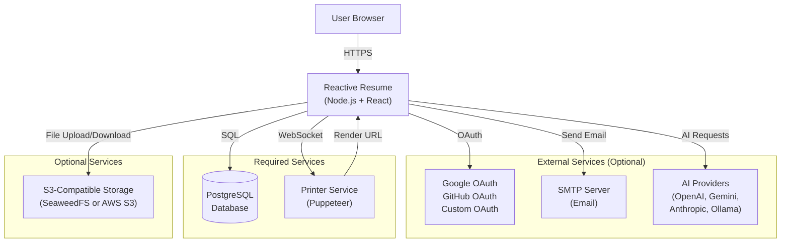
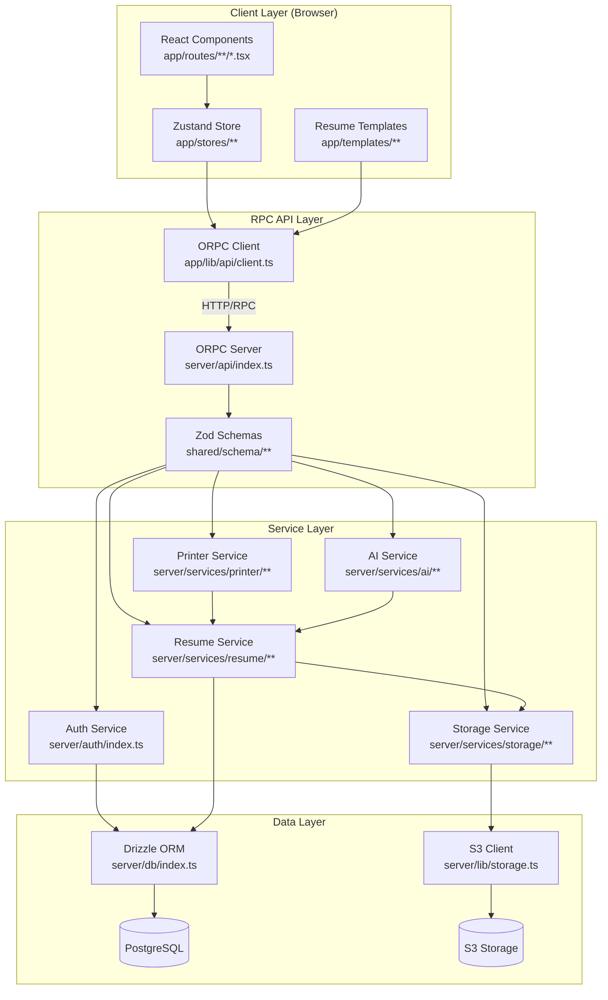
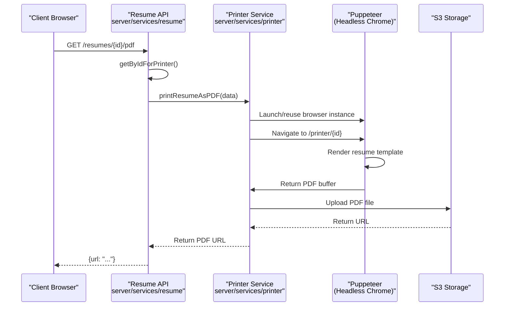
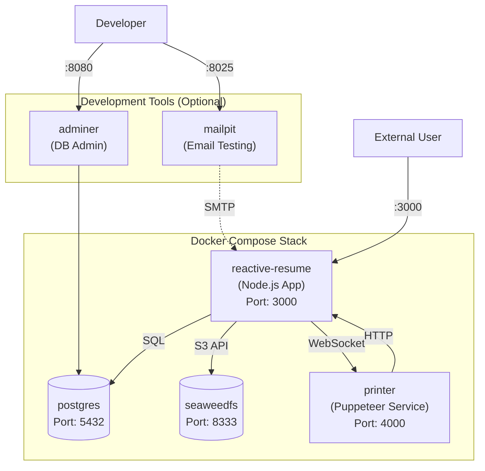

# Page: Overview

# Overview

<details>
<summary>Relevant source files</summary>

The following files were used as context for generating this wiki page:

- [.env.example](.env.example)
- [CLAUDE.md](CLAUDE.md)
- [README.md](README.md)
- [compose.dev.yml](compose.dev.yml)
- [compose.yml](compose.yml)
- [docs/contributing/development.mdx](docs/contributing/development.mdx)
- [docs/getting-started/quickstart.mdx](docs/getting-started/quickstart.mdx)
- [docs/self-hosting/docker.mdx](docs/self-hosting/docker.mdx)
- [docs/self-hosting/examples.mdx](docs/self-hosting/examples.mdx)
- [package.json](package.json)
- [pnpm-lock.yaml](pnpm-lock.yaml)
- [src/integrations/orpc/router/storage.ts](src/integrations/orpc/router/storage.ts)
- [src/integrations/orpc/services/storage.ts](src/integrations/orpc/services/storage.ts)
- [src/routes/__root.tsx](src/routes/__root.tsx)
- [src/routes/api/health.ts](src/routes/api/health.ts)
- [src/utils/env.ts](src/utils/env.ts)
- [src/vite-env.d.ts](src/vite-env.d.ts)

</details>


## Purpose and Scope

This page provides a high-level introduction to Reactive Resume, covering the system's purpose, architecture, and core technologies. It serves as the entry point for understanding how the codebase is structured and how major components interact.

For specific topics, refer to:
- Quick setup instructions: see [Getting Started](#1.1)
- Detailed architecture diagrams and component interactions: see [Architecture Overview](#1.2)
- Frontend implementation details: see [Frontend Architecture](#2.1)
- Backend services and APIs: see [Backend Services](#2.2)
- Resume building functionality: see [Resume Builder](#3.1)
- Deployment and infrastructure: see [Docker Deployment](#5.1)
- Local development setup: see [Development Setup](#6.1)

---

## What is Reactive Resume

Reactive Resume is a free and open-source resume builder application that enables users to create, update, and share professional resumes. The application is built with privacy as a core principle, allowing users to self-host the entire system on their own infrastructure. No account is required for basic usage, and all data belongs to the user.

The system supports real-time resume editing with instant preview, multiple export formats (PDF, JSON), customizable templates, and optional AI integration for content generation. It is designed to run as a containerized application with minimal external dependencies.

**Sources:** [README.md:1-8](), [package.json:1-4]()

---

## System Context

The following diagram shows how Reactive Resume fits into the broader ecosystem and its external dependencies:



**Sources:** [.env.example:1-78](), [README.md:180-184]()

---

## Technology Stack

Reactive Resume uses a modern TypeScript-based stack with type safety enforced across all layers:

| Layer | Technology | Purpose |
|-------|-----------|---------|
| **Frontend** | React 19 | UI component library |
| | TanStack Start | Server-side rendering framework |
| | Vite | Build tool and development server |
| | Tailwind CSS | Utility-first styling |
| | Radix UI | Accessible UI primitives |
| **State Management** | Zustand | Client-side state container |
| | Immer | Immutable state updates |
| | Zundo | Undo/redo functionality (100 states) |
| | TanStack Query | Server state caching and synchronization |
| **API Layer** | ORPC | Type-safe RPC framework |
| | Zod | Runtime schema validation |
| **Backend** | Node.js | Runtime environment |
| | Better Auth | Authentication framework |
| | Drizzle ORM | Type-safe database queries |
| **Data Storage** | PostgreSQL | Primary database |
| | S3 API | Object storage (files, images, PDFs) |
| **Document Generation** | Puppeteer Core | Headless Chrome automation |
| **AI Integration** | Vercel AI SDK | Multi-provider AI abstraction |
| | Ollama, OpenAI, Gemini, Anthropic | AI model providers |

**Sources:** [package.json:33-115](), [README.md:152-164]()

---

## Architecture Layers

The system follows a three-tier architecture with clear separation between presentation, business logic, and data persistence:



This architecture ensures:
- **Type Safety**: TypeScript types flow from client to server through ORPC contracts
- **Validation**: All API requests validated via Zod schemas before processing
- **Separation of Concerns**: Business logic isolated in service layer
- **Testability**: Each layer can be tested independently

**Sources:** [package.json:48-78](), [.env.example:15-56]()

---

## Project Structure

The codebase is organized as a monorepo with the following top-level structure:

| Directory | Purpose | Key Files |
|-----------|---------|-----------|
| `app/` | Frontend application code | Routes, components, stores, templates |
| `server/` | Backend API and services | ORPC routes, business logic, database access |
| `shared/` | Shared code between client/server | Type definitions, schemas, constants |
| `public/` | Static assets | Images, fonts, template previews |
| `docs/` | Documentation site | Mint documentation |
| `.devcontainer/` | Development container setup | Docker Compose for local development |

The application uses a **unified codebase** approach where both client and server code live in the same repository, sharing types and schemas through the `shared/` directory.

**Sources:** [package.json:1-32]()

---

## Core Subsystems

### Authentication and Authorization

The authentication system is built on **Better Auth** and supports multiple authentication methods:

- **Email/Password**: Traditional credentials with email verification
- **Social OAuth**: Google, GitHub, and custom OAuth providers
- **Passkeys**: WebAuthn-based authentication
- **Two-Factor Authentication (2FA)**: TOTP-based additional security
- **API Keys**: Rate-limited token authentication (500 requests/24 hours)

All authentication configuration is centralized in the auth configuration, with session management handled via cookies.

**Sources:** [.env.example:18-36](), [package.json:39-40](), [package.json:71-72]()

---

### Resume Management

The resume management subsystem handles CRUD operations for resume data:

- **Resume CRUD**: Create, read, update, delete operations via ORPC endpoints
- **JSON Patch API**: Atomic partial updates using RFC 6902 operations for efficient synchronization
- **Debounced Auto-save**: Client-side changes are debounced (500ms) before syncing to server
- **Version History**: Undo/redo support for 100 states via Zundo
- **Import/Export**: JSON Resume format support

Resume data is stored in PostgreSQL with file attachments (photos, images) stored in S3-compatible storage or local filesystem.

**Sources:** [package.json:82](), [package.json:84](), [package.json:113-114]()

---

### Document Generation Pipeline

The printer service generates PDFs and screenshots using headless Chrome:



The printer service communicates with the main application via WebSocket connection specified in `PRINTER_ENDPOINT`. Images in resumes are converted to base64 to avoid network requests during rendering.

**Sources:** [.env.example:12-13](), [package.json:91]()

---

### Storage Abstraction

The storage service provides a unified interface for file operations:

- **S3-Compatible Storage**: Primary option using AWS SDK (SeaweedFS, MinIO, AWS S3)
- **Local Filesystem**: Fallback option storing files in `/data` directory
- **Automatic Fallback**: If S3 credentials not configured, automatically uses local storage

Configuration is controlled via environment variables with all S3 keys optional.

**Sources:** [.env.example:46-56](), [package.json:38]()

---

## Development and Build

### Build System

The application uses **Vite 8** (beta) as the build tool with the following key features:

- **Hot Module Replacement (HMR)**: Instant feedback during development
- **SSR Support**: Server-side rendering via TanStack Start
- **TypeScript Compilation**: Native TypeScript support
- **Code Splitting**: Automatic bundle optimization

Build scripts available:
- `pnpm dev`: Start development server with HMR
- `pnpm build`: Production build with optimization
- `pnpm start`: Start production server

**Sources:** [package.json:17-31](), [package.json:140]()

---

### Package Management

The project uses **pnpm 10** as the package manager with specific version pinning:

```json
"packageManager": "pnpm@10.29.2+sha512.bef43fa759d91fd2da4b319a5a0d13ef7a45bb985a3d7342058470f9d2051a3ba8674e629672654686ef9443ad13a82da2beb9eeb3e0221c87b8154fff9d74b8"
```

This ensures deterministic builds across all environments. Certain packages (`bcrypt`, `sharp`, `prisma`) are configured to build from source for platform compatibility.

**Sources:** [package.json:7](), [package.json:143-154]()

---

## Deployment Architecture

Reactive Resume is deployed as a containerized application using Docker:



All services are orchestrated via `docker-compose.yml` with environment variables configured through `.env` file.

**Sources:** [.env.example:1-78](), [README.md:132-146]()

---

## Feature Flags

The application supports runtime feature flags for controlling behavior:

| Flag | Environment Variable | Purpose |
|------|---------------------|---------|
| Debug Printer | `FLAG_DEBUG_PRINTER` | Bypass server-only check for printer endpoint |
| Disable Signups | `FLAG_DISABLE_SIGNUPS` | Prevent new user registration |
| Disable Email Auth | `FLAG_DISABLE_EMAIL_AUTH` | Disable password-based authentication |
| Disable Image Processing | `FLAG_DISABLE_IMAGE_PROCESSING` | Skip image optimization (for low-resource systems) |

These flags allow administrators to configure the application behavior without code changes.

**Sources:** [.env.example:58-71]()

---

## Internationalization

The application supports **54+ languages** through the Lingui i18n framework:

- **Message Extraction**: Automated extraction from source code
- **Translation Management**: Crowdin integration for collaborative translation
- **Runtime Loading**: Locale files loaded on-demand via `@lingui/core`
- **Automated PRs**: GitHub Actions automatically create PRs with updated translations

Translation files are stored as `.po` files in `locales/` directory, with English (`en-US`) as the source language.

**Sources:** [package.json:45-46](), [package.json:119-121](), [README.md:61]()

---

## Next Steps

For deeper dives into specific subsystems:

- **Getting Started**: Learn how to run the application locally → [Getting Started](#1.1)
- **Architecture Details**: Detailed component diagrams and data flows → [Architecture Overview](#1.2)
- **Frontend Deep Dive**: React components, routing, and state management → [Frontend Architecture](#2.1)
- **Backend Services**: ORPC endpoints and business logic → [Backend Services](#2.2)
- **Resume Building**: Editor implementation and template system → [Resume Builder](#3.1)
- **Deployment**: Production deployment and configuration → [Docker Deployment](#5.1)
- **Development**: Setting up a local development environment → [Development Setup](#6.1)

---

