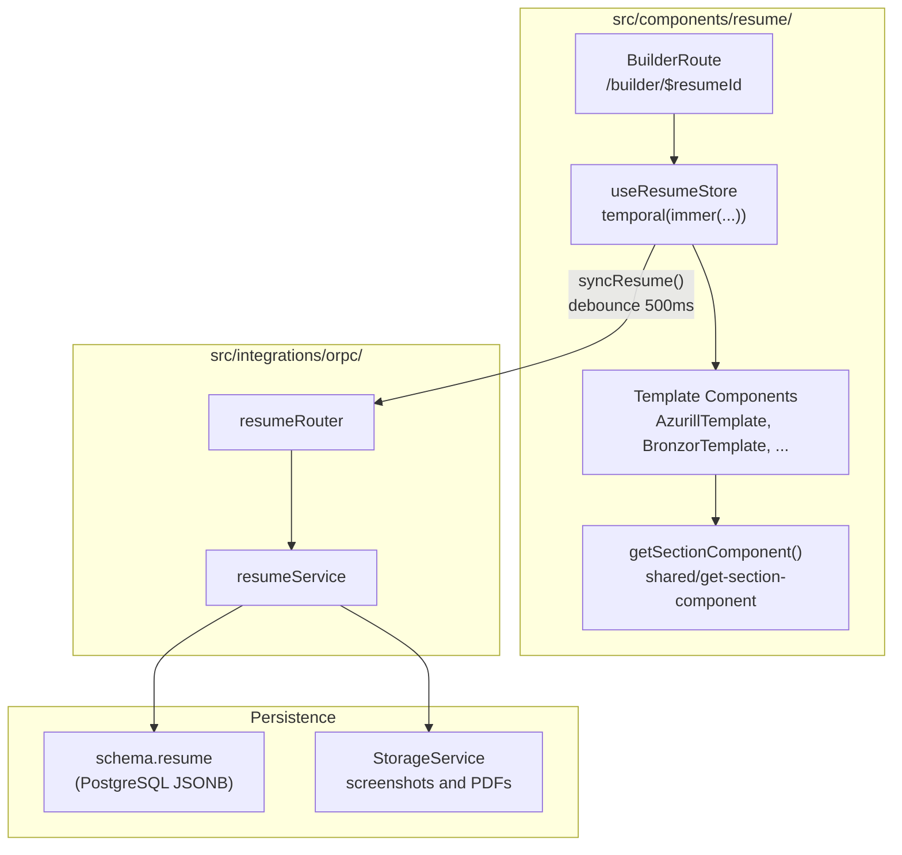
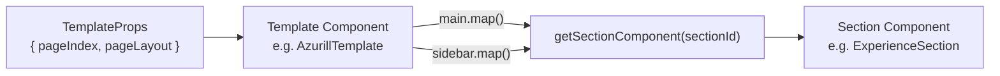
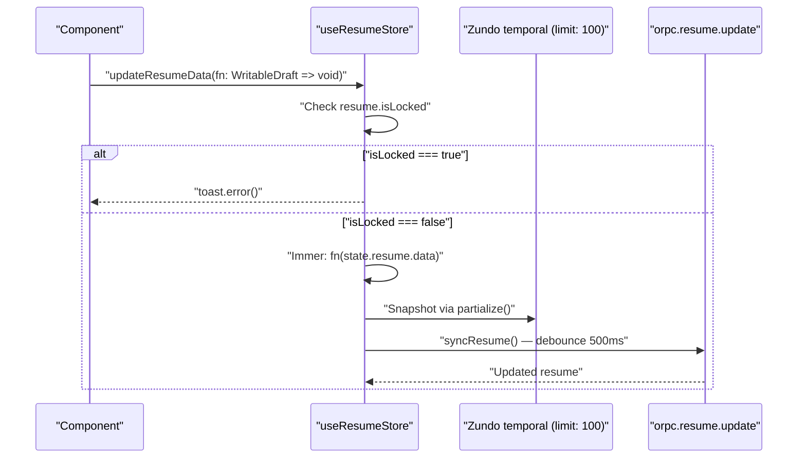
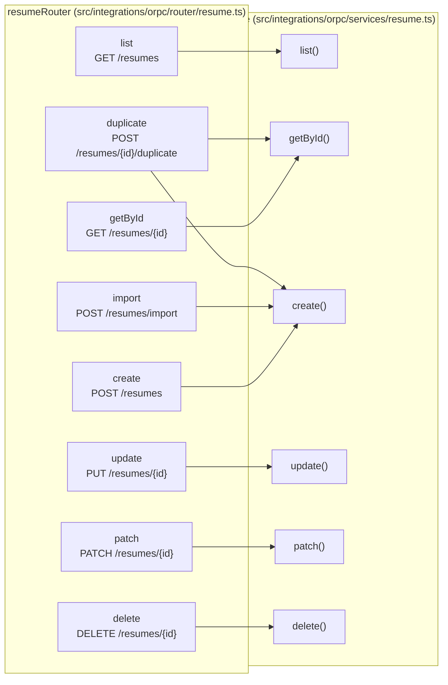
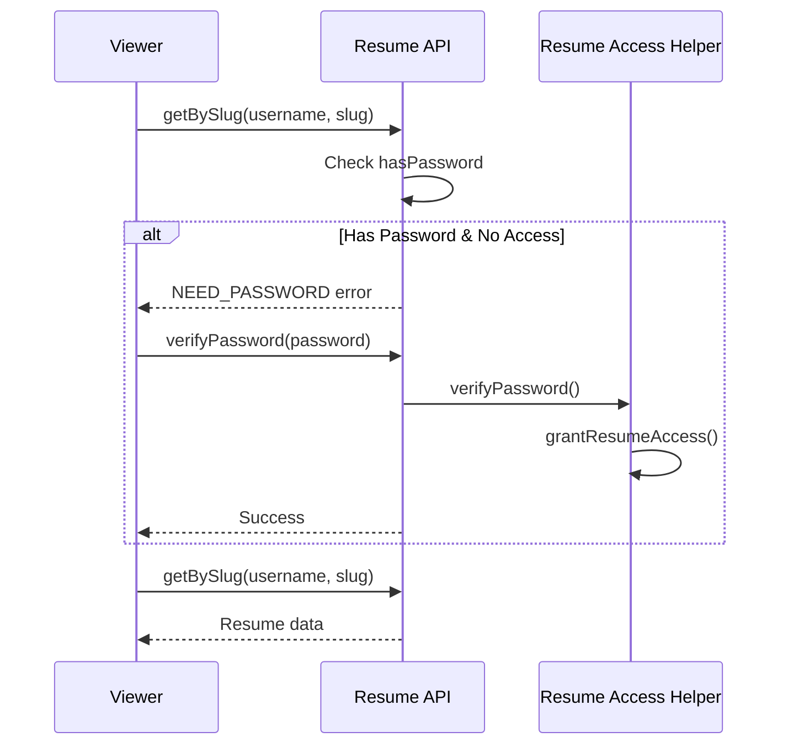
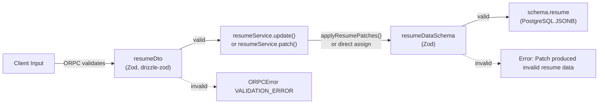
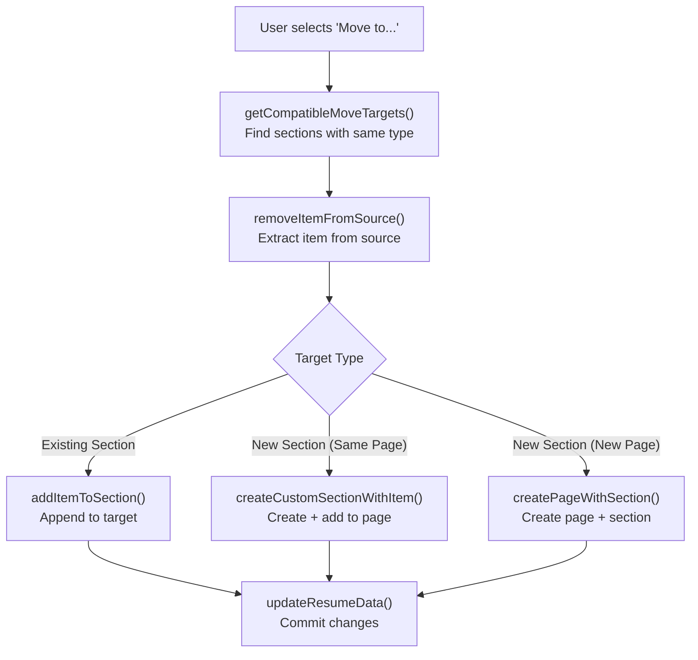
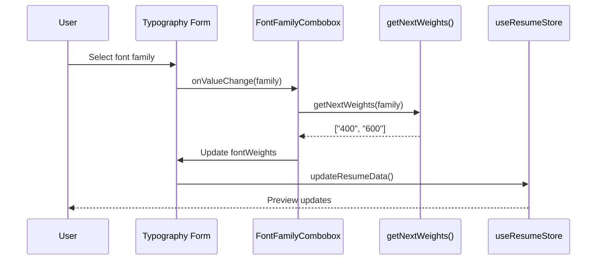
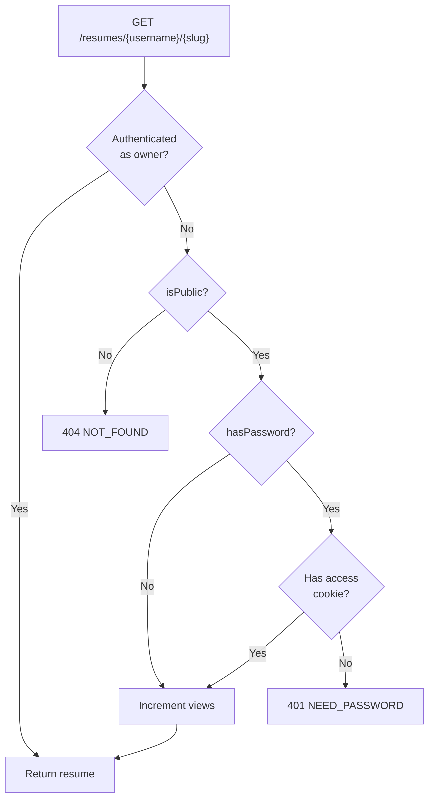

# Page: Resume Builder

# Resume Builder

<details>
<summary>Relevant source files</summary>

The following files were used as context for generating this wiki page:

- [README.md](README.md)
- [docs/community/spotlight.mdx](docs/community/spotlight.mdx)
- [docs/docs.json](docs/docs.json)
- [docs/guides/using-the-patch-api.mdx](docs/guides/using-the-patch-api.mdx)
- [docs/self-hosting/sso.mdx](docs/self-hosting/sso.mdx)
- [src/components/level/display.tsx](src/components/level/display.tsx)
- [src/components/resume/store/resume.ts](src/components/resume/store/resume.ts)
- [src/components/resume/templates/azurill.tsx](src/components/resume/templates/azurill.tsx)
- [src/components/resume/templates/bronzor.tsx](src/components/resume/templates/bronzor.tsx)
- [src/components/resume/templates/chikorita.tsx](src/components/resume/templates/chikorita.tsx)
- [src/components/resume/templates/ditgar.tsx](src/components/resume/templates/ditgar.tsx)
- [src/components/resume/templates/ditto.tsx](src/components/resume/templates/ditto.tsx)
- [src/components/resume/templates/gengar.tsx](src/components/resume/templates/gengar.tsx)
- [src/components/resume/templates/glalie.tsx](src/components/resume/templates/glalie.tsx)
- [src/components/resume/templates/kakuna.tsx](src/components/resume/templates/kakuna.tsx)
- [src/components/resume/templates/lapras.tsx](src/components/resume/templates/lapras.tsx)
- [src/components/resume/templates/leafish.tsx](src/components/resume/templates/leafish.tsx)
- [src/components/resume/templates/onyx.tsx](src/components/resume/templates/onyx.tsx)
- [src/components/resume/templates/pikachu.tsx](src/components/resume/templates/pikachu.tsx)
- [src/components/resume/templates/rhyhorn.tsx](src/components/resume/templates/rhyhorn.tsx)
- [src/integrations/orpc/dto/resume.ts](src/integrations/orpc/dto/resume.ts)
- [src/integrations/orpc/router/printer.ts](src/integrations/orpc/router/printer.ts)
- [src/integrations/orpc/router/resume.ts](src/integrations/orpc/router/resume.ts)
- [src/integrations/orpc/services/ai.ts](src/integrations/orpc/services/ai.ts)
- [src/integrations/orpc/services/printer.ts](src/integrations/orpc/services/printer.ts)
- [src/integrations/orpc/services/resume.ts](src/integrations/orpc/services/resume.ts)
- [src/utils/resume/move-item.ts](src/utils/resume/move-item.ts)
- [src/utils/resume/patch.ts](src/utils/resume/patch.ts)
- [src/utils/string.ts](src/utils/string.ts)

</details>


The Resume Builder is the core editing interface of Reactive Resume, enabling users to create, edit, and customize their resumes through a real-time preview system. This page covers the overall architecture, editor interface, data management, and CRUD operations.

For specific subsystems within the builder:
- Template selection and rendering: see [Resume Templates](#3.1.1)
- State management with Zustand: see [State Management](#3.1.2)
- Resume data structure and validation: see [Resume Data Schema](#3.1.3)
- Partial update API: see [JSON Patch API](#3.1.4)
- PDF generation and export: see [Document Generation](#3.2)
- Authentication and permissions: see [Authentication System](#3.4)

---

## Architecture Overview

The Resume Builder follows a client-server architecture with clear separation between the editing interface (React), state management (Zustand), API layer (ORPC), and data persistence (PostgreSQL).

**Resume Builder: Code Entity Map**



Sources: [src/components/resume/store/resume.ts:1-81](), [src/integrations/orpc/router/resume.ts:1-379](), [src/integrations/orpc/services/resume.ts:1-434](), [src/components/resume/templates/azurill.tsx:59-89]()

---

## Editor Interface Structure

The builder interface is organized as a route at `/builder/$resumeId` with a three-panel layout: left sidebar (section editors), center panel (live resume preview), and right sidebar (typography, design, and layout settings).

**Template Rendering: TemplateProps → Page Layout**

Each template component receives a `TemplateProps` object containing `pageIndex` and `pageLayout`. The `pageLayout` has three properties:

| Property | Type | Description |
|----------|------|-------------|
| `main` | `string[]` | Section IDs assigned to the main column |
| `sidebar` | `string[]` | Section IDs assigned to the sidebar column |
| `fullWidth` | `boolean` | When true, the template renders without a sidebar |

Templates iterate over `main` and `sidebar` arrays and delegate rendering to `getSectionComponent()`, which maps a section ID to its corresponding React component.



Sources: [src/components/resume/templates/azurill.tsx:59-89](), [src/components/resume/templates/chikorita.tsx:33-71](), [src/components/resume/templates/gengar.tsx:22-76]()

---

## State Management

Resume state is managed by a Zustand store with Immer for immutable updates and Zundo for undo/redo history. Changes are debounced (500ms) before syncing to the server.

**Edit-to-Auto-Save Flow**



The store is created with `create<ResumeStore>()(temporal(immer(...)))`. The three layers compose as:

- **`immer`** — enables draft-style mutations inside `updateResumeData`
- **`temporal` (Zundo)** — records a history of `{ resume }` snapshots for undo/redo; capped at 100 entries
- **`create`** (Zustand) — provides the React hook `useResumeStore`

The store exposes two main actions and one history hook:

| Symbol | Purpose |
|--------|---------|
| `initialize(resume)` | Load a resume on mount; clears undo history |
| `updateResumeData(fn)` | Apply Immer draft mutations; triggers debounced save |
| `useTemporalStore(selector)` | Access Zundo's undo/redo state |

The debounce uses an `AbortController` signal so in-flight debounced calls are cancelled if the store is re-initialized.

Sources: [src/components/resume/store/resume.ts:1-81]()

**Key Implementation Details:**

| Concept | Implementation | Location |
|---------|---------------|----------|
| Store creation | `create<ResumeStore>()(temporal(immer(...)))` | [src/components/resume/store/resume.ts:42-76]() |
| Debounce delay | `debounce(_syncResume, 500, { signal })` | [src/components/resume/store/resume.ts:36]() |
| Undo/redo limit | `limit: 100` snapshots | [src/components/resume/store/resume.ts:73]() |
| Sync function | `orpc.resume.update.call({ id, data })` | [src/components/resume/store/resume.ts:33]() |
| Lock check | `if (state.resume.isLocked) toast.error(...)` | [src/components/resume/store/resume.ts:60-63]() |
| Undo/redo hook | `useTemporalStore(selector)` | [src/components/resume/store/resume.ts:78-80]() |

---

## Standard and Custom Sections

Resume content is organized into sections of two kinds.

**Standard Sections**

Standard sections have fixed keys in `ResumeData.sections` and are identified by the `SectionType` union type. The full list is:

| Section ID | Content |
|------------|---------|
| `profiles` | Social and professional profiles |
| `experience` | Work history |
| `education` | Educational background |
| `projects` | Project entries |
| `skills` | Technical and soft skills |
| `languages` | Language proficiency |
| `interests` | Personal interests |
| `awards` | Awards and recognition |
| `certifications` | Professional certifications |
| `publications` | Published works |
| `volunteer` | Volunteer experience |
| `references` | Professional references |

Additionally, the `summary` section is special — some templates (e.g. `GengarTemplate`, `LeafishTemplate`) pull it out of the section list and render it at a fixed position in the header area rather than in the main column.

**Custom Sections**

Custom sections are defined by the user and stored in `ResumeData.customSections` (an array of `CustomSection` objects). Each custom section has an `id`, a `type` matching one of the `SectionType` values, a `title`, `columns`, `hidden`, and an `items` array. This allows multiple instances of, say, an `experience`-type section under different headings.

The `getSectionComponent()` function resolves both standard and custom section IDs to the correct React component. For standard sections, the ID directly matches a section type. For custom sections, the `id` is a UUID that maps to the stored `CustomSection.type`.

**Drag-and-Drop Ordering**

Within the builder, section items can be reordered by drag-and-drop. Sections themselves can also be reordered across pages. This is managed client-side through `updateResumeData`, which commits the new order to the store and triggers the debounced sync. The `move-item` utilities handle cross-section moves; within-section reordering is handled directly via the drag-and-drop event handlers in the UI.

Sources: [src/utils/resume/move-item.ts:33-49](), [src/components/resume/templates/gengar.tsx:42-52](), [src/components/resume/templates/leafish.tsx:29-36]()

---

## CRUD Operations

The resume service exposes operations through the ORPC router. All operations require authentication except public resume viewing.

**resumeRouter → resumeService Binding**



Sources: [src/integrations/orpc/router/resume.ts:60-378](), [src/integrations/orpc/services/resume.ts:82-433]()

**Operation Details:**

| Operation | Endpoint | Input | Output | Purpose |
|-----------|----------|-------|--------|---------|
| `list` | GET `/resumes` | `tags`, `sort` | Resume metadata array | Filter and sort user's resumes |
| `getById` | GET `/resumes/{id}` | `id` | Full resume object | Load resume for editing |
| `create` | POST `/resumes` | `name`, `slug`, `tags`, `withSampleData` | Resume ID | Create new resume |
| `update` | PUT `/resumes/{id}` | `id`, `name?`, `slug?`, `tags?`, `data?`, `isPublic?` | Updated resume | Full update |
| `patch` | PATCH `/resumes/{id}` | `id`, `operations[]` | Patched resume | Atomic partial update |
| `duplicate` | POST `/resumes/{id}/duplicate` | `id`, `name?`, `slug?`, `tags?` | New resume ID | Clone existing resume |
| `delete` | DELETE `/resumes/{id}` | `id` | void | Permanently delete |

Sources: [src/integrations/orpc/router/resume.ts:64-378](), [src/integrations/orpc/dto/resume.ts:21-103]()

---

## Resume Features

**Tags and Organization**

Resumes can be tagged for filtering. The `tags.list()` operation returns all unique tags across a user's resumes.

```typescript
// Get all unique tags
const tags = await resumeService.tags.list({ userId });
// Returns: ["Technical", "Creative", "Manager", ...]
```

Sources: [src/integrations/orpc/services/resume.ts:18-30]()

**Locking**

Locked resumes cannot be modified or deleted. The lock status is checked before all mutation operations.

```typescript
// Check in service layer
if (resume?.isLocked) throw new ORPCError("RESUME_LOCKED");

// Check in store
if (state.resume.isLocked) {
  errorToastId = toast.error(t`This resume is locked...`);
  return state;
}
```

Sources: [src/integrations/orpc/services/resume.ts:280](), [src/components/resume/store/resume.ts:60-63]()

**Password Protection**

Public resumes can be password-protected. The `verifyPassword` endpoint grants session-based access.



Sources: [src/integrations/orpc/services/resume.ts:170-229](), [src/integrations/orpc/router/resume.ts:289-314]()

**Statistics Tracking**

View and download counts are tracked in `schema.resumeStatistics`. The `increment` method is called after PDF generation or public viewing.

| Statistic | Updated When | Tracked In |
|-----------|--------------|------------|
| `views` | Public resume viewed | `resumeService.statistics.increment()` |
| `downloads` | PDF generated (unauthenticated) | `printerRouter.printResumeAsPDF()` |
| `lastViewedAt` | On view increment | SQL `now()` |
| `lastDownloadedAt` | On download increment | SQL `now()` |

Sources: [src/integrations/orpc/services/resume.ts:32-80](), [src/integrations/orpc/router/printer.ts:20-29]()

---

## Data Validation and Schema

All resume data conforms to `resumeDataSchema` (Zod). The schema is enforced at multiple layers:

1. **Input validation**: ORPC validates request DTOs using `resumeDto` schemas
2. **Patch validation**: JSON Patch operations validate the result against `resumeDataSchema`
3. **Database constraint**: PostgreSQL enforces JSONB structure

**Validation Flow**



The `patch` path has an additional validation step: `applyResumePatches()` in `src/utils/resume/patch.ts` first applies operations with `fast-json-patch`, then re-validates the result against `resumeDataSchema`. If validation fails, it throws an error before the database write.

Sources: [src/integrations/orpc/dto/resume.ts:1-104](), [src/utils/resume/patch.ts:101-122](), [src/integrations/orpc/services/resume.ts:322-368]()

---

## Moving Items Between Sections

The builder supports moving resume items (e.g., experience entries) between sections and pages. This is handled client-side through the `move-item` utility.

**Move Operation Flow**



**Key Functions:**

| Function | Purpose | Returns |
|----------|---------|---------|
| `getCompatibleMoveTargets()` | Find all sections with matching type | `MoveTargetPage[]` |
| `removeItemFromSource()` | Extract item from source section | `SectionItem \| null` |
| `addItemToSection()` | Insert item into existing section | `void` |
| `createCustomSectionWithItem()` | Create new section on existing page | New section ID |
| `createPageWithSection()` | Create new page with new section | `void` |

Sources: [src/utils/resume/move-item.ts:1-275]()

---

## Typography and Fonts

Font selection is managed through the typography settings panel. The system supports both local fonts (Arial, Georgia, etc.) and web fonts (Google Fonts + Computer Modern).

**Font Selection Process**



The `getNextWeights()` function automatically selects appropriate font weights (preferring 400 and 600) when a font family changes, ensuring the resume remains readable.

Sources: [src/components/typography/combobox.ts:40-62](), [src/routes/builder/$resumeId/-sidebar/right/sections/typography.tsx:1-293]()

**Font Storage:**

| Font Type | Source | File | Count |
|-----------|--------|------|-------|
| Local fonts | System-installed | `combobox.ts` | 12 families |
| Web fonts | Google Fonts API + Computer Modern | `webfontlist.json` | 500+ families |

Sources: [src/components/typography/combobox.ts:11-26](), [scripts/fonts/generate.ts:1-185]()

---

## Resume Import/Export

**Import**

The `import` endpoint creates a resume from a `ResumeData` object, generating a random name and slug:

```typescript
// Import workflow
const name = generateRandomName(); // "Fancy Blue Tiger"
const slug = slugify(name); // "fancy-blue-tiger"
const id = await resumeService.create({
  name, slug, tags: [], data: importedData, locale, userId
});
```

Sources: [src/integrations/orpc/router/resume.ts:156-187](), [src/utils/string.ts:53-60]()

**Export**

Resumes are exported as PDF via the printer service (see [Document Generation](#3.2)) or as JSON via the `getById` endpoint.

Sources: [src/integrations/orpc/services/printer.ts:79-240]()

---

## Public Resume Sharing

Resumes can be shared publicly via the `getBySlug` endpoint, which uses the pattern `/{username}/{slug}`.

**Public Access Flow**



Sources: [src/integrations/orpc/services/resume.ts:170-229]()

---

## Error Handling

The resume service throws structured errors that are caught by the ORPC layer and returned as HTTP responses:

| Error Code | Status | Trigger |
|------------|--------|---------|
| `NOT_FOUND` | 404 | Resume doesn't exist or doesn't belong to user |
| `RESUME_LOCKED` | 403 | Attempting to modify locked resume |
| `RESUME_SLUG_ALREADY_EXISTS` | 400 | Duplicate slug for same user |
| `INVALID_PASSWORD` | 401 | Wrong password for protected resume |
| `NEED_PASSWORD` | 401 | Password required but not provided |
| `INVALID_PATCH_OPERATIONS` | 400 | Malformed or invalid JSON Patch |

Sources: [src/integrations/orpc/services/resume.ts:131-408](), [src/integrations/orpc/router/resume.ts:140-244]()

---

