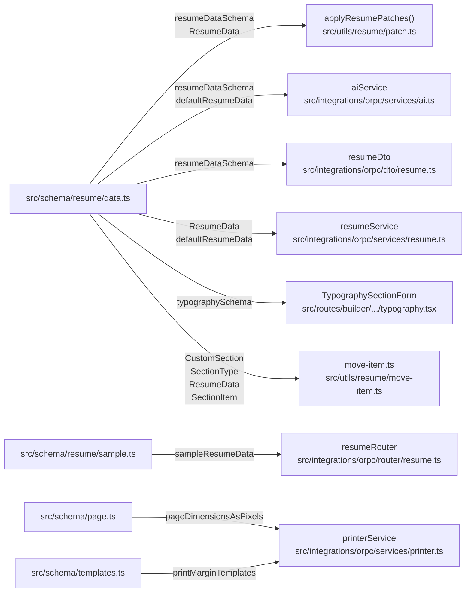
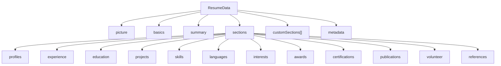
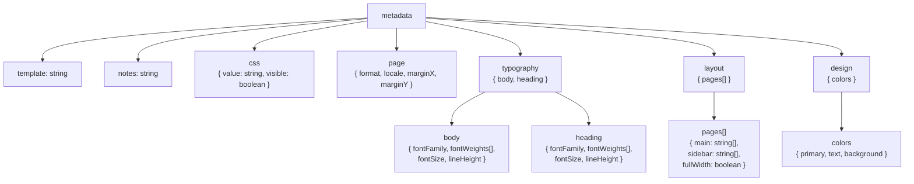
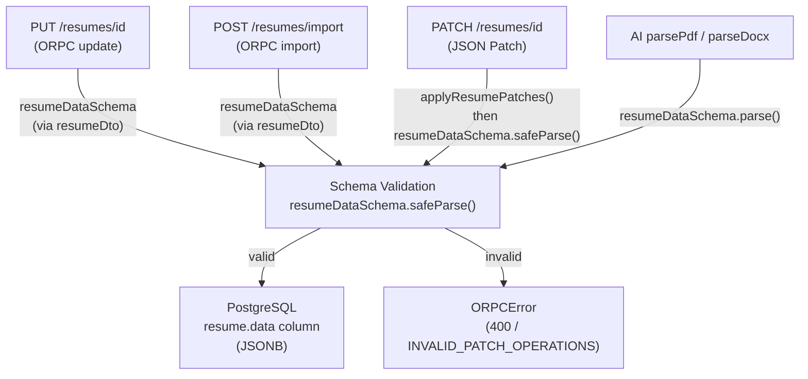

# Page: Resume Data Schema

# Resume Data Schema

<details>
<summary>Relevant source files</summary>

The following files were used as context for generating this wiki page:

- [.gitignore](.gitignore)
- [.vscode/settings.json](.vscode/settings.json)
- [docs/changelog/index.mdx](docs/changelog/index.mdx)
- [docs/community/spotlight.mdx](docs/community/spotlight.mdx)
- [docs/docs.json](docs/docs.json)
- [docs/guides/setting-up-passkeys.mdx](docs/guides/setting-up-passkeys.mdx)
- [docs/guides/using-the-patch-api.mdx](docs/guides/using-the-patch-api.mdx)
- [docs/self-hosting/sso.mdx](docs/self-hosting/sso.mdx)
- [docs/spec.json](docs/spec.json)
- [knip.json](knip.json)
- [scripts/fonts/generate.ts](scripts/fonts/generate.ts)
- [scripts/fonts/types.ts](scripts/fonts/types.ts)
- [src/components/resume/preview.module.css](src/components/resume/preview.module.css)
- [src/components/resume/store/resume.ts](src/components/resume/store/resume.ts)
- [src/components/typography/combobox.tsx](src/components/typography/combobox.tsx)
- [src/components/typography/webfontlist.json](src/components/typography/webfontlist.json)
- [src/integrations/auth/client.ts](src/integrations/auth/client.ts)
- [src/integrations/auth/config.ts](src/integrations/auth/config.ts)
- [src/integrations/orpc/dto/resume.ts](src/integrations/orpc/dto/resume.ts)
- [src/integrations/orpc/router/printer.ts](src/integrations/orpc/router/printer.ts)
- [src/integrations/orpc/router/resume.ts](src/integrations/orpc/router/resume.ts)
- [src/integrations/orpc/services/ai.ts](src/integrations/orpc/services/ai.ts)
- [src/integrations/orpc/services/printer.ts](src/integrations/orpc/services/printer.ts)
- [src/integrations/orpc/services/resume.ts](src/integrations/orpc/services/resume.ts)
- [src/routes/auth/-components/social-auth.tsx](src/routes/auth/-components/social-auth.tsx)
- [src/routes/auth/login.tsx](src/routes/auth/login.tsx)
- [src/routes/auth/register.tsx](src/routes/auth/register.tsx)
- [src/routes/builder/$resumeId/-sidebar/right/sections/typography.tsx](src/routes/builder/$resumeId/-sidebar/right/sections/typography.tsx)
- [src/routes/dashboard/settings/authentication/-components/hooks.tsx](src/routes/dashboard/settings/authentication/-components/hooks.tsx)
- [src/utils/resume/move-item.ts](src/utils/resume/move-item.ts)
- [src/utils/resume/patch.ts](src/utils/resume/patch.ts)
- [src/utils/string.ts](src/utils/string.ts)
- [vite.config.ts](vite.config.ts)

</details>


This page documents `ResumeData` — the canonical JSON type that holds all content and presentation settings for a single resume. It covers the structure of every top-level field, the 12 built-in section types and their item schemas, custom sections, metadata sub-objects, and the points in the codebase where the Zod schema is validated.

- For how `ResumeData` is persisted in PostgreSQL via Drizzle ORM, see [2.3](#2.3).
- For how the client-side Zustand store holds and mutates `ResumeData`, see [3.1.2](#3.1.2).
- For how RFC 6902 JSON Patch operations are applied and validated against `ResumeData`, see [3.1.4](#3.1.4).
- For the 14 resume templates that consume `ResumeData` for rendering, see [3.1.1](#3.1.1).

---

## Primary Source Files

The schema lives under `src/schema/`. The relevant files are:

| File | Purpose |
|---|---|
| `src/schema/resume/data.ts` | Defines `resumeDataSchema`, `ResumeData`, `defaultResumeData`, `typographySchema`, `SectionType`, `CustomSectionType`, `CustomSection`, `SectionItem` |
| `src/schema/resume/sample.ts` | Exports `sampleResumeData` — pre-filled example data used when `withSampleData: true` |
| `src/schema/page.ts` | Exports `pageDimensionsAsPixels` — pixel dimensions for `a4`, `letter`, `free-form` |
| `src/schema/templates.ts` | Exports `printMarginTemplates` — which templates require PDF-level margins |

---

## Exported Symbols

`src/schema/resume/data.ts` is the entry point for most consumers.

| Export | Kind | Description |
|---|---|---|
| `resumeDataSchema` | `ZodObject` | Full Zod validation schema for `ResumeData` |
| `ResumeData` | TypeScript type | `z.infer<typeof resumeDataSchema>` |
| `defaultResumeData` | `ResumeData` | A valid, empty resume object used as the default on creation |
| `typographySchema` | `ZodObject` | Sub-schema for `metadata.typography` (also used standalone in the builder) |
| `SectionType` | union type | `"profiles" \| "experience" \| ... \| "references"` (12 keys) |
| `CustomSectionType` | union type | `SectionType` plus `"summary"` and other custom-section-only types |
| `CustomSection` | interface | Shape of a user-defined section object |
| `SectionItem` | union type | Union of all section-specific item shapes |

**Code entity relationships:**



Sources: [src/utils/resume/patch.ts:4](), [src/integrations/orpc/services/ai.ts:29-31](), [src/integrations/orpc/dto/resume.ts:4](), [src/integrations/orpc/services/resume.ts:8-9](), [src/routes/builder/$resumeId/-sidebar/right/sections/typography.tsx:10](), [src/utils/resume/move-item.ts:2](), [src/integrations/orpc/router/resume.ts:2](), [src/integrations/orpc/services/printer.ts:5-6]()

---

## Top-Level Structure

`ResumeData` has six top-level keys:

```
ResumeData
├── picture        — profile photo configuration
├── basics         — personal contact information
├── summary        — freeform professional summary block
├── sections       — exactly 12 named content sections
├── customSections — array of user-defined additional sections
└── metadata       — layout, typography, design, and page settings
```

**Top-level structure diagram:**



Sources: [src/utils/resume/move-item.ts:33-48](), [docs/spec.json:1-1]()

---

## picture

Profile photo configuration. All display properties are optional style overrides.

| Field | Type | Constraints | Description |
|---|---|---|---|
| `hidden` | `boolean` | — | Hides the photo when `true` |
| `url` | `string` | valid URL | Must include `http://` or `https://` |
| `size` | `number` | 32–512 | Display size in pt |
| `rotation` | `number` | 0–360 | Rotation in degrees |
| `aspectRatio` | `number` | 0.5–2.5 | Width ÷ height |
| `borderRadius` | `number` | 0–100 | Border radius in pt |
| `borderColor` | `string` | rgba | `rgba(r, g, b, a)` |
| `borderWidth` | `number` | ≥ 0 | Border width in pt |
| `shadowColor` | `string` | rgba | `rgba(r, g, b, a)` |
| `shadowWidth` | `number` | ≥ 0 | Shadow spread in pt |

Sources: [docs/spec.json:1-1]()

---

## basics

Personal information shown in the resume header.

| Field | Type | Description |
|---|---|---|
| `name` | `string` | Full name |
| `headline` | `string` | Professional title or headline |
| `email` | `string` | Email address |
| `phone` | `string` | Phone number |
| `location` | `string` | Location (city, country, etc.) |
| `website` | `{ url: string, label: string }` | Personal website link |
| `customFields` | `CustomField[]` | Additional contact/info entries |

**`CustomField` item shape** (in `basics.customFields`):

| Field | Type | Description |
|---|---|---|
| `id` | `string` | UUID (UUIDv7) |
| `icon` | `string` | Phosphor icon name, or `""` to hide |
| `text` | `string` | Display text |
| `link` | `string` | Optional URL |

The `{ url, label }` website object is reused as-is across most section item types.

Sources: [docs/spec.json:1-1]()

---

## summary

A single freeform block, separate from the `sections` object. Rendered before or after the sections depending on the template.

| Field | Type | Description |
|---|---|---|
| `title` | `string` | Section heading text |
| `columns` | `number` | Number of layout columns spanned |
| `hidden` | `boolean` | Suppress from rendered output |
| `content` | `string` | HTML-formatted text |

Sources: [docs/spec.json:1-1]()

---

## Standard Sections

`sections` is a fixed-key object containing exactly the 12 `SectionType` keys. Each value is a section envelope with an `items` array.

### Section Envelope (all 12 sections)

| Field | Type | Description |
|---|---|---|
| `title` | `string` | Display heading |
| `columns` | `number` | Layout column span |
| `hidden` | `boolean` | Hides the section from the rendered resume |
| `items` | `SectionItem[]` | Section-specific item objects |

### Shared Item Base Fields

Every item across all section types carries these fields:

| Field | Type | Description |
|---|---|---|
| `id` | `string` | UUID (UUIDv7), unique per item |
| `hidden` | `boolean` | Hides this specific item |
| `options.showLinkInTitle` | `boolean` | Renders the `website.url` as a hyperlink on the title |

### Section-Specific Item Fields

| Section | Key Field(s) | Additional Fields | Has `website` | Has `level` |
|---|---|---|---|---|
| `profiles` | `network`, `username` | `icon` | ✓ | — |
| `experience` | `company`, `position` | `location`, `period`, `description` (HTML) | ✓ | — |
| `education` | `school`, `degree` | `area`, `grade`, `location`, `period`, `description` (HTML) | ✓ | — |
| `projects` | `name` | `period`, `description` (HTML) | ✓ | — |
| `skills` | `name` | `proficiency`, `keywords[]`, `icon` | — | ✓ (0–5) |
| `languages` | `language` | `fluency` | — | ✓ (0–5) |
| `interests` | `name` | `keywords[]`, `icon` | — | — |
| `awards` | `title`, `awarder` | `date`, `description` (HTML) | ✓ | — |
| `certifications` | `title`, `issuer` | `date`, `description` (HTML) | ✓ | — |
| `publications` | `title`, `publisher` | `date`, `description` (HTML) | ✓ | — |
| `volunteer` | `organization` | `location`, `period`, `description` (HTML) | ✓ | — |
| `references` | `name` | `position`, `phone`, `description` (HTML) | ✓ | — |

Notes:
- `level` is an integer 0–5. Setting it to `0` hides the proficiency/level indicator icons entirely.
- `icon` accepts any name from the `@phosphor-icons/web` set, or `""` to suppress.
- `website` is always `{ url: string, label: string }`.
- `keywords` fields (`skills`, `interests`) are `string[]` rendered as tag chips.

**Section type hierarchy:**

```mermaid
classDiagram
  class "SectionEnvelope" {
    +title: string
    +columns: number
    +hidden: boolean
    +items: SectionItem[]
  }
  class "ItemBase" {
    +id: string
    +hidden: boolean
    +options_showLinkInTitle: boolean
  }
  class "ExperienceItem" {
    +company: string
    +position: string
    +location: string
    +period: string
    +website: Website
    +description: string
  }
  class "SkillItem" {
    +name: string
    +proficiency: string
    +level: number
    +keywords: string[]
    +icon: string
  }
  class "LanguageItem" {
    +language: string
    +fluency: string
    +level: number
  }
  class "ProfileItem" {
    +network: string
    +username: string
    +icon: string
    +website: Website
  }
  class "Website" {
    +url: string
    +label: string
  }

  "SectionEnvelope" --> "ItemBase"
  "ItemBase" <|-- "ExperienceItem"
  "ItemBase" <|-- "SkillItem"
  "ItemBase" <|-- "LanguageItem"
  "ItemBase" <|-- "ProfileItem"
  "ExperienceItem" --> "Website"
  "ProfileItem" --> "Website"
```

Sources: [docs/spec.json:1-1](), [src/utils/resume/move-item.ts:33-48]()

---

## Custom Sections

`customSections` is a top-level `CustomSection[]` array for user-defined sections beyond the 12 built-ins.

| Field | Type | Description |
|---|---|---|
| `id` | `string` | UUID identifying this section instance |
| `type` | `CustomSectionType` | Determines item shape and move compatibility |
| `title` | `string` | Display heading |
| `columns` | `number` | Layout column span |
| `hidden` | `boolean` | Hides the section |
| `items` | array | Items matching the schema for `type` |

The `type` field is the key for inter-section item movement. When a user moves an item from one section to another, `getCompatibleMoveTargets()` ([src/utils/resume/move-item.ts:87-131]()) finds all sections — both standard and custom — that share the same `type`.

`CustomSectionType` includes all 12 `SectionType` values plus `"summary"` (a rich-text-only block, used for cover letter content or additional summary sections).

Section instances are referenced from `metadata.layout.pages[n].main` and `metadata.layout.pages[n].sidebar` by their `id` (UUID). Standard sections are referenced by their string key (e.g. `"experience"`).

Sources: [src/utils/resume/move-item.ts:210-275]()

---

## metadata

`metadata` controls rendering, pagination, and visual style. It has seven sub-objects.

```
metadata
├── template      string — active template name
├── notes         string — private notes (not rendered)
├── css           { value, visible }
├── page          { format, locale, marginX, marginY }
├── typography    { body, heading }
├── layout        { pages[] }
└── design        { colors }
```

**metadata structure diagram:**



Sources: [src/integrations/orpc/services/printer.ts:94-111](), [src/routes/builder/$resumeId/-sidebar/right/sections/typography.tsx:21-43](), [src/utils/resume/move-item.ts:87-131]()

### metadata.template

A string matching one of the 14 template names (e.g. `"azurill"`, `"bronzor"`, `"chikorita"`). See [3.1.1](#3.1.1).

### metadata.notes

Plain text. Never included in rendered output. Accessible only in the builder sidebar.

### metadata.css

| Field | Type | Description |
|---|---|---|
| `value` | `string` | Raw CSS injected into the rendered resume page |
| `visible` | `boolean` | Whether the CSS editor panel is open in the builder |

### metadata.page

| Field | Type | Constraints | Description |
|---|---|---|---|
| `format` | `"a4" \| "letter" \| "free-form"` | — | Paper size / pagination mode |
| `locale` | `string` | BCP 47 tag | Locale used when rendering (set as a cookie by the printer) |
| `marginX` | `number` | — | Horizontal margin in CSS pixels |
| `marginY` | `number` | — | Vertical margin in CSS pixels |

The printer service reads all four fields when generating PDFs. For templates in `printMarginTemplates`, `marginX`/`marginY` are converted from CSS pixels to PDF points (`÷ 0.75`) and passed to Puppeteer. See [src/integrations/orpc/services/printer.ts:94-111]().

The `"free-form"` format does not use fixed page heights — the PDF height is measured from the actual rendered content height.

### metadata.typography

Font settings for body text and headings, validated by the exported `typographySchema`.

| Path | Type | Constraints | Description |
|---|---|---|---|
| `body.fontFamily` | `string` | — | Font family name |
| `body.fontWeights` | `string[]` | — | Active font weight variants |
| `body.fontSize` | `number` | 6–24 | Base size in pt |
| `body.lineHeight` | `number` | 0.5–4 | Multiplier |
| `heading.fontFamily` | `string` | — | Font family name |
| `heading.fontWeights` | `string[]` | — | Active font weight variants |
| `heading.fontSize` | `number` | 6–24 | Base heading size in pt |
| `heading.lineHeight` | `number` | 0.5–4 | Multiplier |

`typographySchema` is used directly as the form schema in `TypographySectionForm` ([src/routes/builder/$resumeId/-sidebar/right/sections/typography.tsx:21]()). For how fonts are loaded and applied, see [7](#7).

### metadata.layout

Controls multi-page layout. Each entry in `pages` corresponds to one rendered page.

```
layout.pages: Array<{
  main:      string[]  // ordered list of section IDs for the main column
  sidebar:   string[]  // ordered list of section IDs for the sidebar column
  fullWidth: boolean   // true = entire page width used, no sidebar
}>
```

Each entry in `main` and `sidebar` is either a `SectionType` string (e.g. `"experience"`) for the 12 built-in sections, or a custom section's UUID for user-defined sections. Render order matches array order. Page and section reordering in the builder directly mutates this array.

### metadata.design

| Path | Type | Description |
|---|---|---|
| `design.colors.primary` | `string` | Primary accent color as `rgba(r, g, b, a)` |
| `design.colors.text` | `string` | Default text color |
| `design.colors.background` | `string` | Page background color |

---

## Zod Validation and Data Flow

`resumeDataSchema` is invoked at three distinct points:

| Location | Trigger | Purpose |
|---|---|---|
| `applyResumePatches()` — [src/utils/resume/patch.ts:118-119]() | After applying JSON Patch operations | Rejects patches that produce an invalid `ResumeData` |
| `parsePdf()` / `parseDocx()` — [src/integrations/orpc/services/ai.ts:112-117]() | After AI extraction | Normalizes and validates AI output; resets `picture` and `metadata` to `defaultResumeData` values |
| `resumeDto` — [src/integrations/orpc/dto/resume.ts:4-15]() | At ORPC request boundary | Validates the `data` field in `import` and `update` endpoint inputs |

`defaultResumeData` is used in `resumeService.create()` when no data is provided ([src/integrations/orpc/services/resume.ts:241]()). `sampleResumeData` (from `src/schema/resume/sample.ts`) is passed when `withSampleData: true` in `createResume` ([src/integrations/orpc/router/resume.ts:152]()).

**Validation flow:**



Sources: [src/utils/resume/patch.ts:101-122](), [src/integrations/orpc/services/ai.ts:86-153](), [src/integrations/orpc/dto/resume.ts:1-19](), [src/integrations/orpc/services/resume.ts:231-264](), [src/integrations/orpc/router/resume.ts:145-187]()

---

## OpenAPI Specification

The `ResumeData` Zod schema is reflected in the OpenAPI specification auto-generated by the ORPC layer and committed to `docs/spec.json`. It is registered as the named component `#/components/schemas/ResumeData` and referenced from all endpoints that accept or return resume data: `GET /resumes/{id}`, `PUT /resumes/{id}`, `PATCH /resumes/{id}`, and `POST /resumes/import`.

The spec is served live at `/api/openapi` and used to render the API Reference section of the documentation.

Sources: [docs/spec.json:1-1](), [src/integrations/orpc/dto/resume.ts:1-19](), [docs/docs.json:106-108]()

---

