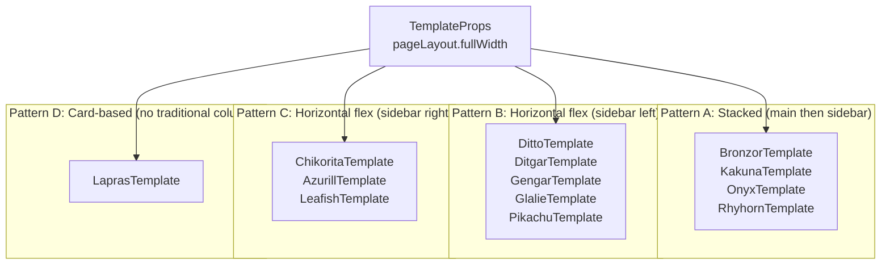
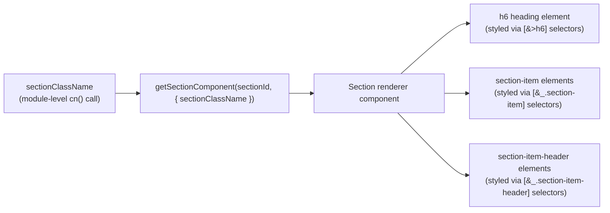

# Page: Resume Templates

# Resume Templates

<details>
<summary>Relevant source files</summary>

The following files were used as context for generating this wiki page:

- [docs/community/spotlight.mdx](docs/community/spotlight.mdx)
- [docs/docs.json](docs/docs.json)
- [docs/guides/using-the-patch-api.mdx](docs/guides/using-the-patch-api.mdx)
- [docs/self-hosting/sso.mdx](docs/self-hosting/sso.mdx)
- [src/components/level/display.tsx](src/components/level/display.tsx)
- [src/components/resume/store/resume.ts](src/components/resume/store/resume.ts)
- [src/components/resume/templates/azurill.tsx](src/components/resume/templates/azurill.tsx)
- [src/components/resume/templates/bronzor.tsx](src/components/resume/templates/bronzor.tsx)
- [src/components/resume/templates/chikorita.tsx](src/components/resume/templates/chikorita.tsx)
- [src/components/resume/templates/ditgar.tsx](src/components/resume/templates/ditgar.tsx)
- [src/components/resume/templates/ditto.tsx](src/components/resume/templates/ditto.tsx)
- [src/components/resume/templates/gengar.tsx](src/components/resume/templates/gengar.tsx)
- [src/components/resume/templates/glalie.tsx](src/components/resume/templates/glalie.tsx)
- [src/components/resume/templates/kakuna.tsx](src/components/resume/templates/kakuna.tsx)
- [src/components/resume/templates/lapras.tsx](src/components/resume/templates/lapras.tsx)
- [src/components/resume/templates/leafish.tsx](src/components/resume/templates/leafish.tsx)
- [src/components/resume/templates/onyx.tsx](src/components/resume/templates/onyx.tsx)
- [src/components/resume/templates/pikachu.tsx](src/components/resume/templates/pikachu.tsx)
- [src/components/resume/templates/rhyhorn.tsx](src/components/resume/templates/rhyhorn.tsx)
- [src/integrations/orpc/dto/resume.ts](src/integrations/orpc/dto/resume.ts)
- [src/integrations/orpc/router/printer.ts](src/integrations/orpc/router/printer.ts)
- [src/integrations/orpc/router/resume.ts](src/integrations/orpc/router/resume.ts)
- [src/integrations/orpc/services/ai.ts](src/integrations/orpc/services/ai.ts)
- [src/integrations/orpc/services/printer.ts](src/integrations/orpc/services/printer.ts)
- [src/integrations/orpc/services/resume.ts](src/integrations/orpc/services/resume.ts)
- [src/utils/resume/move-item.ts](src/utils/resume/move-item.ts)
- [src/utils/resume/patch.ts](src/utils/resume/patch.ts)
- [src/utils/string.ts](src/utils/string.ts)

</details>


This page documents the 13 resume template implementations in the codebase: their layout structures, header designs, sidebar behavior, shared component usage, and how the PDF generation system interacts with template-specific margin handling.

For the broader resume builder context (real-time preview, section reordering, auto-save), see [3.1](). For the resume data schema that templates consume, see [3.1.3](). For PDF and screenshot generation, see [3.2]().

---

## Component Model

Every template is a React component living under `src/components/resume/templates/`. Each file exports a single named component (e.g., `AzurillTemplate`, `BronzorTemplate`) and accepts a uniform `TemplateProps` interface imported from `src/components/resume/templates/types`.

The two props are:

| Prop | Type | Description |
|---|---|---|
| `pageIndex` | `number` | Zero-based page index; used to conditionally render the header only on the first page |
| `pageLayout` | `{ main: string[], sidebar: string[], fullWidth: boolean }` | Section IDs assigned to each column and whether the page has no sidebar |

The `pageLayout.main` and `pageLayout.sidebar` arrays contain section identifiers (e.g., `"experience"`, `"education"`, or a UUID for custom sections). The template iterates over these arrays and renders each section through the `getSectionComponent` resolver.

The active template name is stored as `data.metadata.template` inside the resume's `ResumeData` object. The printer service reads this value at `src/integrations/orpc/services/printer.ts` line 96 when deciding how to apply PDF margins.

Sources: [src/components/resume/templates/azurill.tsx](), [src/components/resume/templates/chikorita.tsx](), [src/integrations/orpc/services/printer.ts:94-111]()

---

## Shared Components

All templates delegate rendering to a small set of shared components. These are located under `src/components/resume/shared/` and handle the pieces that are identical across all layouts.

| Component | Import path | Role |
|---|---|---|
| `getSectionComponent` | `../shared/get-section-component` | Resolves the correct section renderer for a given section ID and applies the template's `sectionClassName` |
| `PagePicture` | `../shared/page-picture` | Profile photo respecting `picture.borderRadius` and `picture.size` settings |
| `PageLink` | `../shared/page-link` | Hyperlink that uses `url` and `label`; respects the resume's link display preference |
| `PageIcon` | `../shared/page-icon` | Phosphor icon rendered at the correct color/size for the page context |
| `PageSummary` | `../shared/page-summary` | Inline summary block; used by Gengar and Leafish to embed the summary in the header area |

All templates read resume data through the `useResumeStore` Zustand hook (see [3.1.2]()) via `useResumeStore((state) => state.resume.data.basics)`. The store is the single source of truth; templates never receive resume data as props.

Sources: [src/components/resume/templates/gengar.tsx:6](), [src/components/resume/templates/leafish.tsx:7-8](), [src/components/resume/store/resume.ts]()

---

## CSS Variable System

Templates do not use hard-coded colors, spacing, or font sizes. All visual design tokens are consumed as CSS custom properties. The values of these variables are injected at the page root based on `data.metadata.design` settings.

| CSS Variable | Controls |
|---|---|
| `--page-primary-color` | Accent color (borders, backgrounds, icon tints, section headings) |
| `--page-background-color` | Page background; also used as foreground text color in inverted (sidebar) regions |
| `--page-text-color` | Body text color |
| `--page-margin-x` | Horizontal page padding |
| `--page-margin-y` | Vertical page padding |
| `--page-sidebar-width` | Width of the sidebar column |
| `--page-gap-x` / `--page-gap-y` | Inter-element spacing |
| `--picture-border-radius` | Border radius applied to the profile picture and derived decorations |

Templates apply these variables through Tailwind's arbitrary value syntax, for example `px-(--page-margin-x)`, `bg-(--page-primary-color)`, and `w-(--page-sidebar-width)`.

Sources: [src/components/resume/templates/chikorita.tsx:10-28](), [src/components/resume/templates/lapras.tsx:11-20](), [src/components/resume/templates/glalie.tsx:79]()

---

## Template Catalog

The following table summarizes the layout characteristics of each template.

**Diagram: Template-to-File Mapping**

```mermaid
graph LR
  subgraph "Templates (src/components/resume/templates/)"
    A["azurill.tsx → AzurillTemplate"]
    B["bronzor.tsx → BronzorTemplate"]
    C["chikorita.tsx → ChikoritaTemplate"]
    D["ditto.tsx → DittoTemplate"]
    E["ditgar.tsx → DitgarTemplate"]
    F["gengar.tsx → GengarTemplate"]
    G["glalie.tsx → GlalieTemplate"]
    H["kakuna.tsx → KakunaTemplate"]
    I["lapras.tsx → LaprasTemplate"]
    J["leafish.tsx → LeafishTemplate"]
    K["onyx.tsx → OnyxTemplate"]
    L["pikachu.tsx → PikachuTemplate"]
    M["rhyhorn.tsx → RhyhornTemplate"]
  end
```



Sources: [src/components/resume/templates/azurill.tsx](), [src/components/resume/templates/bronzor.tsx](), [src/components/resume/templates/chikorita.tsx](), [src/components/resume/templates/ditto.tsx](), [src/components/resume/templates/ditgar.tsx](), [src/components/resume/templates/gengar.tsx](), [src/components/resume/templates/glalie.tsx](), [src/components/resume/templates/kakuna.tsx](), [src/components/resume/templates/lapras.tsx](), [src/components/resume/templates/leafish.tsx](), [src/components/resume/templates/onyx.tsx](), [src/components/resume/templates/pikachu.tsx](), [src/components/resume/templates/rhyhorn.tsx]()

---

| Template | Component | Header Position | Sidebar Side | Sidebar BG | Notable Feature |
|---|---|---|---|---|---|
| Azurill | `AzurillTemplate` | Top, full-width centered | Left | None | Timeline marker (vertical line + dot) on main section content |
| Bronzor | `BronzorTemplate` | Top, full-width centered | Below main | None | Sections rendered as 5-column grid; heading in first column |
| Chikorita | `ChikoritaTemplate` | Top of main column | Right | Solid primary color | Sidebar text is `--page-background-color` (inverted) |
| Ditto | `DittoTemplate` | Full-width spanning both columns | Left | None | Header top band uses primary color; picture floats into body |
| Ditgar | `DitgarTemplate` | Top of sidebar column | Left | 20% primary tint | Summary pinned to top of main; left-border decoration on item headers |
| Gengar | `GengarTemplate` | Top of sidebar column | Left | 20% primary tint | Summary rendered as full-width tinted banner in main area |
| Glalie | `GlalieTemplate` | Top of sidebar column | Left | 20% primary tint | Header is centered; contacts inside a primary-bordered box |
| Kakuna | `KakunaTemplate` | Top, full-width centered | Below main | None | Section headings are center-aligned |
| Lapras | `LaprasTemplate` | Top, full-width | Below main | None | Sections are rounded bordered cards; heading is a floating label at card top |
| Leafish | `LeafishTemplate` | Top, full-width with tinted background | Right | None | Summary embedded in header; contact row is a second tinted band |
| Onyx | `OnyxTemplate` | Top, picture left | Below main | None | Header bottom border uses primary color |
| Pikachu | `PikachuTemplate` | In main column as rounded primary-color banner | Left | None | Picture lives at top of sidebar; header styled as accent card |
| Rhyhorn | `RhyhornTemplate` | Top, picture right | Below main | None | Contact items separated by primary-colored vertical dividers |

---

## Layout Patterns

Templates fall into four structural patterns based on how main content and sidebar are arranged.

**Diagram: Layout Pattern Classification**



Sources: [src/components/resume/templates/azurill.tsx:63-88](), [src/components/resume/templates/gengar.tsx:22-76](), [src/components/resume/templates/chikorita.tsx:33-71](), [src/components/resume/templates/lapras.tsx:25-63]()

---

When `pageLayout.fullWidth` is `true`, all templates suppress the sidebar column and render only `pageLayout.main`. Most left-sidebar templates (Ditgar, Gengar, Glalie) additionally preserve the sidebar column header region on non-first pages by checking `!fullWidth || isFirstPage`:

```
// Example from GengarTemplate (gengar.tsx lines 28-31)
{(!fullWidth || isFirstPage) && (
  <div className="page-sidebar-background ..." />
)}
```

This ensures the sidebar background extends correctly across pages even when the sidebar has no sections on that particular page.

Sources: [src/components/resume/templates/gengar.tsx:28-50](), [src/components/resume/templates/ditgar.tsx:38-55](), [src/components/resume/templates/glalie.tsx:28-62]()

---

## Summary Section Handling

Two templates embed the summary section outside the normal section flow:

- **Gengar** (`GengarTemplate`): Renders a `PageSummary` component as a tinted banner at the top of the main area on the first page. The `"summary"` ID is then filtered out of `pageLayout.main` when iterating sections to avoid a duplicate. [src/components/resume/templates/gengar.tsx:54-68]()

- **Leafish** (`LeafishTemplate`): Renders `PageSummary` inside the header block (alongside name and headline). The `"summary"` ID is filtered from both `main` and `sidebar` arrays during iteration. [src/components/resume/templates/leafish.tsx:19-52]()

- **Ditgar** (`DitgarTemplate`): Manually resolves a `SummaryComponent` via `getSectionComponent("summary", ...)` and places it at the top of the main column. It too filters `"summary"` from the `main` array. [src/components/resume/templates/ditgar.tsx:32-68]()

---

## `sectionClassName` Pattern

Each template file declares a `const sectionClassName` at module scope using the `cn()` utility. This string is passed to every `getSectionComponent` call and applies template-specific styling to section containers, headings, and items.

**Diagram: sectionClassName Flow**



The CSS selectors inside `sectionClassName` use Tailwind's group-data and arbitrary child selectors to target nested elements. For example, in Chikorita, sidebar sections receive inverted text color and level-indicator styles:

```
// chikorita.tsx lines 15-27
"group-data-[layout=sidebar]:[&>h6]:text-(--page-background-color)"
"group-data-[layout=sidebar]:[&_.section-item-level>div]:border-(--page-background-color)"
```

The `data-layout` attribute is set on the `<aside>` and `<main>` elements to allow CSS selectors to differentiate styling based on whether a section is in the sidebar or main column.

Sources: [src/components/resume/templates/chikorita.tsx:10-28](), [src/components/resume/templates/azurill.tsx:10-53](), [src/components/resume/templates/ditgar.tsx:9-23]()

---

## Print Margin Handling

Some templates apply outer padding via CSS (`px-(--page-margin-x) pt-(--page-margin-y)` on the root element) and suppress that padding during print with `print:p-0`. When these templates are printed, the PDF generator (see [3.2]()) applies equivalent margins directly as PDF page margins.

The printer service checks `printMarginTemplates` (defined in `src/schema/templates`) to determine which templates require this treatment. When a template is in that list, `marginX` and `marginY` are computed from `data.metadata.page.marginX/Y` and passed to Puppeteer's `page.pdf()` call. The CSS variable `--page-height` is also reduced by the margin amount to prevent content overflow.

Templates that include `print:p-0` on their root element (and therefore rely on PDF-level margins):

| Template | Root class contains `print:p-0` |
|---|---|
| Azurill | Yes |
| Bronzor | Yes |
| Kakuna | Yes |
| Lapras | Yes |
| Onyx | Yes |
| Pikachu | Yes |
| Rhyhorn | Yes |
| Chikorita | No |
| Ditto | No |
| Ditgar | No |
| Gengar | No |
| Glalie | No |
| Leafish | No |

Templates without `print:p-0` handle their own interior spacing and do not receive PDF-level margins from the printer.

Sources: [src/integrations/orpc/services/printer.ts:103-111](), [src/components/resume/templates/azurill.tsx:64](), [src/components/resume/templates/chikorita.tsx:38](), [src/components/resume/templates/gengar.tsx:27]()

---

