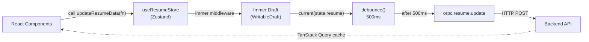
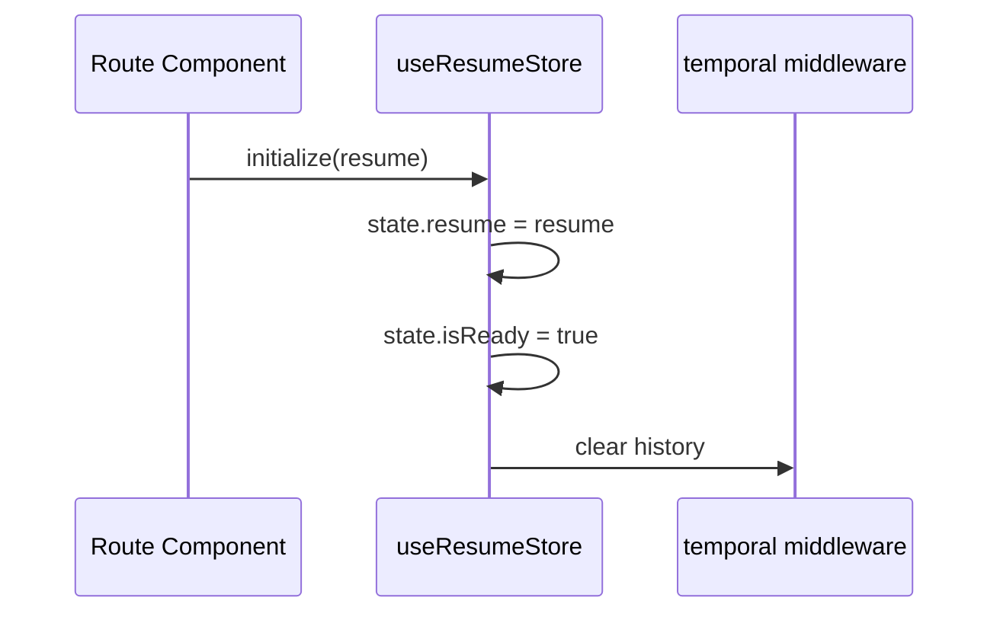
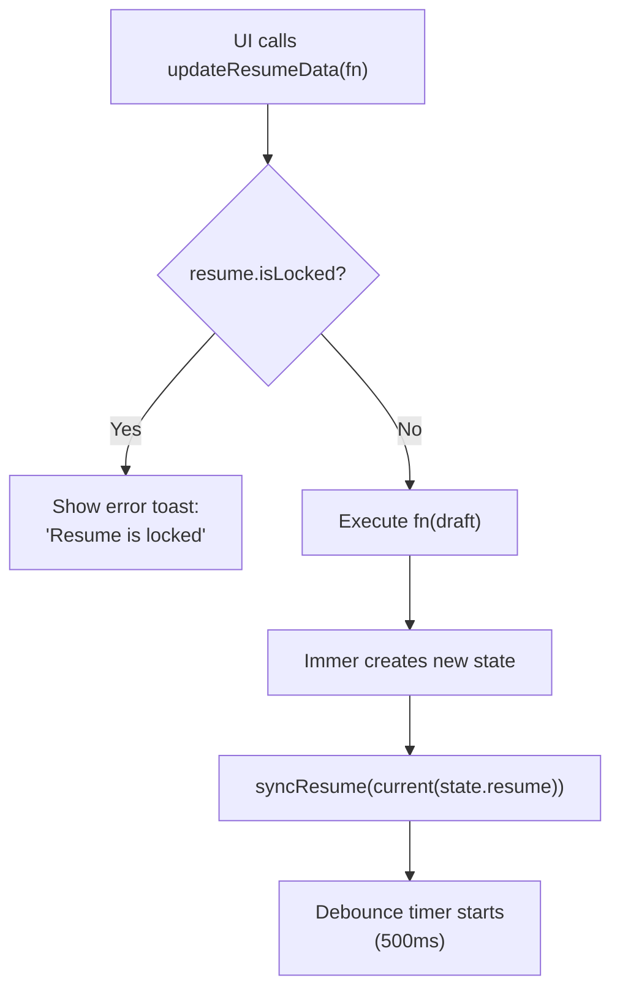
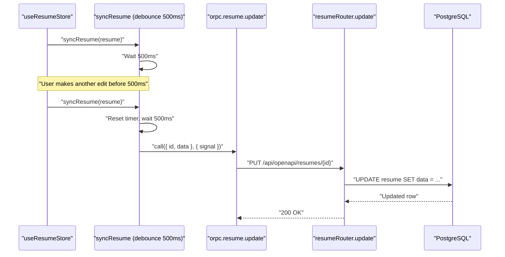
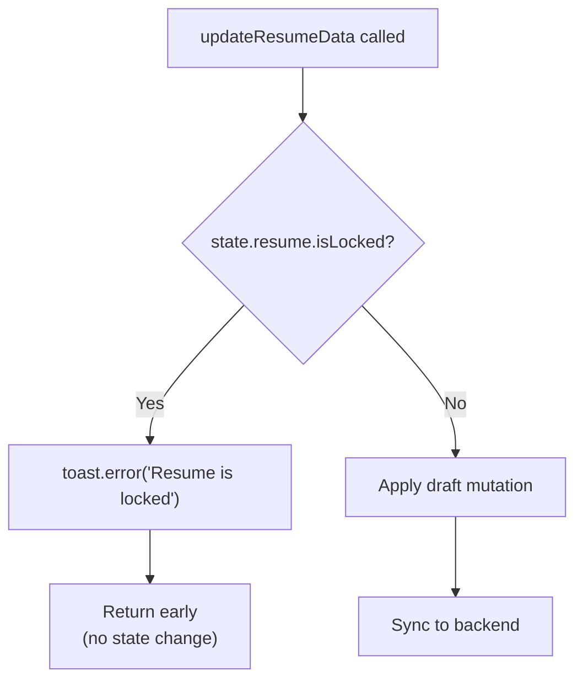
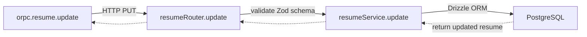
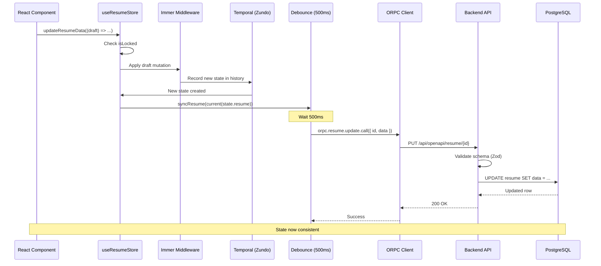

# Page: State Management

# State Management

<details>
<summary>Relevant source files</summary>

The following files were used as context for generating this wiki page:

- [.env.example](.env.example)
- [docs/community/spotlight.mdx](docs/community/spotlight.mdx)
- [docs/docs.json](docs/docs.json)
- [docs/guides/using-the-patch-api.mdx](docs/guides/using-the-patch-api.mdx)
- [docs/self-hosting/sso.mdx](docs/self-hosting/sso.mdx)
- [package.json](package.json)
- [pnpm-lock.yaml](pnpm-lock.yaml)
- [src/components/level/display.tsx](src/components/level/display.tsx)
- [src/components/resume/store/resume.ts](src/components/resume/store/resume.ts)
- [src/components/resume/templates/azurill.tsx](src/components/resume/templates/azurill.tsx)
- [src/components/resume/templates/bronzor.tsx](src/components/resume/templates/bronzor.tsx)
- [src/components/resume/templates/chikorita.tsx](src/components/resume/templates/chikorita.tsx)
- [src/components/resume/templates/ditgar.tsx](src/components/resume/templates/ditgar.tsx)
- [src/components/resume/templates/ditto.tsx](src/components/resume/templates/ditto.tsx)
- [src/components/resume/templates/gengar.tsx](src/components/resume/templates/gengar.tsx)
- [src/components/resume/templates/glalie.tsx](src/components/resume/templates/glalie.tsx)
- [src/components/resume/templates/kakuna.tsx](src/components/resume/templates/kakuna.tsx)
- [src/components/resume/templates/lapras.tsx](src/components/resume/templates/lapras.tsx)
- [src/components/resume/templates/leafish.tsx](src/components/resume/templates/leafish.tsx)
- [src/components/resume/templates/onyx.tsx](src/components/resume/templates/onyx.tsx)
- [src/components/resume/templates/pikachu.tsx](src/components/resume/templates/pikachu.tsx)
- [src/components/resume/templates/rhyhorn.tsx](src/components/resume/templates/rhyhorn.tsx)
- [src/integrations/orpc/dto/resume.ts](src/integrations/orpc/dto/resume.ts)
- [src/integrations/orpc/router/printer.ts](src/integrations/orpc/router/printer.ts)
- [src/integrations/orpc/router/resume.ts](src/integrations/orpc/router/resume.ts)
- [src/integrations/orpc/services/ai.ts](src/integrations/orpc/services/ai.ts)
- [src/integrations/orpc/services/printer.ts](src/integrations/orpc/services/printer.ts)
- [src/integrations/orpc/services/resume.ts](src/integrations/orpc/services/resume.ts)
- [src/utils/resume/move-item.ts](src/utils/resume/move-item.ts)
- [src/utils/resume/patch.ts](src/utils/resume/patch.ts)
- [src/utils/string.ts](src/utils/string.ts)

</details>


This document explains the client-side state management system for the resume builder. It covers the Zustand store configuration, the Immer-based update mechanism, the undo/redo history system powered by Zundo, and the debounced synchronization with the backend API.

For information about the server-side JSON Patch API available for targeted external updates, see page 3.1.4. For details on the resume data schema that flows through this store, see page 3.1.3.

---

## Architecture Overview

The state management system is built on **Zustand** with three key middleware layers:

| Middleware | Purpose | Configuration |
|------------|---------|---------------|
| `temporal` (Zundo) | Undo/redo history | 100 states, deep equality checks |
| `immer` | Immutable updates via drafts | Enables mutation syntax for immutability |
| Debouncing | Batch updates to reduce API calls | 500ms delay before sync |

**High-Level Data Flow**



**Sources:** [src/components/resume/store/resume.ts:1-81](), [package.json:84,114-115]()

---

## Store Structure

The resume store is defined in `useResumeStore` with the following state shape:

```typescript
type ResumeStoreState = {
  resume: Resume;      // Current resume data
  isReady: boolean;    // Initialization flag
}

type ResumeStoreActions = {
  initialize: (resume: Resume | null) => void;
  updateResumeData: (fn: (draft: WritableDraft<ResumeData>) => void) => void;
}
```

The `Resume` type includes:

- `id`, `name`, `slug`, `tags` - Metadata fields
- `data` - The full `ResumeData` object containing all resume content
- `isLocked` - Protection flag preventing updates

**Sources:** [src/components/resume/store/resume.ts:15-27]()

---

## Initialization and Update Flow

### Initialization

The `initialize` action loads a resume into the store and resets the undo/redo history:



**Sources:** [src/components/resume/store/resume.ts:48-54]()

### Update Mechanism

The `updateResumeData` action accepts a function that mutates an Immer draft. The actual resume object remains immutable:



**Example usage from components:**

```javascript
updateResumeData((draft) => {
  draft.basics.name = "Jane Doe";
  draft.basics.headline = "Software Engineer";
});
```

**Sources:** [src/components/resume/store/resume.ts:56-68]()

---

## Undo/Redo System

The store uses the `temporal` middleware from **Zundo** to maintain a history of up to 100 states. This enables time-travel debugging and user-friendly undo/redo functionality.

### Configuration

```typescript
temporal(
  immer((set) => ({ /* store implementation */ })),
  {
    partialize: (state) => ({ resume: state.resume }),
    equality: (pastState, currentState) => isDeepEqual(pastState, currentState),
    limit: 100,
  }
)
```

| Option | Value | Purpose |
|--------|-------|---------|
| `partialize` | `{ resume }` | Only track resume field (exclude `isReady`) |
| `equality` | `isDeepEqual` | Skip duplicate states |
| `limit` | `100` | Maximum history size |

### Accessing Temporal State

The `useTemporalStore` hook provides access to undo/redo controls:

```typescript
const { undo, redo, pastStates, futureStates } = useTemporalStore((state) => ({
  undo: state.undo,
  redo: state.redo,
  pastStates: state.pastStates,
  futureStates: state.futureStates,
}));
```

**Sources:** [src/components/resume/store/resume.ts:42-75,78-80](), [package.json:114]()

---

## Debounced Synchronization

To avoid overwhelming the backend with API calls on every keystroke, updates are debounced using `es-toolkit`'s `debounce` function with a 500ms delay.

### Sync Flow

**Debounced synchronization sequence**



### Abort Signal

A module-level `AbortController` is created once. Its signal is passed to both `debounce` (to cancel any queued invocation) and to the ORPC call itself (to cancel in-flight HTTP requests):

[src/components/resume/store/resume.ts:29-36]()

```
const controller = new AbortController();
const signal = controller.signal;

const _syncResume = (resume: Resume) => {
    orpc.resume.update.call({ id: resume.id, data: resume.data }, { signal });
};

const syncResume = debounce(_syncResume, 500, { signal });
```

Note that the debounced sync always sends the **full `ResumeData` object** to the `update` endpoint (`PUT /resumes/{id}`), not JSON Patch operations. JSON Patch is a separate API surface used for external/programmatic updates (see page 3.1.4).

**Sources:** [src/components/resume/store/resume.ts:29-36]()

---

## Lock Protection

Locked resumes cannot be updated. When `isLocked` is true, the `updateResumeData` action displays an error toast and aborts the update:



The toast is deduplicated by reusing the same `errorToastId`:

```typescript
if (state.resume.isLocked) {
  errorToastId = toast.error(t`This resume is locked`, { id: errorToastId });
  return state;
}
```

**Sources:** [src/components/resume/store/resume.ts:38,60-63]()

---

## Integration with Backend

The store synchronizes with the backend through the ORPC client, which wraps the REST API in a type-safe interface.

### API Call Structure

```typescript
orpc.resume.update.call(
  { id: resume.id, data: resume.data },
  { signal }
);
```

This calls the `PUT /resumes/{id}` endpoint with the full `ResumeData` object. The backend validates and persists the change.

**Backend Flow:**



**Sources:** [src/components/resume/store/resume.ts:32-34](), [src/integrations/orpc/router/resume.ts:189-218](), [src/integrations/orpc/services/resume.ts:266-320]()

---

## Complete Data Flow Diagram

This diagram shows the full lifecycle of a user edit from the React component to backend persistence:



**Sources:** [src/components/resume/store/resume.ts:1-81](), [src/integrations/orpc/router/resume.ts:189-218](), [src/integrations/orpc/services/resume.ts:266-320]()

---

## Key Dependencies

| Package | Version | Role |
|---------|---------|------|
| `zustand` | ^5.0.11 | Core state management library |
| `immer` | ^11.1.4 | Immutable updates via mutable syntax |
| `zundo` | ^2.3.0 | Temporal middleware for undo/redo |
| `fast-deep-equal` | ^3.1.3 | Deep equality checks for history deduplication |
| `es-toolkit` | ^1.44.0 | Debounce utility with signal support |

**Sources:** [package.json:84,114-115,81,155]()

---

