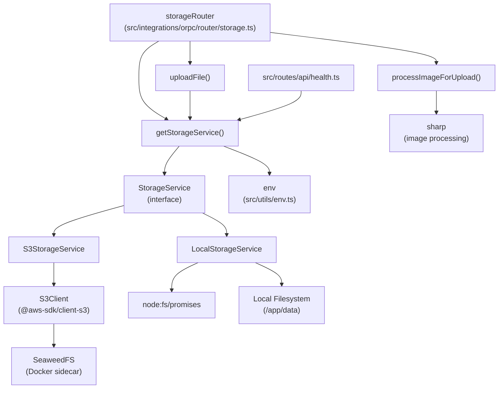
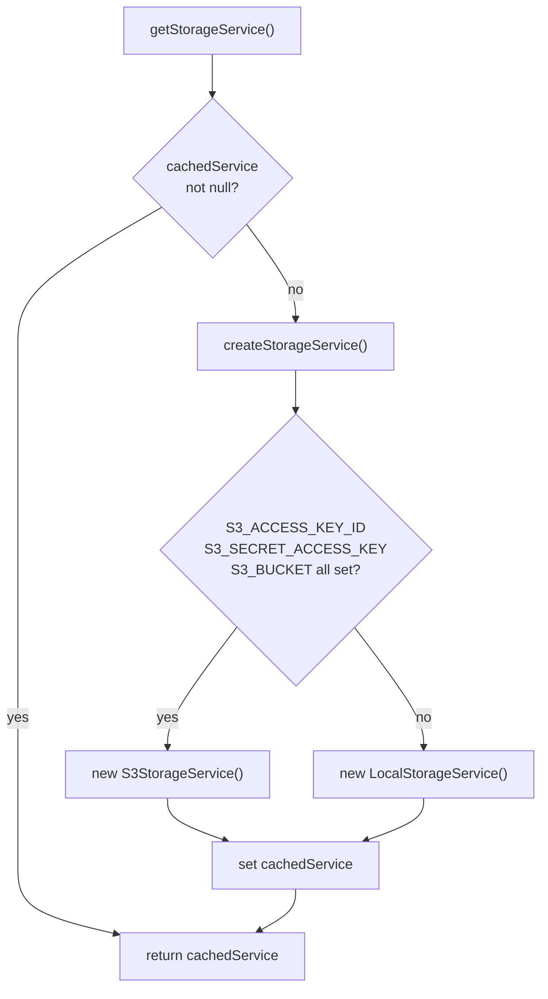
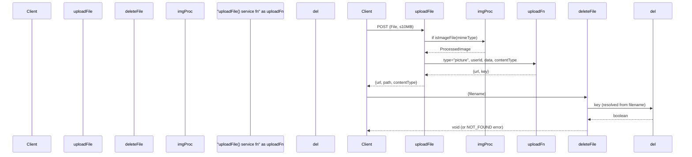

# Page: Storage System

# Storage System

<details>
<summary>Relevant source files</summary>

The following files were used as context for generating this wiki page:

- [.devcontainer/Dockerfile](.devcontainer/Dockerfile)
- [.devcontainer/devcontainer.json](.devcontainer/devcontainer.json)
- [.devcontainer/docker-compose.yml](.devcontainer/docker-compose.yml)
- [.env.example](.env.example)
- [CLAUDE.md](CLAUDE.md)
- [compose.dev.yml](compose.dev.yml)
- [compose.yml](compose.yml)
- [docs/contributing/development.mdx](docs/contributing/development.mdx)
- [docs/getting-started/quickstart.mdx](docs/getting-started/quickstart.mdx)
- [docs/self-hosting/docker.mdx](docs/self-hosting/docker.mdx)
- [docs/self-hosting/examples.mdx](docs/self-hosting/examples.mdx)
- [package.json](package.json)
- [pnpm-lock.yaml](pnpm-lock.yaml)
- [src/integrations/orpc/router/storage.ts](src/integrations/orpc/router/storage.ts)
- [src/integrations/orpc/services/storage.ts](src/integrations/orpc/services/storage.ts)
- [src/routes/__root.tsx](src/routes/__root.tsx)
- [src/routes/api/health.ts](src/routes/api/health.ts)
- [src/utils/env.ts](src/utils/env.ts)
- [src/vite-env.d.ts](src/vite-env.d.ts)

</details>


This page documents the storage subsystem of Reactive Resume: the `StorageService` interface, its two backend implementations (`LocalStorageService` and `S3StorageService`), the `getStorageService` factory, file upload and deletion operations, image processing, and the SeaweedFS sidecar used in the default Docker Compose stack. For deployment configuration of storage in Docker Compose, see [Docker Deployment](#5.1). For the full list of storage-related environment variables, see [Environment Configuration](#5.3).

---

## Overview

The storage system is responsible for persisting user-uploaded files: profile pictures, resume screenshots, and exported PDFs. It abstracts over two backends behind a common interface and selects the active backend at startup based on environment variables.

**Storage backends:**

| Backend | Class | Condition |
|---|---|---|
| Local filesystem | `LocalStorageService` | `S3_ACCESS_KEY_ID`, `S3_SECRET_ACCESS_KEY`, or `S3_BUCKET` not set |
| S3-compatible object store | `S3StorageService` | All three S3 credentials present |

The default production stack uses **SeaweedFS** as the S3-compatible store. Local filesystem storage is available as a fallback when no S3 credentials are configured.

Sources: [src/integrations/orpc/services/storage.ts:308-323]()

---

## Architecture

**Diagram: Storage subsystem components and relationships**



Sources: [src/integrations/orpc/services/storage.ts:1-370](), [src/integrations/orpc/router/storage.ts:1-91](), [src/routes/api/health.ts:1-87]()

---

## `StorageService` Interface

Defined at [src/integrations/orpc/services/storage.ts:26-32](), the interface requires four operations and a health check:

```
interface StorageService {
    list(prefix: string): Promise<string[]>
    write(input: StorageWriteInput): Promise<void>
    read(key: string): Promise<StorageReadResult | null>
    delete(key: string): Promise<boolean>
    healthcheck(): Promise<StorageHealthResult>
}
```

Supporting types:

| Type | Fields |
|---|---|
| `StorageWriteInput` | `key: string`, `data: Uint8Array`, `contentType: string` |
| `StorageReadResult` | `data: Uint8Array`, `size: number`, `etag?: string`, `lastModified?: Date`, `contentType?: string` |
| `StorageHealthResult` | `status: "healthy" \| "unhealthy"`, `type: "local" \| "s3"`, `message: string`, `error?: string` |

Sources: [src/integrations/orpc/services/storage.ts:12-39]()

---

## `LocalStorageService`

Persists files to the local filesystem under a `data/` directory relative to the working directory (in Docker, `/app/data`). This directory should be mounted to a persistent volume; otherwise, files are lost on container restart.

**Key behaviors:**

- `resolvePath(key)` — sanitizes the key by stripping leading slashes, filtering path traversal segments (`.`, `..`), and joining with the root directory. [src/integrations/orpc/services/storage.ts:198-207]()
- `write` — creates parent directories with `fs.mkdir` (recursive) before writing the file. [src/integrations/orpc/services/storage.ts:137-142]()
- `delete` — checks whether the path is a file or directory; removes files with `fs.unlink`, directories recursively with `fs.rm`. Returns `false` if the path does not exist. [src/integrations/orpc/services/storage.ts:157-176]()
- `read` — returns `null` only on explicit `ENOENT`; other errors propagate. [src/integrations/orpc/services/storage.ts:144-155]()
- `list` — uses `fs.readdir` with `{ recursive: true }` and returns an empty array if the directory does not exist. [src/integrations/orpc/services/storage.ts:120-135]()
- `healthcheck` — attempts to create the root directory and verify read/write access. [src/integrations/orpc/services/storage.ts:178-196]()
- `inferContentType(key)` — determines the MIME type from the file extension using `CONTENT_TYPE_MAP`; falls back to `application/octet-stream`. [src/integrations/orpc/services/storage.ts:75-78]()

The Docker Compose volume mount for local storage is:

```yaml
volumes:
  - reactive_resume_data:/app/data
```

Sources: [src/integrations/orpc/services/storage.ts:113-208](), [compose.yml:95-96]()

---

## `S3StorageService`

Uses the AWS SDK v3 (`@aws-sdk/client-s3`) to communicate with any S3-compatible endpoint. In the default stack, this is SeaweedFS.

**Constructor** [src/integrations/orpc/services/storage.ts:214-229]()

Reads `S3_ACCESS_KEY_ID`, `S3_SECRET_ACCESS_KEY`, `S3_BUCKET`, `S3_REGION`, `S3_ENDPOINT`, and `S3_FORCE_PATH_STYLE` from the validated `env` object. Throws immediately if any required credential is missing.

**`S3_FORCE_PATH_STYLE`** controls URL style:

| Value | URL pattern | Use with |
|---|---|---|
| `true` | `https://s3-server.com/bucket/key` | MinIO, SeaweedFS, self-hosted stores |
| `false` (default) | `https://bucket.s3-server.com/key` | AWS S3, Cloudflare R2 |

**Operation mapping:**

| Method | AWS SDK command |
|---|---|
| `list(prefix)` | `ListObjectsV2Command` |
| `write(input)` | `PutObjectCommand` (ACL: `public-read`) |
| `read(key)` | `GetObjectCommand` |
| `delete(keyOrPrefix)` | `list` then `DeleteObjectCommand` per key |
| `healthcheck()` | `PutObjectCommand` + `DeleteObjectCommand` on key `healthcheck` |

The `delete` method first calls `list(keyOrPrefix)` to resolve all matching keys, then issues parallel `DeleteObjectCommand` calls via `Promise.allSettled`. This handles both single-file and prefix-based (directory) deletes transparently. [src/integrations/orpc/services/storage.ts:270-282]()

Sources: [src/integrations/orpc/services/storage.ts:210-306]()

---

## Service Factory and Singleton

**Diagram: `getStorageService` selection logic**



`getStorageService` returns a module-level singleton (`cachedService`) so the backend is instantiated only once per process. [src/integrations/orpc/services/storage.ts:308-323]()

Sources: [src/integrations/orpc/services/storage.ts:308-323]()

---

## File Key Structure

All storage keys follow a structured path. The key determines the public URL via `buildPublicUrl(path)`, which calls `new URL(path, env.APP_URL).toString()`.

| Upload type | Key pattern | Builder function |
|---|---|---|
| Profile picture | `uploads/{userId}/pictures/{timestamp}.webp` | `buildPictureKey` |
| Resume screenshot | `uploads/{userId}/screenshots/{resumeId}/{timestamp}.webp` | `buildScreenshotKey` |
| Resume PDF | `uploads/{userId}/pdfs/{resumeId}/{timestamp}.pdf` | `buildPdfKey` |

All timestamps are `Date.now()` at write time. For local storage, these paths are relative to the `data/` root directory.

Sources: [src/integrations/orpc/services/storage.ts:56-73]()

---

## High-Level `uploadFile` Function

`uploadFile(input: UploadFileInput): Promise<UploadFileResult>` [src/integrations/orpc/services/storage.ts:341-370]() is the main entry point for writing files. It:

1. Selects the appropriate key builder based on `input.type` (`"picture"`, `"screenshot"`, or `"pdf"`).
2. Calls `storageService.write` with the resolved key and data.
3. Returns `{ key, url }` where `url` is the public-facing URL.

`resumeId` is required for `"screenshot"` and `"pdf"` uploads; omitting it throws immediately.

Sources: [src/integrations/orpc/services/storage.ts:326-370]()

---

## Image Processing

`processImageForUpload(file: File): Promise<ProcessedImage>` [src/integrations/orpc/services/storage.ts:89-111]() converts uploaded images before storage:

- If `FLAG_DISABLE_IMAGE_PROCESSING` is `true`, the raw file buffer and original MIME type are returned unchanged. This flag is intended for resource-constrained environments such as Raspberry Pi.
- Otherwise, the `sharp` library is imported dynamically and used to:
  - Resize to a maximum of 800×800 pixels (`fit: "inside"`, no enlargement).
  - Convert to WebP format (`preset: "picture"`).
  - The output MIME type is always `image/webp`.

`isImageFile(mimeType)` checks against the list `["image/gif", "image/png", "image/jpeg", "image/webp"]` to determine whether processing should be applied. [src/integrations/orpc/services/storage.ts:80-82]()

Sources: [src/integrations/orpc/services/storage.ts:41-111]()

---

## ORPC Router (`storageRouter`)

Defined in [src/integrations/orpc/router/storage.ts:14-91](), the router exposes two `protectedProcedure` endpoints. Both require an authenticated session or API key.

**Diagram: storageRouter procedures and service calls**



**`uploadFile` procedure:**
- Validates input as a `z.file()` with a 10 MB max.
- Calls `isImageFile` to decide whether to run `processImageForUpload`.
- Delegates to the `uploadFile` service function with `type: "picture"`.
- Returns `{ url, path, contentType }`.

**`deleteFile` procedure:**
- Accepts `{ filename: string }`.
- If `filename` starts with `"uploads/"`, it is used directly as the storage key. Otherwise, the key is inferred as `uploads/{userId}/pictures/{filename}`.
- Returns `NOT_FOUND` (HTTP 404) if `storageService.delete` returns `false`.

Sources: [src/integrations/orpc/router/storage.ts:1-91]()

---

## Health Check Integration

`GET /api/health` at [src/routes/api/health.ts:1-87]() calls `getStorageService().healthcheck()` as part of its aggregated health check. The response includes a `storage` field with the `StorageHealthResult`. If `storage.status` is `"unhealthy"`, the overall health endpoint returns HTTP 500.

This is how the Docker health check for the `reactive_resume` container indirectly validates storage connectivity on every probe cycle.

Sources: [src/routes/api/health.ts:68-78](), [compose.yml:106-110]()

---

## SeaweedFS Deployment

SeaweedFS is the S3-compatible store used in both production (`compose.yml`) and development (`compose.dev.yml`) Docker Compose stacks. It is started in combined mode with the S3 API, filer, and master server on a single process.

```yaml
command: server -s3 -filer -dir=/data -ip=0.0.0.0
```

A one-shot init container (`seaweedfs_create_bucket`) runs the MinIO client (`mc`) to create the `reactive-resume` bucket before the application starts. The application depends on this job completing successfully.

**SeaweedFS environment variables (Docker Compose):**

| Variable | Value in default stack | Purpose |
|---|---|---|
| `S3_ACCESS_KEY_ID` | `seaweedfs` | Access key |
| `S3_SECRET_ACCESS_KEY` | `seaweedfs` | Secret key |
| `S3_ENDPOINT` | `http://seaweedfs:8333` | S3 API endpoint |
| `S3_BUCKET` | `reactive-resume` | Bucket name |
| `S3_FORCE_PATH_STYLE` | `true` | Required for SeaweedFS |
| `S3_REGION` | `us-east-1` | Region (default, SeaweedFS ignores this) |

Sources: [compose.yml:43-105](), [src/utils/env.ts:57-64](), [.env.example:50-56]()

---

## Environment Variable Reference

All storage environment variables are declared and validated in `src/utils/env.ts` using `@t3-oss/env-core` with Zod schemas.

| Variable | Zod schema | Default | Required for S3 |
|---|---|---|---|
| `S3_ACCESS_KEY_ID` | `z.string().min(1).optional()` | — | Yes |
| `S3_SECRET_ACCESS_KEY` | `z.string().min(1).optional()` | — | Yes |
| `S3_REGION` | `z.string()` | `"us-east-1"` | No |
| `S3_ENDPOINT` | `z.url().optional()` | — | No |
| `S3_BUCKET` | `z.string().min(1).optional()` | — | Yes |
| `S3_FORCE_PATH_STYLE` | `z.stringbool()` | `false` | No |
| `FLAG_DISABLE_IMAGE_PROCESSING` | `z.stringbool()` | `false` | — |

If `S3_ACCESS_KEY_ID`, `S3_SECRET_ACCESS_KEY`, and `S3_BUCKET` are all empty, `createStorageService` returns a `LocalStorageService` and all file I/O goes to `/app/data`. The volume must be mounted persistently or uploads will not survive container restarts.

Sources: [src/utils/env.ts:57-70](), [.env.example:46-56]()

---

