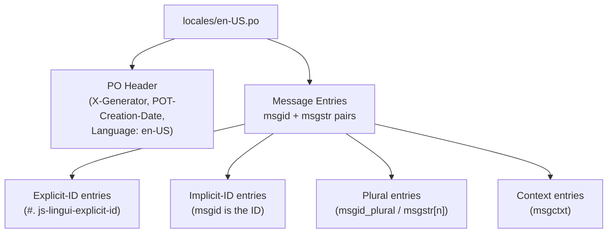
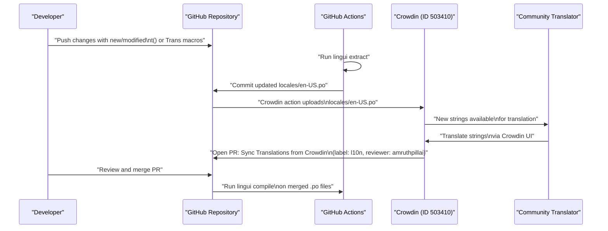
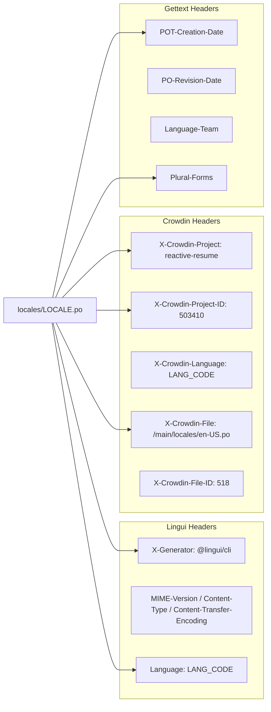
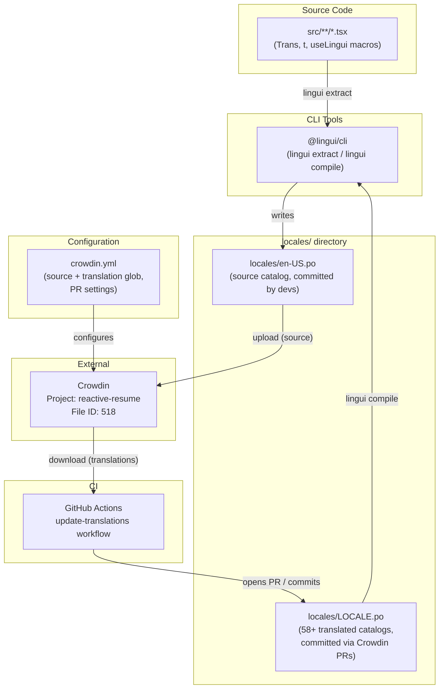

# Page: Translation Workflow

# Translation Workflow

<details>
<summary>Relevant source files</summary>

The following files were used as context for generating this wiki page:

- [crowdin.yml](crowdin.yml)
- [lingui.config.ts](lingui.config.ts)
- [locales/am-ET.po](locales/am-ET.po)
- [locales/ar-SA.po](locales/ar-SA.po)
- [locales/az-AZ.po](locales/az-AZ.po)
- [locales/bg-BG.po](locales/bg-BG.po)
- [locales/bn-BD.po](locales/bn-BD.po)
- [locales/ca-ES.po](locales/ca-ES.po)
- [locales/cs-CZ.po](locales/cs-CZ.po)
- [locales/da-DK.po](locales/da-DK.po)
- [locales/de-DE.po](locales/de-DE.po)
- [locales/el-GR.po](locales/el-GR.po)
- [locales/es-ES.po](locales/es-ES.po)
- [locales/fr-FR.po](locales/fr-FR.po)
- [locales/it-IT.po](locales/it-IT.po)

</details>


This page documents the end-to-end pipeline for internationalizing the application: how UI strings are extracted from source code, managed as PO files, synchronized with Crowdin for community translation, and merged back into the repository. For information about supported locales, fallback rules, the pseudo-locale `zu-ZA`, and how compiled catalogs are loaded at runtime, see [Locale Files](#4.2).

---

## Pipeline Overview

The translation system links three distinct systems: the React source code, the `locales/` directory of PO files, and Crowdin as a third-party translation management platform. The flow is unidirectional in terms of source strings (source code → Crowdin) and bidirectional for translated content (Crowdin ↔ repository).

**End-to-End Translation Pipeline**

```mermaid
flowchart LR
    SRC["React source files\n(src/**)"]
    LinguiExtract["lingui extract\n(@lingui/cli)"]
    EnUS["locales/en-US.po\n(source catalog)"]
    Crowdin["Crowdin project\n(reactive-resume, ID 503410)"]
    LocalePO["locales/LOCALE.po\n(translated catalogs)"]
    LinguiCompile["lingui compile\n(@lingui/cli)"]
    Runtime["i18n Runtime\n(Lingui in browser)"]
    GHActions["GitHub Actions\n(update-translations)"]
    PR["Pull Request\n(Sync Translations from Crowdin)"]

    SRC -->|"t(), Trans macros"| LinguiExtract
    LinguiExtract --> EnUS
    EnUS -->|"crowdin.yml upload"| Crowdin
    Crowdin -->|"community translators"| Crowdin
    Crowdin -->|"crowdin.yml download"| GHActions
    GHActions --> PR
    PR -->|"merge"| LocalePO
    LocalePO --> LinguiCompile
    LinguiCompile --> Runtime
```



Sources: [crowdin.yml:1-11](), [locales/fr-FR.po:1-19](), [locales/es-ES.po:1-19]()

---

## String Extraction with Lingui

The `@lingui/cli` tool scans the React source tree for Lingui macros (`t`, `Trans`, `useLingui`, etc.) and generates the source PO file at `locales/en-US.po`. This is the single file that serves as the translation template for all other locales.

Evidence of this process is visible in the generated PO file headers:

```
X-Generator: @lingui/cli
POT-Creation-Date: 2025-11-04 23:14+0100
```

[locales/fr-FR.po:1-8]()

### Source References

Each extracted string is annotated with its source file location. For example:

```
#. js-lingui-explicit-id
#: src/routes/dashboard/resumes/index.tsx
msgid "Last Updated"
msgstr ""
```

The `#. js-lingui-explicit-id` comment marks strings that use an explicit message ID rather than the message text as the ID. The `#:` comment records the file path (and optionally line number) from which the string was extracted.

Source references appear throughout every locale file, always pointing back to `src/` paths:

| Comment type | Meaning |
|---|---|
| `#. js-lingui-explicit-id` | String uses an explicit Lingui message ID |
| `#: src/path/to/file.tsx` | Source file that contains this string |
| `#. placeholder {0}: ...` | Describes a positional placeholder in the message |
| `msgctxt "..."` | Context string to disambiguate identical msgids |

Sources: [locales/fr-FR.po:21-34](), [locales/fr-FR.po:40-48]()

---

## Source File: `locales/en-US.po`

`locales/en-US.po` is the authoritative source catalog. It is the only file committed by developers directly. All other locale files are downstream of it.

**File structure of the en-US.po source catalog**



Sources: [locales/fr-FR.po:1-65]()

---

## Crowdin Configuration

Crowdin integration is configured in `crowdin.yml` at the repository root. This file is consumed by the Crowdin GitHub Actions integration.

[crowdin.yml:1-11]()

```yaml
preserve_hierarchy: true
commit_message: "[ci skip]"

pull_request_title: "Sync Translations from Crowdin"
pull_request_labels: ["l10n"]
pull_request_reviewers: ["amruthpillai"]

files:
  - source: /locales/en-US.po
    translation: /locales/%locale%.%file_extension%
```

| Field | Value | Effect |
|---|---|---|
| `source` | `/locales/en-US.po` | Single file uploaded to Crowdin as the translation source |
| `translation` | `/locales/%locale%.%file_extension%` | Crowdin substitutes the locale code and extension to determine the output file path |
| `preserve_hierarchy` | `true` | Maintains directory structure when syncing |
| `commit_message` | `[ci skip]` | Prevents CI from running on Crowdin's automated commits |
| `pull_request_title` | `Sync Translations from Crowdin` | Title of PRs opened by Crowdin automation |
| `pull_request_labels` | `["l10n"]` | Label applied to translation PRs |
| `pull_request_reviewers` | `["amruthpillai"]` | Reviewer assigned to translation PRs |

The Crowdin project is identified in all translated PO file headers as:

```
X-Crowdin-Project: reactive-resume
X-Crowdin-Project-ID: 503410
X-Crowdin-File: /main/locales/en-US.po
X-Crowdin-File-ID: 518
```

Sources: [crowdin.yml:1-11](), [locales/fr-FR.po:15-19]()

---

## Locale File Naming

Crowdin writes translated files using the `%locale%` placeholder from `crowdin.yml`. The resulting filenames follow the pattern `<language-REGION>.po`:

| Crowdin locale | Output file | Language-Team |
|---|---|---|
| `fr` | `locales/fr-FR.po` | French |
| `es-ES` | `locales/es-ES.po` | Spanish |
| `de` | `locales/de-DE.po` | German |
| `it` | `locales/it-IT.po` | Italian |
| `ar` | `locales/ar-SA.po` | Arabic |
| `bn` | `locales/bn-BD.po` | Bengali |
| `cs` | `locales/cs-CZ.po` | Czech |
| `da` | `locales/da-DK.po` | Danish |
| `bg` | `locales/bg-BG.po` | Bulgarian |
| `ca` | `locales/ca-ES.po` | Catalan |
| `az` | `locales/az-AZ.po` | Azerbaijani |
| `el` | `locales/el-GR.po` | Greek |
| `am` | `locales/am-ET.po` | Amharic |

Each translated file carries a `PO-Revision-Date` header set by Crowdin when translations are exported.

Sources: [locales/fr-FR.po:1-19](), [locales/es-ES.po:1-19](), [locales/de-DE.po:1-19](), [locales/ar-SA.po:1-19](), [locales/cs-CZ.po:1-19]()

---

## Automated Pull Request Flow

**Crowdin PR synchronization flow**



Sources: [crowdin.yml:1-11]()

---

## PO File Header Anatomy

Every translated PO file written by Crowdin contains a standard set of headers. The headers serve both Lingui (for runtime locale identification) and Crowdin (for file tracking).



The `Plural-Forms` header is locale-specific and important for correct pluralization. For example:

| Locale file | Plural-Forms |
|---|---|
| `ar-SA.po` | `nplurals=6; plural=(n==0 ? 0 : n==1 ? 1 : n==2 ? 2 : n%100>=3 && n%100<=10 ? 3 : n%100>=11 && n%100<=99 ? 4 : 5);` |
| `cs-CZ.po` | `nplurals=4; plural=(n==1) ? 0 : (n>=2 && n<=4) ? 1 : 3;` |
| `fr-FR.po` | `nplurals=2; plural=(n > 1);` |
| `de-DE.po` | `nplurals=2; plural=(n != 1);` |

Sources: [locales/ar-SA.po:14](), [locales/cs-CZ.po:14](), [locales/fr-FR.po:14](), [locales/de-DE.po:14]()

---

## Message Entry Types

Lingui supports several message patterns visible across the PO files:

**1. Simple string**
```
msgid "Last Updated"
msgstr "Dernière mise à jour"
```

**2. ICU plural**
```
#. placeholder {0}: section.items.length
msgid "{0, plural, one {# item} other {# items}}"
msgstr "{0, plural, one {# élément} other {# éléments}}"
```

**3. Rich text with component placeholders**
```
msgid "<0>Finally,</0><1>A free and open-source resume builder</1>"
msgstr "<0>Enfin,</0><1>Un outil de création de CV gratuit et open-source</1>"
```

**4. Message with context (`msgctxt`)**
```
msgctxt "Body Text (paragraphs, lists, etc.)"
msgid "Body"
msgstr "Corps"
```

The `msgctxt` field disambiguates messages that share the same `msgid` but appear in different UI contexts.

Sources: [locales/fr-FR.po:21-48](), [locales/fr-FR.po:398-402]()

---

## Relationship Between Files and Tools

**Code entities involved in the translation pipeline**



Sources: [crowdin.yml:1-11](), [locales/fr-FR.po:1-19](), [locales/de-DE.po:1-19]()

---

