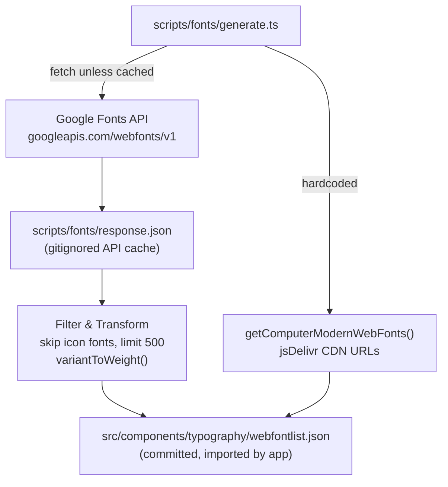
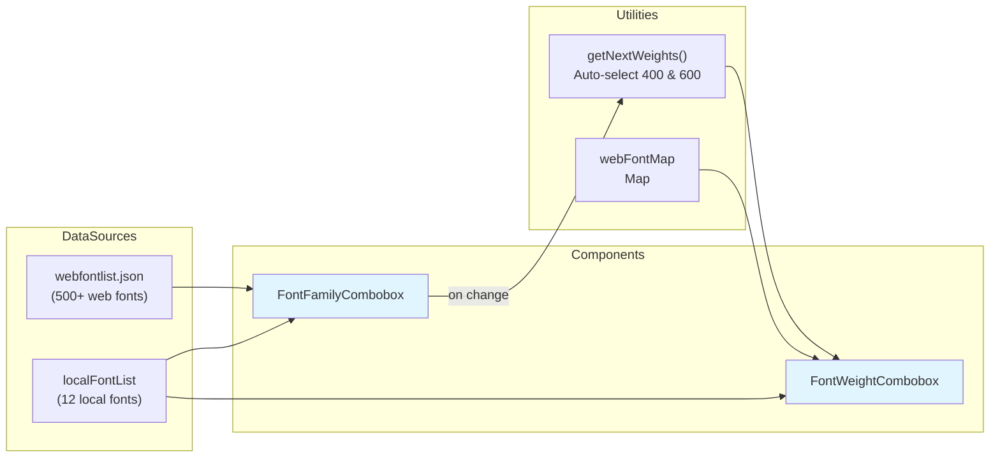
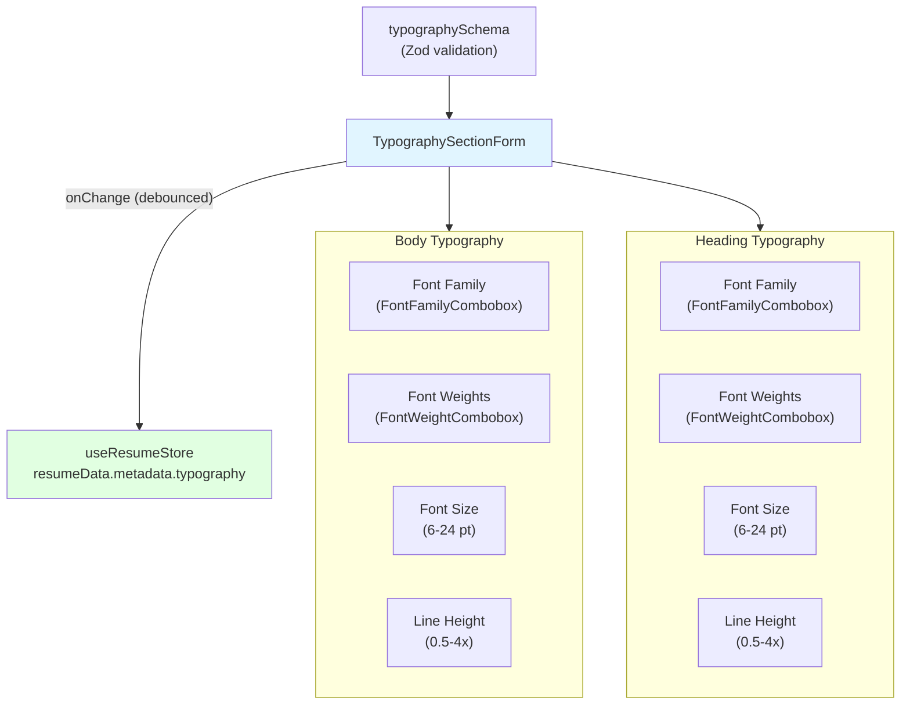
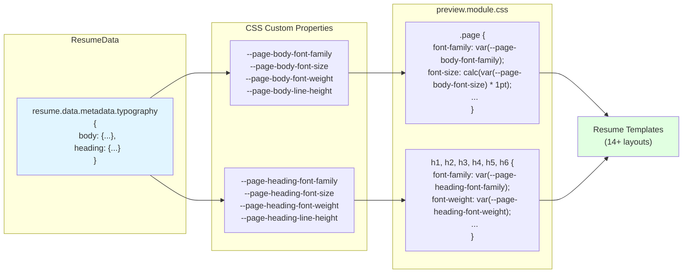

# Page: Typography System

# Typography System

<details>
<summary>Relevant source files</summary>

The following files were used as context for generating this wiki page:

- [.env.example](.env.example)
- [.gitignore](.gitignore)
- [.vscode/settings.json](.vscode/settings.json)
- [docs/changelog/index.mdx](docs/changelog/index.mdx)
- [docs/guides/setting-up-passkeys.mdx](docs/guides/setting-up-passkeys.mdx)
- [docs/spec.json](docs/spec.json)
- [knip.json](knip.json)
- [package.json](package.json)
- [pnpm-lock.yaml](pnpm-lock.yaml)
- [scripts/fonts/generate.ts](scripts/fonts/generate.ts)
- [scripts/fonts/types.ts](scripts/fonts/types.ts)
- [src/components/level/display.tsx](src/components/level/display.tsx)
- [src/components/resume/preview.module.css](src/components/resume/preview.module.css)
- [src/components/resume/templates/azurill.tsx](src/components/resume/templates/azurill.tsx)
- [src/components/resume/templates/bronzor.tsx](src/components/resume/templates/bronzor.tsx)
- [src/components/resume/templates/chikorita.tsx](src/components/resume/templates/chikorita.tsx)
- [src/components/resume/templates/ditgar.tsx](src/components/resume/templates/ditgar.tsx)
- [src/components/resume/templates/ditto.tsx](src/components/resume/templates/ditto.tsx)
- [src/components/resume/templates/gengar.tsx](src/components/resume/templates/gengar.tsx)
- [src/components/resume/templates/glalie.tsx](src/components/resume/templates/glalie.tsx)
- [src/components/resume/templates/kakuna.tsx](src/components/resume/templates/kakuna.tsx)
- [src/components/resume/templates/lapras.tsx](src/components/resume/templates/lapras.tsx)
- [src/components/resume/templates/leafish.tsx](src/components/resume/templates/leafish.tsx)
- [src/components/resume/templates/onyx.tsx](src/components/resume/templates/onyx.tsx)
- [src/components/resume/templates/pikachu.tsx](src/components/resume/templates/pikachu.tsx)
- [src/components/resume/templates/rhyhorn.tsx](src/components/resume/templates/rhyhorn.tsx)
- [src/components/typography/combobox.tsx](src/components/typography/combobox.tsx)
- [src/components/typography/webfontlist.json](src/components/typography/webfontlist.json)
- [src/integrations/auth/client.ts](src/integrations/auth/client.ts)
- [src/integrations/auth/config.ts](src/integrations/auth/config.ts)
- [src/routes/auth/-components/social-auth.tsx](src/routes/auth/-components/social-auth.tsx)
- [src/routes/auth/login.tsx](src/routes/auth/login.tsx)
- [src/routes/auth/register.tsx](src/routes/auth/register.tsx)
- [src/routes/builder/$resumeId/-sidebar/right/sections/typography.tsx](src/routes/builder/$resumeId/-sidebar/right/sections/typography.tsx)
- [src/routes/dashboard/settings/authentication/-components/hooks.tsx](src/routes/dashboard/settings/authentication/-components/hooks.tsx)
- [vite.config.ts](vite.config.ts)

</details>


The Typography System manages font selection, configuration, and application across all resume templates in Reactive Resume. It provides users with access to 500+ web fonts (including Google Fonts and Computer Modern) plus common local system fonts, allowing full control over body text and heading typography.

## Purpose and Scope

This page documents:
- Font sources (web fonts and local fonts)
- Font generation script and pipeline
- Font selection UI components
- Typography configuration interface
- CSS variable system for font application
- Automatic weight selection logic

For resume template rendering details, see [Resume Templates](#3.1.1). For the resume data schema that stores typography settings, see [Resume Data Schema](#3.1.3).

---

## Font Sources

The typography system supports two categories of fonts:

| Font Type | Count | Source | Loading Method |
|-----------|-------|--------|----------------|
| Web Fonts | 500+ | Google Fonts API + Computer Modern | Dynamic `@font-face` injection |
| Local Fonts | 12 | System fonts | CSS font-family fallback |

### Web Fonts

Web fonts are defined in [src/components/typography/webfontlist.json:1]() and include:

- **Computer Modern fonts** (5 families): LaTeX-style fonts hosted on jsDelivr CDN, including:
  - Computer Modern Bright (display)
  - Computer Modern Concrete (serif)
  - Computer Modern Sans (sans-serif)
  - Computer Modern Serif (serif)
  - Computer Modern Typewriter (monospace)

- **Google Fonts** (500 families): Popular fonts from Google Fonts API, sorted by popularity

Each web font entry contains:
```typescript
{
  type: "web",
  category: "serif" | "sans-serif" | "monospace" | "display" | "handwriting",
  family: string,           // e.g., "Roboto"
  weights: Weight[],        // e.g., ["400", "600", "700"]
  preview: string,          // URL for font preview
  files: {                  // URLs for each weight and italic variant
    "400": string,
    "400italic": string,
    ...
  }
}
```

**Sources:** [src/components/typography/combobox.tsx:26-38](), [scripts/fonts/types.ts:44-51]()

### Local Fonts

Local fonts are hardcoded in [src/components/typography/combobox.tsx:11-24]() and include common system fonts:

- **Sans-serif**: Arial, Calibri, Helvetica, Tahoma, Trebuchet MS, Verdana
- **Serif**: Bookman, Cambria, Garamond, Georgia, Palatino, Times New Roman

All local fonts support weights `["400", "600", "700"]` for consistency.

**Sources:** [src/components/typography/combobox.tsx:11-24]()

---

## Font Generation Pipeline

The font list is generated by a Node.js script that fetches data from Google Fonts API and adds Computer Modern fonts.

**Font Generation Pipeline**



Sources: [scripts/fonts/generate.ts:21-49](), [scripts/fonts/generate.ts:63-133]()

### Script Usage

There is no dedicated `package.json` script for font generation. The script is run directly with `tsx` (a dev dependency) and requires `GOOGLE_CLOUD_API_KEY` to be set. See `.env.example` line 76 for the key name.

| Flag | Description |
|------|-------------|
| *(none)* | Generate up to 500 fonts, using the local API response cache if available |
| `--force` | Re-fetch from the Google Fonts API, ignoring the local cache |
| `--compress` | Output minified JSON (no whitespace) |
| `--limit N` | Cap the number of Google Fonts families included |

```bash
GOOGLE_CLOUD_API_KEY=<key> tsx scripts/fonts/generate.ts
GOOGLE_CLOUD_API_KEY=<key> tsx scripts/fonts/generate.ts --force
GOOGLE_CLOUD_API_KEY=<key> tsx scripts/fonts/generate.ts --limit 100 --compress
```

**Sources:** [scripts/fonts/generate.ts:14-17](), [.env.example:73-77]()

### Generation Logic

The script performs these steps:

1. **Fetch Google Fonts**: Call API or read from `scripts/fonts/response.json` (local cache). Both `response.json` and any intermediate `.json` under `scripts/` are gitignored via the `.gitignore` pattern `scripts/**/*.json`.
2. **Filter families**: Skip icon-only fonts like "Material Icons" ([scripts/fonts/generate.ts:19]())
3. **Transform variants**: Convert Google's variant strings to simple weight strings:
   - `"regular"` → `"400"`
   - `"italic"` → `"400italic"`
   - Numeric variants (e.g., `"700"`) remain unchanged
4. **Add Computer Modern**: Prepend 5 Computer Modern font families with jsDelivr CDN URLs ([scripts/fonts/generate.ts:63-133]())
5. **Write output**: Save the final combined list to `src/components/typography/webfontlist.json` — this file is committed to the repository and imported directly by the frontend

**Sources:** [scripts/fonts/generate.ts:21-49](), [scripts/fonts/generate.ts:63-133](), [.gitignore:17]()

### Computer Modern Integration

Computer Modern fonts are manually defined in [scripts/fonts/generate.ts:63-133]():

```typescript
{
  type: "web",
  category: "serif",
  family: "Computer Modern Serif",
  weights: ["400", "700"],
  preview: "https://cdn.jsdelivr.net/gh/bitmaks/cm-web-fonts@latest/font/Serif/cmunrm.woff",
  files: {
    "400": "https://cdn.jsdelivr.net/gh/bitmaks/cm-web-fonts@latest/font/Serif/cmunrm.woff",
    "700": "https://cdn.jsdelivr.net/gh/bitmaks/cm-web-fonts@latest/font/Serif/cmunbx.woff",
    "400italic": "https://cdn.jsdelivr.net/gh/bitmaks/cm-web-fonts@latest/font/Serif/cmunti.woff",
    "700italic": "https://cdn.jsdelivr.net/gh/bitmaks/cm-web-fonts@latest/font/Serif/cmunbi.woff"
  }
}
```

These fonts are sourced from [bitmaks/cm-web-fonts](https://github.com/bitmaks/cm-web-fonts) repository and served via jsDelivr CDN.

**Sources:** [scripts/fonts/generate.ts:63-133](), [docs/changelog/index.mdx:7-11]()

---

## Font Types

The frontend type definitions for the combobox are declared in `src/components/typography/types.ts`, which defines `LocalFont` and `WebFont`. These parallel (but are separate from) the generation-side types in `scripts/fonts/types.ts`.

| Type | File | Fields |
|------|------|--------|
| `WebFont` | `src/components/typography/types.ts` | `type: "web"`, `category`, `family`, `weights`, `preview`, `files` |
| `LocalFont` | `src/components/typography/types.ts` | `type: "local"`, `category`, `family`, `weights` |
| `WebFont` | `scripts/fonts/types.ts` | Same shape — used only by the generation script |

**Sources:** [scripts/fonts/types.ts:44-51](), [src/components/typography/combobox.tsx:6-7]()

---

## Font Selection Components

The typography system provides two React components for font selection:



### FontFamilyCombobox

Displays a searchable dropdown of all available fonts. Each option's label is rendered by `FontDisplay` (from `src/components/typography/font-display.tsx`), which shows the font name styled in the actual font face using a preview URL — enabling the user to see what the font looks like before selecting it.

The component combines web fonts and local fonts into a single options array ([src/components/typography/combobox.tsx:67-73]()):

```typescript
const options = [...webFontList, ...localFontList].map((font) => ({
  value: font.family,
  keywords: [font.family],
  label: <FontDisplay name={font.family} type={font.type} url={font.preview} />
}));
```

**Sources:** [src/components/typography/combobox.tsx:64-76]()

### FontWeightCombobox

Displays available weights for the selected font family.

```typescript
// Usage
<FontWeightCombobox
  fontFamily={fontFamily}
  value={selectedWeights}  // Array of weight strings
  onValueChange={(weights) => setWeights(weights)}
/>
```

The component determines available weights by looking up the font family in `webFontMap` or `localFontList`. If the font is not found, it falls back to all standard weights ([src/components/typography/combobox.tsx:80-103]()):

```typescript
let weights: string[] = [];

if (webFontData?.weights) {
  weights = webFontData.weights;
} else if (localFontData?.weights) {
  weights = localFontData.weights;
} else {
  // Fallback
  weights = ["100", "200", "300", "400", "500", "600", "700", "800", "900"];
}
```

**Sources:** [src/components/typography/combobox.tsx:78-104]()

---

## Weight Selection Logic

When a user changes the font family, the `getNextWeights()` function automatically selects appropriate font weights:

```typescript
function getNextWeights(fontFamily: string): Weight[] | null {
  const fontData = webFontMap.get(fontFamily);
  if (!fontData?.weights) return null;

  const weights: Weight[] = [];

  // Prefer 400 and 600
  if (uniqueWeights.includes("400")) weights.push("400");
  if (uniqueWeights.includes("600")) weights.push("600");

  // Fill with first/last if needed
  while (weights.length < 2) {
    const candidate = weights.length === 0 
      ? uniqueWeights[0] 
      : uniqueWeights[lastIndex];
    if (!weights.includes(candidate)) weights.push(candidate);
  }

  return weights.length > 0 ? weights : null;
}
```

**Selection strategy:**
1. Attempt to select `"400"` (regular) and `"600"` (semibold)
2. If these weights are unavailable, select the lightest and heaviest available weights
3. Ensure at least 2 weights are selected for variety

**Sources:** [src/components/typography/combobox.tsx:40-62]()

---

## Typography Configuration Interface

Users configure typography through a form in the resume builder sidebar.



### Form Structure

The typography form is split into two sections: Body and Heading ([src/routes/builder/$resumeId/-sidebar/right/sections/typography.tsx:47-289]()):

| Section | Purpose | Fields |
|---------|---------|--------|
| **Body** | Paragraph text, lists, descriptions | Font Family, Font Weights, Font Size, Line Height |
| **Heading** | Section titles (h1-h6) | Font Family, Font Weights, Font Size, Line Height |

### Font Family Selection

When a font family changes, the form automatically updates font weights:

```typescript
<FontFamilyCombobox
  value={field.value}
  onValueChange={(value) => {
    if (value === null) return;
    field.onChange(value);
    
    // Auto-select appropriate weights
    const nextWeights = getNextWeights(value);
    if (nextWeights !== null) {
      form.setValue("body.fontWeights", nextWeights, { shouldDirty: true });
    }
    
    form.handleSubmit(onSubmit)();
  }}
/>
```

**Sources:** [src/routes/builder/$resumeId/-sidebar/right/sections/typography.tsx:65-77]()

### Font Size and Line Height

Both sections allow precise control over font size and line height:

- **Font Size**: 6-24 pt (points), configurable in 0.1 pt increments
- **Line Height**: 0.5-4x (multiplier), configurable in 0.05x increments

**Sources:** [src/routes/builder/$resumeId/-sidebar/right/sections/typography.tsx:107-167](), [src/routes/builder/$resumeId/-sidebar/right/sections/typography.tsx:228-288]()

---

## Font Application in Templates

Typography settings are applied to resume pages via CSS custom properties (CSS variables).



### CSS Variable Mapping

Typography data is converted to CSS variables and applied to each page:

| Resume Data Field | CSS Variable | Usage |
|-------------------|--------------|-------|
| `typography.body.fontFamily` | `--page-body-font-family` | Base font for all text |
| `typography.body.fontSize` | `--page-body-font-size` | Converted to points (pt) |
| `typography.body.fontWeights[0]` | `--page-body-font-weight` | Regular text weight |
| `typography.body.fontWeights[1]` | `--page-body-font-weight-bold` | Bold text weight |
| `typography.body.lineHeight` | `--page-body-line-height` | Line spacing multiplier |
| `typography.heading.fontFamily` | `--page-heading-font-family` | Font for h1-h6 |
| `typography.heading.fontSize` | `--page-heading-font-size` | Base heading size |
| `typography.heading.fontWeights[0]` | `--page-heading-font-weight` | Heading font weight |
| `typography.heading.lineHeight` | `--page-heading-line-height` | Heading line spacing |

**Sources:** [src/components/resume/preview.module.css:1-50]()

### Page-Level Styles

The `.page` class applies body typography ([src/components/resume/preview.module.css:1-14]()):

```css
.page {
  font-family: var(--page-body-font-family);
  font-size: calc(var(--page-body-font-size) * 1pt);
  font-weight: var(--page-body-font-weight);
  line-height: var(--page-body-line-height);
  ...
}
```

### Heading-Level Styles

Headings (h1-h6) use heading typography with size multipliers ([src/components/resume/preview.module.css:16-49]()):

```css
h1, h2, h3, h4, h5, h6 {
  font-family: var(--page-heading-font-family);
  font-weight: var(--page-heading-font-weight);
  line-height: var(--page-heading-line-height);
}

h1 { font-size: calc(var(--page-heading-font-size) * 1.5pt); }
h2 { font-size: calc(var(--page-heading-font-size) * 1.25pt); }
h3 { font-size: calc(var(--page-heading-font-size) * 1.125pt); }
h4 { font-size: calc(var(--page-heading-font-size) * 1pt); }
h5 { font-size: calc(var(--page-heading-font-size) * 0.875pt); }
h6 { font-size: calc(var(--page-heading-font-size) * 0.75pt); }
```

### Bold Text Handling

The `<strong>` tag uses the second weight from `fontWeights` array ([src/components/resume/preview.module.css:61-63]()):

```css
strong {
  font-weight: var(--page-body-font-weight-bold);
}
```

**Sources:** [src/components/resume/preview.module.css:1-68]()

---

## Typography Schema

Typography settings are validated using Zod schema. The schema structure is:

```typescript
{
  body: {
    fontFamily: string,
    fontWeights: string[],  // At least 2 weights required
    fontSize: number,       // 6-24 pt
    lineHeight: number      // 0.5-4x
  },
  heading: {
    fontFamily: string,
    fontWeights: string[],  // At least 2 weights required
    fontSize: number,       // 6-24 pt
    lineHeight: number      // 0.5-4x
  }
}
```

The schema enforces:
- At least 2 font weights for each section (for regular and bold variants)
- Font size range: 6-24 points
- Line height range: 0.5-4x multiplier

**Sources:** [src/routes/builder/$resumeId/-sidebar/right/sections/typography.tsx:10](), [src/routes/builder/$resumeId/-sidebar/right/sections/typography.tsx:21-23]()

---

## Font Loading in Templates

While templates don't directly load fonts (they rely on CSS variables), the font files are dynamically injected into the page via `@font-face` rules based on the selected font family and weights. This ensures that only the required font files are loaded, optimizing page performance.

All 14+ resume templates ([Pikachu](#src/components/resume/templates/pikachu.tsx), [Chikorita](#src/components/resume/templates/chikorita.tsx), [Onyx](#src/components/resume/templates/onyx.tsx), etc.) automatically inherit typography settings through the CSS variable system, requiring no template-specific font handling code.

**Sources:** [src/components/resume/templates/pikachu.tsx:1-123](), [src/components/resume/templates/chikorita.tsx:1-128](), [src/components/resume/templates/onyx.tsx:1-95](), [src/components/resume/templates/azurill.tsx:1-144](), [src/components/resume/templates/kakuna.tsx:1-98](), [src/components/resume/templates/bronzor.tsx:1-103](), [src/components/resume/templates/rhyhorn.tsx:1-98](), [src/components/resume/templates/glalie.tsx:1-121](), [src/components/resume/templates/gengar.tsx:1-134](), [src/components/resume/templates/lapras.tsx:1-123](), [src/components/resume/templates/ditgar.tsx:1-115](), [src/components/resume/templates/ditto.tsx:1-112](), [src/components/resume/templates/leafish.tsx:1-114]()